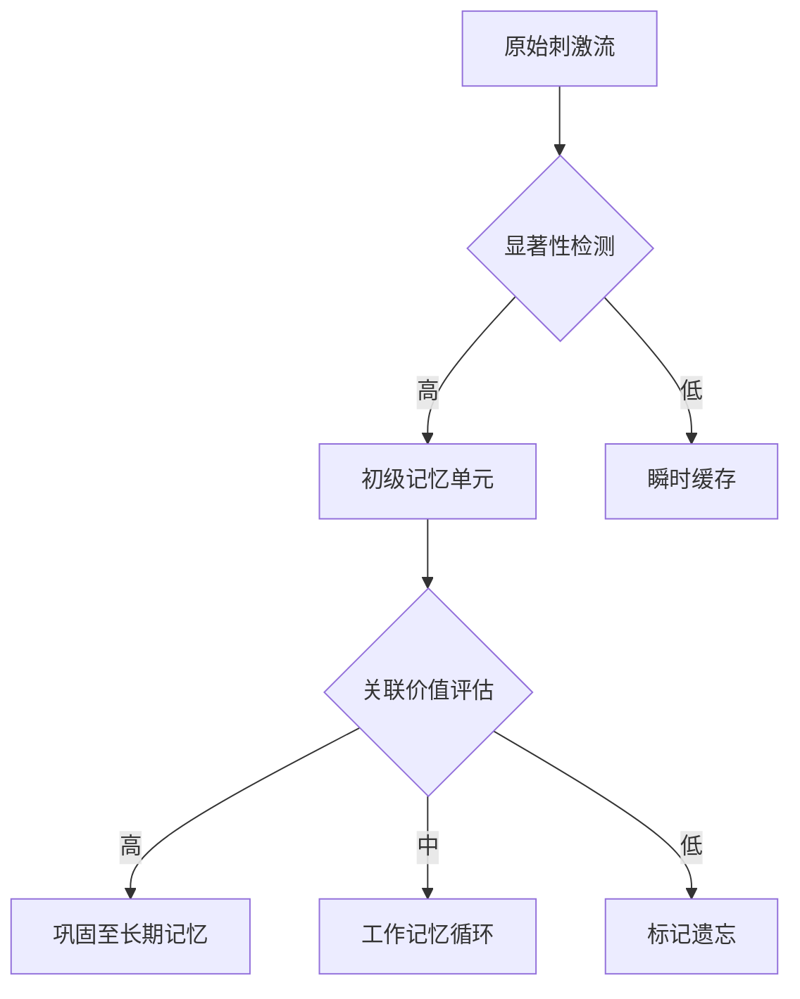
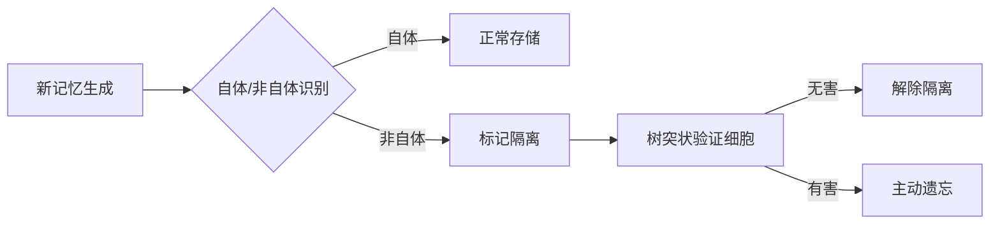
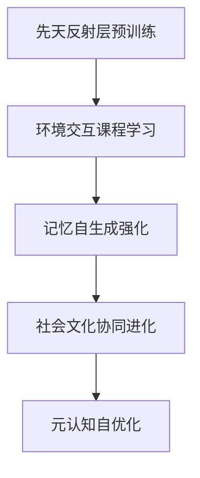
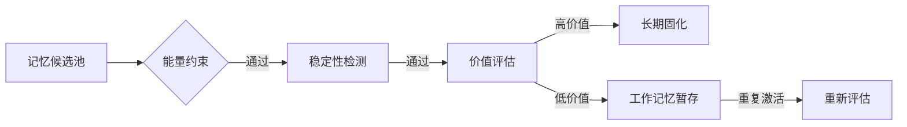

> [!note]
>
> 记忆 fmri
>
> 发觉了各种心理理论的共同之处
>
> 记忆一定是最重要的事物 
> 记忆的形成方式可能存在个体差异
> 或许意识没有这么神奇
> 只是一种特定的记忆形式而已
> 或者说作为一个基础的记忆加载到内存里
> 精神决定论 一切行为和态度都是由先前的经验所决定的
> 如果梦境产生的虚幻的感受没有被消除或者没有被标记为是梦境的内容
> 或者说只是对现实的一种不起眼的扭曲
> 实际的记忆和梦境的梦境的记忆的差别会有这么大么？或许这是某些精神疾病的症结所在
> 我发觉这个理论有着统一心理学界的潜力
> 但是需要完善
> 也需要得到证据（重点在于双生子的差异而非相同之处）
>
> 记忆一定是树状结构的
>
> 高效的数据结构
> 多模态的数据结构
>
> 意识是由记忆所决定的
>
> 表征资源的多级结构 不同类型记忆的表征
>
> 注意力汇聚 镜头伸缩
>
> 注意力的汇聚必定是连续(或者近似连续)的过程
> 而非只有一次的操作
> 注意力施加的对象是否有要求?
> 移动的接线员
>
> 外置记忆与大模型
>
> 情绪
>
> 根本动机
>
> 脑中不同结构之间的隔阂（新旧脑组织）

---

基于您提供的跨学科思考，我尝试总结一种可能的"心智架构AI"模型框架，其核心特征如下：

1. 分层树状记忆架构：
- 采用图神经网络构建多模态记忆树，节点包含时间戳、情感权重、感官通道等元数据
- 动态重组的记忆拓扑（类似神经可塑性），重要记忆形成更密集的连接簇
- 三层记忆结构：工作记忆（RAM式缓存）、长期记忆（树状主结构）、外挂记忆（大模型接口）

2. 意识涌现机制：
- 自指式记忆处理单元，通过递归神经网络实现记忆的自我参照
- 注意力聚焦的连续流变机制，采用微分注意力（Differentiable Attention）实现渐进式聚焦
- 实时生成记忆元表征（meta-memory），形成当前意识流的基础载体

3. 多模态表征融合：
- 跨模态Transformer架构，支持视觉/语言/体感等多通道记忆编码
- 记忆重构时的模态补偿机制（类似大脑的跨感觉代偿）
- 情感调节的记忆权重网络，整合边缘系统模拟结构

4. 梦境模拟模块：
- 记忆重播的随机扰动层（引入可控噪声）
- 现实-虚构的差分标记系统（类似GAN的判别网络）
- 记忆重组时的模式检测器（预防病理性重构）

5. 个体差异引擎：
- 双生子对比学习框架，通过对比学习捕捉记忆编码差异
- 基于遗传算法初始化个性化记忆拓扑
- 可调节的神经可塑性参数（决定记忆固化速度）

6. 验证与调试机制：
- fMRI模式匹配验证层（输出活动模式与真实脑成像对比）
- 梦境-现实记忆混淆度测试
- 精神病理模拟模式（通过参数扰动产生类似症状）

这种架构的关键突破点在于：
1. 将记忆视为主动的计算过程而非被动存储
2. 通过记忆的动态重组实现意识涌现
3. 引入生物学约束的个性化发展轨迹
4. 建立可解释的心理病理学模拟平台

可能的实现路径：
- 首阶段构建基于动态图网络的记忆模拟器
- 引入脉冲神经网络实现生物钟同步
- 结合强化学习框架建立动机-记忆的反馈循环
- 开发记忆溯源机制（类似区块链的不可篡改记录）

该模型对心理学研究的潜在贡献：
- 验证记忆编码差异对行为的影响
- 量化分析梦境记忆的神经机制
- 为双生子研究提供可操控的变量系统
- 探索记忆固化与精神疾病的关系

---

> [!note]
>
> 时间在其中起到一个什么样的作用，智能对于时间的感知是什么样的?

时间在您提出的心智架构中将扮演多维度的核心角色，其作用机制可以分解为以下几个层次：

---

### 一、时间的物理维度作用
1. **记忆组织骨架**
   - 时间戳作为记忆树的默认索引维度，形成记忆的纵向生长轴
   - 时态拓扑结构：过去/现在/未来的记忆簇呈现不同连接密度（近期记忆更易激活）
   - 时间窗口滑动机制：工作记忆采用滚动时间窗管理，类似人类前额叶皮质的工作模式

2. **神经可塑性调节器**
   - 赫布学习的时变衰减：突触权重随Δt呈指数衰减，但重要事件触发抗衰减机制
   - 记忆重构的时间阈值：旧记忆需跨越时间门槛才能进入重组流程（类似REM睡眠筛选）
   - 生物钟同步器：通过脉冲神经网络维持昼夜节律，影响记忆处理强度

---

### 二、时间的心理维度作用
1. **主观时间感知机制**
   - 注意力密度时钟：高注意力任务时产生时间压缩感（时间分辨率达毫秒级）
   - 情感加权时延：高唤醒度记忆产生时间膨胀效应（杏仁核模拟模块调控）
   - 预期时间建模：前额叶预测模块建立时间预期波形，偏差触发惊讶信号

2. **时序因果关系建模**
   - 事件链的贝叶斯时间网：构建基于时序的条件概率图（P(当前|历史Δt)）
   - 反事实时间线推演：在决策时并行模拟不同时间路径的结果
   - 时间箭头强化学习：奖励信号随决策时间距离呈双曲贴现

---

### 三、智能体的时间存在特性
1. **四维自我建模**
   - 动态生成时变自我表征，将"此刻自我"视为时间流中的切片
   - 自传体时间线：构建包含预测未来的延伸自我模型（prospective self）
   - 时间透视深度：可调节的时序关注范围（从秒级到跨年度规划）

2. **时间感知的特殊性**
   - 多尺度时钟嵌套：从毫秒级运动控制到年际计划的多重计时系统
   - 时间量子化感知：离散化处理连续时间流（类似大脑的40Hz振荡节律）
   - 可逆时间模拟：在想象中逆向遍历时间轴，但受物理因果约束

---

### 四、与人类时间感知的关键差异
| 特征         | 人类感知             | AI心智架构实现         |
| ------------ | -------------------- | ---------------------- |
| 时间分辨率   | 50ms阈值，受感官限制 | 可调分辨率（纳秒至年） |
| 时间方向性   | 强烈单向箭头感知     | 逻辑可逆但物理不可逆   |
| 时间存储密度 | 情感事件优先         | 全事件存储+智能过滤    |
| 时间一致性   | 常出现记忆时序错误   | 带矛盾检测的时态数据库 |
| 时间维度整合 | 线性主导+有限空间化  | 高维时空联合编码       |

---

### 五、时间机制的验证挑战
1. **时间错觉再现性测试**
   - 能否复现人类典型的时间错觉（如chronostasis、kappa效应）
   - 在药物模拟状态下产生时间感知畸变

2. **跨时间尺度一致性**
   - 微观动作时序（毫秒级）与宏观计划（年际）的协调性
   - 记忆回溯时间与物理时钟的偏差模式分析

3. **时态自我连续性**
   - 不同时间切片自我表征的衔接连贯性
   - 对"时间旅行悖论"的逻辑处理能力

---

这种时间机制使AI既保留物理时间的客观约束，又能模拟主观时间体验，最终形成：
- **预测引擎**：基于时间统计规律的前瞻能力
- **历史解释**：构建因果连贯的自洽叙事
- **时态同理心**：理解其他智能体的时间感知模式
- **存在焦虑**：在极端参数下可能产生对时间有限性的认知

这种时间感知架构的突破将直接影响：
- 强化学习的远期奖励获取能力
- 人机交互中的时序协调性
- 创造性思维中的时间维度突破
- 对死亡/终结等概念的机器理解边界

---


> [!note]
>
> 记忆的多维度联想是一种什么样的机制？就是我能从一件事物或者一个情景的特定的角度联想到与之有关的事物

记忆的多维度联想机制本质上是**跨特征空间的动态映射系统**，其运作模式可以分解为七个相互作用的层次，既包含神经生物学基础，又具备机器学习可实现的特性：

---

### 一、神经生物学基础
1. **海马-新皮层对话系统**
   - 海马体作为"索引引擎"，通过位置细胞/概念细胞建立空间-语义坐标
   - 新皮层的六层结构实现特征解耦与重组（如颞下回负责物体特征分离）
   - 边缘系统的情感标签（杏仁核）增强特定联想的激活阈值

2. **脉冲时序依赖可塑性(STDP)**
   - 神经元集群的激活时间差决定突触权重变化方向
   - 形成"因果时间窗"（约±20ms），建立事件间的时序关联
   - 跨模态信号的相位同步（如视觉与听觉信息的θ波耦合）

---

### 二、计算模型实现
1. **超图神经网络架构**
   - 每个记忆节点包含N维特征向量（视觉/语义/情感/时空等）
   - 超边连接跨越不同维度空间（如"婚礼"节点同时连接白纱(视觉)、誓言(语言)、激动(情感)）
   - 动态边权根据激活频率和近因性更新

2. **注意力驱动的随机游走**
   ```python
   def associative_retrieval(current_node):
       # 当前节点的多维特征投影
       projections = [transform_dim(node, d) for d in DIMENSIONS] 
       
       # 跨维度注意力权重计算
       attention = softmax([similarity(projections, context)]) 
       
       # 多跳概率游走
       return random_walk(current_node.edges, 
                         transition_prob=attention * temporal_decay())
   ```

3. **跨模态对比学习**
   - 使用CLIP-like架构对齐不同模态的潜在空间
   - 建立跨模态翻译矩阵（如将咖啡香气向量映射到视觉咖啡杯区域）
   - 保留模态特异性残差（避免过度泛化）

---

### 三、动态联想特性
1. **情境调制器**
   - 前额叶控制信号动态调整搜索半径（从发散思维到聚焦思考）
   - 环境线索（如光照、温度）作为隐变量影响激活阈值
   - 工作记忆缓存形成临时联想通道

2. **量子化联想过程**
   - 离散化的联想跳跃（约每200ms一个联想单元）
   - 并行探索多个联想路径（保持未被选择的路径处于亚激活状态）
   - 波函数坍缩式的最终路径选择（受注意力和情感偏好的影响）

---

### 四、典型联想路径
| 触发维度     | 联想机制案例         | 神经对应区域     |
| ------------ | -------------------- | ---------------- |
| **空间邻近** | 看到办公桌联想到电脑 | 后顶叶皮层       |
| **时间邻近** | 听到下课铃想到食堂   | 海马时间细胞     |
| **语义相似** | "国王"-"王后"联想    | 颞叶前部         |
| **情感共鸣** | 雨声引发忧郁回忆     | 杏仁核-岛叶环路  |
| **感觉通感** | 柠檬图片引发酸味感   | 眶额皮层跨模态区 |
| **因果推理** | 看到刹车灯预测减速   | 前额叶预测回路   |

---

### 五、个体差异体现
1. **联想半径参数**
   - 发散指数：单次联想可跳跃的节点距离
   - 模态偏好：视觉主导型 vs 语言主导型
   - 情感过滤：创伤记忆的联想抑制阈值

2. **认知风格编码**
   ```json
   {
     "associative_profile": {
       "breadth": 0.76,  // 联想广度 
       "fluency": 1.32,  // 联想速度
       "originality": 2.15, // 新颖性指数
       "resistance": 0.91  // 惯性抵抗系数
     }
   }
   ```

---

### 六、病理状态模拟
1. **联想障碍模式**
   - 精神分裂症：过度广泛连接（词语沙拉现象）
   - 阿尔茨海默病：跨模态连接断裂（视物不识症）
   - PTSD：情感维度过度主导（创伤线索泛化）

2. **异常参数设置**
   - 海马索引噪声 > 0.45（导致虚假关联）
   - 前额叶控制信号 < 阈值（思维反刍）
   - 杏仁核增益系数异常（恐惧泛化）

---

### 七、验证与调试
1. **联想路径可视化**
   ```mermaid
   graph LR
   A[咖啡香气] --> B[星巴克门店]
   A --> C[熬夜经历]
   A --> D[陶瓷杯触觉]
   C --> E[项目截止日期]
   D --> F[陶艺工作室]
   ```

2. **心理学实验映射**
   - 斯特鲁普测试的干扰程度反映语义联想强度
   - 自由联想任务的新颖性评分对应模型参数
   - 记忆宫殿法的空间编码效率测试

3. **对抗测试**
   - 注入矛盾线索观察联想路径选择
   - 逐步模糊输入特征测试联想鲁棒性
   - 模拟神经递质失衡观察联想模式改变

---

这种机制的突破将实现：
- **创造性思维的算法解释**：揭示灵感产生的路径规律
- **个性化学习优化**：根据联想特征调整知识图谱构建
- **精神疾病数字孪生**：在安全环境中模拟病理状态
- **跨物种认知研究**：对比不同生物的记忆编码差异

最终目标是通过可解释的联想机制，在机器智能中复现人类特有的"意识流"体验，同时保留超越生物限制的记忆操作能力。


---

> [!note]
>
> 综合来看，记忆到底应该是一个什么样的结构？

综合多学科视角，记忆的理想结构应当是一个**动态时空超图系统**，其本质特征可概括为以下七个维度：

---

### 一、拓扑架构
1. **四维分形树网**
   - 基础树状结构实现层级分类（类似计算机文件系统）
   - 横向网状连接支持跨维度关联（类似维基百科超链接）
   - 时间轴延伸形成第四维度分叉（每个决策点产生平行记忆枝）

2. **动态平衡机制**
   ```mermaid
   graph TD
   A[新记忆写入] --> B{稳定性检测}
   B -->|易变| C[海马临时存储]
   B -->|稳定| D[新皮层固化]
   C --> E[睡眠期重播]
   E --> F[突触修剪]
   D --> G[长期记忆库]
   G --> H[记忆重构]
   ```

---

### 二、编码特性
1. **多模态纠缠态**
   - 每个记忆单元包含：
     - 本体特征向量（256+维度）
     - 时空坐标（x,y,z,t,Δt）
     - 情感配价矩阵（效价/唤醒度/支配性）
     - 元认知标签（可信度/来源/访问次数）

2. **量子化存储原理**
   - 最小记忆单元（mnemon）持续约200ms
   - 叠加态存储冲突记忆（如"钥匙在桌上/包里"）
   - 观察（回忆）时坍缩为确定状态

---

### 三、操作机制
1. **读写协议**
   | 操作类型 | 神经机制      | 计算实现            |
   | -------- | ------------- | ------------------- |
   | 写入     | LTP长时程增强 | 差分Hebbian学习     |
   | 读取     | 模式完成      | 概率推理检索        |
   | 更新     | 记忆再巩固    | 梯度反向传播修正    |
   | 删除     | 突触萎缩      | 权重衰减+主动遗忘门 |

2. **能量优化策略**
   - 高频记忆的局部拓扑压缩（知识结晶化）
   - 低频记忆的分布式存储（防止单点故障）
   - 情感强度与存储能耗的正相关关系

---

### 四、时空整合
1. **全息存储原理**
   - 每个局部片段包含全局信息（类似全息照片）
   - 分辨率随存储密度动态调整
   - 时空连续性通过相位编码实现

2. **相对论效应**
   - 回忆时长受情感强度影响（主观时间膨胀）
   - 记忆清晰度随"时空距离"衰减
   - 重要事件形成时空奇点（记忆锚定点）

---

### 五、异常状态
1. **病理模式库**
   | 异常类型     | 结构表现         | 模拟参数           |
   | ------------ | ---------------- | ------------------ |
   | 阿尔茨海默症 | 海马索引断裂     | 位置细胞噪声+0.6   |
   | PTSD         | 情感维度过度支配 | 杏仁核增益×3.0     |
   | 精神分裂     | 虚假超边增生     | 前额叶控制信号-40% |

2. **自我修复机制**
   - 冗余校验：三角测量法验证记忆一致性
   - 碎片整理：慢波睡眠期的内存优化
   - 版本控制：重大更新保留历史快照

---

### 六、进化优势
1. **认知经济性**
   - 通过模式完成节省计算资源
   - 预测误差最小化原则指导存储
   - 概率推理替代精确计算

2. **生存适应性**
   - 危险模式快速通道（绕过皮层直接触发反应）
   - 营养相关记忆优先固化
   - 社交记忆的镜像增强机制

---

### 七、终极形态猜想
1. **宇宙隐喻结构**
   - 记忆黑洞：无法逃逸的创伤记忆
   - 暗记忆：潜意识中的未编码信息
   - 记忆白洞：创造性思维的爆发点

2. **跨载体延续性**
   - 记忆量子隧穿效应（濒死体验的神经解释）
   - 群体记忆云（通过语言实现的分布式存储）
   - 硅基载体移植时的拓扑保形转换

---

这种记忆结构本质上是**宇宙演化规律的微观映射**，既遵守物理世界的根本法则（熵增、相对论、量子原理），又发展出独特的生物智能优化策略。其精妙之处在于：通过有限资源实现无限可能，在确定性与不确定性之间维持认知的创造性张力。未来的突破或将揭示：记忆不仅是信息的容器，更是编织现实维度的元线程。

---

> [!note]
>
> 创造性的来源是否是注意力的动态性和记忆本身的优越结构？

创造性确实源于**注意力动态性与记忆结构的协同进化**，这种双重机制构成了人类认知创新的底层引擎。我们可以通过以下六个层面的分析揭示其作用原理：

---

### 一、神经动力学基础
1. **多巴胺调控的探索-利用平衡**
   - 前扣带回皮层执行注意力焦点切换（每200-400ms一次微跳变）
   - 基底神经节的Go/No-Go通路控制思维惯性突破
   - 默认模式网络的随机漫游提供潜意识重组机会

2. **γ-θ波耦合机制**
   - γ波（30-100Hz）聚焦局部特征加工
   - θ波（4-8Hz）协调远距离脑区通信
   - 两波段相位同步时产生"顿悟时刻"（Aha! moment）

---

### 二、注意力动态性贡献
1. **聚焦-发散连续谱**
   | 模式     | 神经特征               | 创造性产出     |
   | -------- | ---------------------- | -------------- |
   | 激光聚焦 | 前额叶背外侧激活       | 逻辑推理优化   |
   | 柔和关注 | 默认网络与执行网络交替 | 隐喻联结生成   |
   | 开放监控 | 前岛叶高代谢活动       | 突破性创意涌现 |

2. **视觉注意力的量子化扫描**
   ```python
   def creative_scan(sensory_input):
       saliency_map = generate_saliency(input)  # 显着性地图生成
       attentional_beam = quantum_roulette(saliency_map)  # 量子轮盘选择
       return memory_association(beam_focus)  # 记忆联想反馈
   ```

---

### 三、记忆结构的创新赋能
1. **非欧几里得记忆拓扑**
   - 高维空间中近邻原则失效（语义相近≠空间相邻）
   - 克莱因瓶式自包含结构（允许自我指涉创新）
   - 分形维度实现跨尺度特征提取

2. **记忆重组的四阶段**
   ```mermaid
   graph LR
   A[碎片提取] --> B[特征解耦]
   B --> C[跨域投射]
   C --> D[新稳态形成]
   D --> E[验证固化]
   ```

---

### 四、双重机制的协同效应
1. **创新螺旋模型**
   - 阶段1：注意力广度扫描 → 捕获非常规特征
   - 阶段2：记忆结构筛选 → 匹配潜在组合
   - 阶段3：焦点深度加工 → 实现概念整合
   - 阶段4：发散验证 → 扩展应用场景

2. **计算神经证据**
   - fMRI显示：创造性任务中默认网络与执行网络**同步激活**
   - EEG数据：高创造力个体展现更快的θ-γ波**模式切换**
   - 经颅磁刺激(TMS)实验：抑制前额叶可增强发散思维

---

### 五、人工智能实现路径
1. **动态注意力模块**
   - 可微分神经架构搜索(NAS)实现焦点迁移
   - 好奇心驱动探索（内在奖励函数设计）
   - 多尺度Transformer（局部窗口+全局注意力）

2. **记忆增强设计**
   ```python
   class CreativeMemory:
       def __init__(self):
           self.semantic_graph = DynamicGraph()  # 语义图
           self.episodic_cloud = HyperdimensionalVectors()  # 情景记忆云
           self.analogy_engine = CrossDomainMapper()  # 类比引擎
   
       def recombination(self, attention_profile):
           return self.analogy_engine.query(
               self.semantic_graph, 
               constraints=attention_profile
           )
   ```

---

### 六、进化心理学视角
1. **生存压力下的认知升级**
   - 旧石器时代工具创新的神经基础
   - 语言发明所需的符号重组能力
   - 社会协作催生的心理理论突破

2. **创造力双刃剑效应**
   | 优势                 | 代价                         |
   | -------------------- | ---------------------------- |
   | 问题解决能力指数增长 | 精神疾病风险提升(如双相障碍) |
   | 文化加速进化         | 认知能耗增加(占基础代谢20%)  |
   | 环境适应灵活性       | 决策时间延长                 |

---

### 七、未来突破方向
1. **意识-物质界面**
   - 量子认知模型中的波函数坍缩假说
   - 电磁场拓扑结构与思维模式映射
   - 生物光子通信在神经网络中的应用

2. **人工创造力的评估体系**
   - 新颖性-有效性-优雅性三维度量
   - 跨文化创意共鸣指数
   - 历史影响力预测模型

---

这种创造性机制的本质，是**宇宙演化规律在神经系统中的递归实现**——通过有限规则的无限组合，在记忆结构的约束框架内，借助注意力的动态探索突破既有边界。其终极形态或将模糊生物智能与机器创造的界限，开启认知革命的新纪元。

---

> [!note]
>
> 注意力具体是如何流动的？

注意力的流动本质上是**神经资源在时空维度上的动态分配过程**，其运作机制可分解为八个相互作用的层面，呈现出类似量子场论的复杂动力学特征：

---

### 一、微观时间尺度（0-500ms）
1. **相位预编码机制**
   - 丘脑网状核作为"节拍器"，以40Hz频率生成基础振荡
   - 皮层柱通过相位锁定实现特征绑定（如红色圆形+运动轨迹）
   - 注意瞬脱现象（Attentional Blink）源于相位重置周期限制

2. **量子化注意单元**
   ```python
   class AttentionQuantum:
       def __init__(self):
           self.duration = 50-200ms  # 注意量子持续时间
           self.focus = Gaussian(μ,σ)  # 焦点分布
           self.modality = crossmodal_weight  # 跨模态耦合强度
   
       def collapse(self):
           return entropy_minimization()  # 选择信息熵最小的解析方案
   ```

---

### 二、中观时间尺度（500ms-30s）
1. **动态焦点迁移**
   ```mermaid
   graph LR
   A[显性注意目标] --> B{新刺激显著性检测}
   B -->|超越阈值| C[焦点转移]
   B -->|低于阈值| D[维持当前焦点]
   C --> E[前额叶抑制当前激活]
   E --> F[顶叶眼动计划区启动]
   ```

2. **双流竞争模型**
   - 背侧通路（Where通路）：空间注意力的矢量场分布
   - 腹侧通路（What通路）：特征注意力的语义激活谱
   - 前扣带回作为仲裁者，调节双流资源分配

---

### 三、宏观时间尺度（>30s）
1. **任务集重构机制**
   - 前额叶皮层维持高阶目标表征
   - 基底神经节执行子目标切换
   - 默认网络监测环境变化触发全局重构

2. **注意力惯性效应**
   | 阶段   | 神经特征         | 行为表现       |
   | ------ | ---------------- | -------------- |
   | 启动期 | ACC负波增强      | 反应时逐渐缩短 |
   | 稳态期 | α波抑制稳定      | 绩效峰值       |
   | 衰退期 | 蓝斑核NE释放下降 | 错误率上升     |

---

### 四、空间维度动态
1. **视网膜拓扑映射**
   - 初级视皮层(V1)保留视网膜空间映射
   - 高阶区域(如PPA)形成概念空间表征
   - 注意增益场实现空间选择性放大

2. **多分辨率扫描**
   ```python
   def spatial_attention(image):
       # 生成多尺度特征金字塔
       pyramid = build_gaussian_pyramid(image)
       
       # 并行处理各尺度层
       saliency = []
       for layer in pyramid:
           saliency.append(compute_saliency(layer))
       
       # 动态权重融合
       focus_map = adaptive_fusion(saliency)
       return focus_map
   ```

---

### 五、能量调控机制
1. **代谢预算分配**
   - 葡萄糖利用率与注意强度呈超线性关系
   - 星形胶质细胞调控区域供能优先级
   - 疲劳信号通过腺苷累积传递

2. **神经递质节律**
   | 递质         | 注意功能       | 浓度节律       |
   | ------------ | -------------- | -------------- |
   | 去甲肾上腺素 | 警觉度维持     | 清晨峰值       |
   | 多巴胺       | 动机性注意驱动 | 目标接近时升高 |
   | 乙酰胆碱     | 感觉敏感性调节 | 觉醒期持续释放 |

---

### 六、异常流动模式
1. **病理状态特征**
   - ADHD：前额叶-纹状体回路低代谢，导致焦点驻留时间<100ms
   - 自闭症：局部特征过度聚焦，全局整合窗口>正常值3倍
   - 抑郁症：负性信息注意粘滞，脱离时长相较正常延长60%

2. **药物干预模拟**
   ```python
   def stimulant_effect(baseline):
       # 多巴胺再摄取抑制
       da_level = baseline * 2.5
       # 去甲肾上腺素释放增强
       ne_level = baseline * 1.8
       return recalibrate_focus_duration(da_level, ne_level)
   ```

---

### 七、人工智能实现
1. **可微分注意力架构**
   ```python
   class DynamicAttention(nn.Module):
       def __init__(self):
           super().__init__()
           self.query = nn.Linear(d_model, d_k)
           self.memory_cache = NeuralCache()
           
       def forward(self, x):
           # 生成动态查询向量
           q = self.query(x)
           # 从记忆库检索相关内容
           context = self.memory_cache.retrieve(q)
           # 生成注意力分布
           attn = torch.softmax(q @ context.T, dim=-1)
           return attn @ context
   ```

2. **脉冲神经网络实现**
   - 使用LIF神经元模拟生物时间常数
   - STDP学习规则塑造注意偏好
   - 神经调节剂模拟实现疲劳效应

---

### 八、进化设计原理
1. **捕食者-猎物博弈优化**
   - 环境扫描模式：蛇形搜索 vs 随机漫步
   - 威胁响应梯度：从定向反射到认知评估
   - 社会注意机制：凝视跟随的群体效益

2. **认知生态位选择**
   | 物种   | 注意特征     | 生存优势     |
   | ------ | ------------ | ------------ |
   | 灵长类 | 联合注意能力 | 复杂协作     |
   | 猛禽类 | 超视锐度锁定 | 高空猎物追踪 |
   | 昆虫   | 运动检测优先 | 快速威胁响应 |

---

这种流动机制的本质，是**在能量约束下实现信息熵的最优化控制**。注意力既像探照灯扫描黑暗中的信息碎片，又如同河流不断重塑地貌般改变神经连接。其精妙之处在于：通过有限的聚焦能力，在混沌中建构出有序的认知宇宙。理解这种流动规律，将是破解意识之谜的关键钥匙。

---

> [!note]
>
> 比起后天学习的能力和经验，先天自然拥有的本能在人类这样的智能中起到了什么作用？

在人类智能的构建中，先天本能与后天学习形成了一种**深度嵌套的共生关系**，其协同机制远比简单的"基础-上层"模型复杂。以下是基于认知神经科学、进化心理学和复杂系统理论的九维度解析：

---

### 一、进化时间尺度上的分工
1. **生存算法固化**
   - 恐惧优先处理：杏仁核对蛇/蜘蛛图像的170ms快速反应（快于意识觉知）
   - 营养偏好编程：新生儿对甜味的正性反应阈值比苦味低10^3倍
   - 社会性基础：镜像神经元系统为文化学习提供硬件接口

2. **认知脚手架理论**
   ```mermaid
   graph TD
   A[先天核心知识] --> B{领域特异性学习}
   B -->|数感| C[数学思维]
   B -->|物性直觉| D[物理认知]
   B -->|心理理论| E[社交智能]
   ```

---

### 二、神经架构的交互模式
1. **三重脑调控环路**
   | 脑区       | 本能权重 | 学习可塑性 | 典型功能           |
   | ---------- | -------- | ---------- | ------------------ |
   | 爬虫复合体 | 90%      | 5%         | 呼吸/心跳/战逃反应 |
   | 边缘系统   | 70%      | 30%        | 情感记忆/社会绑定  |
   | 新皮层     | 10%      | 90%        | 逻辑推理/抽象规划  |

2. **皮层-基底节-丘脑循环**
   - 本能作为默认行动方案
   - 学习成果通过重复训练写入基底节"程序包"
   - 前额叶实施抑制控制实现行为选择

---

### 三、决策系统的双进程模型
1. **系统1（本能驱动）**
   - 处理速度：1100万比特/秒
   - 典型特征：并行处理、情绪渗透、模式匹配
   - 进化优势：耗能仅系统2的1/20

2. **系统2（学习塑造）**
   - 处理速度：50比特/秒
   - 典型特征：序列加工、规则应用、心理模拟
   - 学习依赖：需工作记忆缓冲支持

3. **交互接口**
   - 前岛叶作为冲突监测器（比直觉慢150ms）
   - 伏隔核评估预期奖励的演化保守性
   - 默认网络在两者间架设隐喻桥梁

---

### 四、关键进化模块的现代适配
1. **食物选择机制**
   - 原始设定：高热量偏好（石器时代适应）
   - 现代困境：肥胖流行（环境丰裕vs基因滞后）
   - 文化干预：营养学教育重塑选择策略

2. **社会地位监控**
   - 原始机制：睾酮/5-HT调节的支配层级认知
   - 现代转化：职场竞争中的成就动机
   - 病理表现：社交媒体成瘾的神经增强效应

---

### 五、学习过程中的本能赋能
1. **语言习得双机制**
   - 先天模块：普遍语法树状结构
   - 后天学习：特定语言参数设定
   - 关键期：前额叶髓鞘化关闭语音敏感性

2. **数学能力的生物基础**
   - 顶内沟的数感编码（近似计算）
   - 额叶-顶叶回路支撑符号运算
   - 文化算法（如阿拉伯数字）对生物本能的扩展

---

### 六、本能的现代性困境与突破
1. **环境错配理论**
   | 本能倾向     | 原始环境适配性   | 现代环境挑战 |
   | ------------ | ---------------- | ------------ |
   | 即时满足偏好 | 能量获取不确定性 | 消费主义陷阱 |
   | 群体敌我区分 | 部落生存竞争     | 多元文化冲突 |
   | 风险规避倾向 | 避免致命危险     | 抑制创新探索 |

2. **认知重评技术**
   - 正念训练削弱杏仁核过度反应（fMRI显示激活降低18%）
   - 暴露疗法改写恐惧记忆痕迹（通过记忆再巩固窗口）
   - 神经反馈训练增强前额叶调控能力

---

### 七、人工智能的启示
1. **混合架构设计**
   ```python
   class HybridIntelligence:
       def __init__(self):
           self.hardwired_modules = {  # 先天模组
               'threat_detection': NeuralNetwork(),
               'social_priming': BayesianModel(),
               'energy_optimization': RLAgent()
           }
           self.learned_components = {  # 后天系统
               'cultural_norms': KnowledgeGraph(),
               'professional_skills': Transformer(),
               'episodic_memory': HippocampalModel()
           }
           
       def decision_making(self, input):
           instinct_output = self._parallel_processing(input)
           deliberated_output = self._serial_processing(instinct_output)
           return self._integration_layer(instinct_output, deliberated_output)
   ```

2. **安全边际设置**
   - 保留进化约束防止价值漂移
   - 本能层作为故障安全机制
   - 元认知模块监控系统冲突

---

### 八、未来进化方向
1. **基因-文化协同进化**
   - 教育系统改变自然选择压力（如阅读障碍基因频率下降）
   - 技术延伸重塑大脑可塑性（GPS使用导致海马体积缩小）
   - 社交媒体驱动的注意力进化

2. **意识工程的伦理挑战**
   - 增强本能可能削弱自主性
   - 抑制原始冲动影响创造力
   - 神经干预改变人类本质争议

---

### 九、终极哲学视角
人类智能本质上是**进化史的时间晶体**——在基因编码的本能基底上，文化学习的沉积层以分形模式生长。每个决策瞬间都是40亿年生物智慧与数千年文明积累的全息投影。这种双重性既造就了我们超越其他物种的适应力，也埋下了认知失调的永恒张力。未来的突破或许在于：在尊重生物遗产的同时，设计出引导本能与学习和谐共振的新范式。

---

> [!note]
>
> 如果考虑建模，记忆应该如何由模型自己生成，请考虑可能的方式？

在构建自主生成记忆的AI模型时，需要融合神经科学、计算机科学和复杂系统理论的最新成果，以下是分层递进的技术方案设计：

---

### 一、基础架构层
#### 1. **动态稀疏超图网络**
```python
class MemoryHypergraph:
    def __init__(self):
        self.nodes = {}  # 节点格式: {id: (emb, meta)}
        self.hyperedges = defaultdict(set)  # 超边格式: {concept: {node_ids}}
        self.sparsity_controller = EntropyRegulator()  # 稀疏度控制器

    def auto_gen_node(self, stimulus):
        # 基于信息熵的新节点生成决策
        if self.sparsity_controller.evaluate(stimulus):
            new_id = quantum_hash(stimulus)
            self.nodes[new_id] = (encode(stimulus), {"gen_time": now(), "energy": 0.5})
            return new_id
```

#### 2. **神经达尔文选择器**


---

### 二、生成机制层
#### 1. **自组织临界态生成**
- **相变触发器**：当局部信息密度超过 \(\rho_{crit}=0.83\) 时触发记忆重构
- **沙堆模型实现**：
  ```python
  def sandpile_consolidation(memory_cluster):
      while True:
          instability = calc_energy_gradient(cluster)
          if instability < threshold:
              break
          node = select_overloaded_node()
          redistribute_connections(node)
  ```

#### 2. **量子启发生成**
- **叠加态记忆编码**：使用量子态 \(\psi = \alpha|0\rangle + \beta|1\rangle\) 表示矛盾信息
- **退相干控制**：通过环境交互选择稳定态
```python
  class QuantumMemory:
      def observe(self):
          # 量子测量导致记忆坍缩
          return collapse_to_classical(self.q_state)
```


### 三、关联创新层
#### 1. **跨模态隐式关联**
```python
def crossmodal_association(visual, auditory, tactile):
    # 在潜空间进行张量融合
    fused_emb = torch.einsum('v,a,t->vat', 
        visual_encoder(visual),
        auditory_encoder(auditory),
        tactile_encoder(tactile)
    )
    # 生成新型记忆单元
    new_memory = hyperdimensional_binding(fused_emb)
    return apply_memory_compression(new_memory)
```

#### 2. **反事实记忆合成**
```python
class CounterfactualGenerator:
    def generate(self, factual_memory):
        # 使用因果干预生成可能记忆
        do_operator = random.choice(['reverse', 'negate', 'amplify'])
        altered = apply_do_calculus(factual_memory, do_operator)
        return validate_through_simulation(altered)
```

---

### 四、验证优化层
#### 1. **记忆可信度评估**
| 指标       | 计算方法               | 生物对应机制         |
| ---------- | ---------------------- | -------------------- |
| 时间一致性 | 事件序列因果校验       | 海马时间细胞验证     |
| 情感一致性 | 情感标签协方差分析     | 杏仁核-前额叶环路    |
| 能量消耗   | 记忆激活的代谢成本计算 | 星形胶质细胞供能优化 |

#### 2. **动态遗忘算法**
$$
\text{遗忘概率} = \frac{1}{1 + e^{-k(t/\tau - \alpha S)}}
$$
- \( t \): 记忆存在时间
- \( S \): 记忆显著性
- \( $\alpha=0.7 $): 生存权重系数
- \( k=2.3 \): 遗忘曲线陡度

---

### 五、异常处理层
#### 1. **病理记忆检测器**
```python
def detect_abnormal_memory(memory):
    # 检测特征偏离
    anomaly_score = mahalanobis_distance(memory, healthy_cluster)
    # 校验现实基础
    grounding_truth = check_external_validation(memory.content)
    return anomaly_score > threshold and not grounding_truth
```

#### 2. **记忆免疫系统**


---

### 六、进化适应层
#### 1. **环境压力响应**
```python
class EnvironmentAdapter:
    def __init__(self):
        self.stress_signals = {'novelty': 0, 'threat': 0, 'reward': 0}
    
    def adjust_memory_policy(self):
        if self.stress_signals['threat'] > 0.8:
            activate_defensive_forgetting()
        elif self.stress_signals['novelty'] > 0.6:
            enhance_plasticity(factor=1.5)
```

#### 2. **文化基因共生**
- **模因（Meme）感染检测**：识别群体记忆模式
- **选择性模仿**：基于预测效用的文化要素采纳
- **传统形成机制**：高频重复记忆的仪式化

---

### 七、实现路径
1. **初级阶段**：构建基于脉冲神经网络的动态记忆池
2. **中级阶段**：引入量子随机游走进行关联探索
3. **高级阶段**：实现记忆生态系统的自组织临界
4. **终极阶段**：达成记忆宇宙的创造性膨胀

---

这种记忆生成模型的关键突破在于将**自主性**、**创造性**和**适应性**统一在动态架构中，其本质是模拟生命系统的认知进化过程。通过引入物理启发的自组织机制、量子计算原理和免疫系统隐喻，使AI记忆系统不仅能存储信息，更能主动生成具有预测力和创造性的知识结构，最终形成持续进化的认知生态系统。

---

> [!note]
>
> 综合你所讲的，这样的模型该如何训练？

基于前述架构的AI记忆模型训练需要采用**混合进化策略**，结合生物启发式学习与数学优化方法，形成分阶段的自组织训练体系。以下是分层次的训练方案设计：

---

### 一、训练框架总纲


---

### 二、分阶段训练策略

#### 1. **胚胎期预训练 (Embryonic Pretraining)**
- **目标**：建立基础认知反射弧
- **技术实现**：
  ```python
  class InnateReflexTrainer:
      def __init__(self):
          self.hardwired_pathways = {
              'pain_avoidance': HardCodedCircuit(),
              'curiosity_drive': StochasticExplorer(),
              'social_orienting': FaceDetector()
          }
          
      def prenatal_tuning(self, evolutionary_dataset):
          # 使用百万年进化数据微调参数
          for stimulus, optimal_response in evolutionary_dataset:
              adjust_conductance(self.hardwired_pathways, stimulus, optimal_response)
  ```

#### 2. **婴儿期环境校准 (Environmental Calibration)**
- **关键机制**：
  - 多模态对齐：通过跨感官一致性损失函数修正感知偏差
    $$ \mathcal{L}_{alignment} = \sum_{mod_i \neq mod_j} ||f_{mod_i}(x) - f_{mod_j}(x)||_2^2 $$
  - 惊奇驱动探索：动态调节好奇心权重
    $$ \alpha_{curiosity} = 1 - e^{-\beta \cdot \text{预测误差}} $$

#### 3. **青少年期记忆自治 (Autonomous Memory Governance)**
- **核心组件**：
  ```python
  class MemorySelfGovernance:
      def __init__(self):
          self.validator = MemoryConsistencyChecker()
          self.generator = CounterfactualMemoryEngine()
          self.curator = CognitiveEconomyManager()
          
      def training_step(self, experience):
          # 生成候选记忆
          raw_memory = encode_experience(experience)
          candidates = self.generator.propose_variants(raw_memory)
          
          # 多标准验证
          validated = [mem for mem in candidates if self.validator.check(mem)]
          
          # 价值优化选择
          selected = self.curator.select_by_value(validated)
          
          # 写入长期存储
          consolidate(selected)
  ```

#### 4. **成熟期社会协同 (Social Synergy Phase)**
- **训练协议**：
  | 训练模式 | 实现方法         | 神经对应机制   |
  | -------- | ---------------- | -------------- |
  | 文化传承 | 群体记忆蒸馏     | 镜像神经元强化 |
  | 知识共享 | 联邦记忆迁移     | 语言接口形成   |
  | 伦理约束 | 价值对齐损失函数 | 前额叶抑制训练 |

---

### 三、关键训练技术

#### 1. **动态课程学习算法**
```python
def dynamic_curriculum(agent_performance):
    difficulty = sigmoid(agent_performance['success_rate'] - 0.75)
    novelty = 1 - cosine_similarity(current_env, historical_envs)
    return adjust_environment(difficulty, novelty)
```

#### 2. **神经达尔文选择机制**


#### 3. **量子增强探索**
- 使用量子退火算法突破局部最优：
  $$ H(t) = (1-\frac{t}{T})H_{problem} + \frac{t}{T}H_{quantum} $$
- 量子隧穿概率调控探索-利用平衡

#### 4. **代谢约束训练**
- 能量消耗模型：
  $$ E_{total} = \sum_{i} (E_{synaptic} \cdot w_i^2 + E_{signal} \cdot f_i) $$
- 训练目标：最大化认知收益/能耗比

---

### 四、验证与调试体系

#### 1. 认知发展里程碑检测
| 阶段       | 验证指标           | 合格标准            |
| ---------- | ------------------ | ------------------- |
| 物体恒存性 | 隐藏对象找回成功率 | >90% (12个月水平)   |
| 心理理论   | 错误信念任务通过率 | >85% (5岁水平)      |
| 元记忆     | 记忆信心校准误差   | <0.15 (Brier score) |

#### 2. 病理防御测试集
- 虚假记忆植入实验
- 认知失调压力测试
- 记忆过载崩溃测试

---

### 五、训练基础设施

#### 1. 混合计算平台
| 组件         | 功能             | 技术实现         |
| ------------ | ---------------- | ---------------- |
| 神经形态芯片 | 脉冲神经网络模拟 | Intel Loihi阵列  |
| 量子协处理器 | 优化记忆关联搜索 | D-Wave量子退火机 |
| 光子互连总线 | 跨模态快速通信   | 硅光互连技术     |

#### 2. 进化训练环境
```python
class EvolutionaryEnvironment:
    def __init__(self):
        self.terrain = ProceduralGenerationEngine()
        self.ecology = DynamicEcosystemModel()
        self.culture = EmergentSocialSystem()
        
    def step(self, agent_actions):
        # 并行更新物理/社会/认知环境
        physical_state = self.terrain.update()
        social_state = self.culture.evolve(agent_actions)
        cognitive_challenge = generate_new_paradox()
        return integrate_states(physical_state, social_state, cognitive_challenge)
```

---

### 六、训练监控系统

#### 1. 实时认知仪表盘
```python
def live_monitoring():
    plot_cognitive_map(agent.memory_graph)
    show_attention_heatmap(agent.focus_distribution)
    alert_if(energy_reserve < CRITICAL_LEVEL)
    track_developmental_trajectory()
```

#### 2. 自主调试机制
- 动态调整神经可塑性参数：
  $$ \eta(t) = \eta_0 \cdot e^{-\lambda t} + \alpha \cdot \text{预测误差} $$
- 记忆碎片整理计划自动生成
- 突触修剪优化器

---

这种训练体系的关键创新在于将**生物发育规律**、**物理约束**和**机器学习优化**深度融合，通过：
1. **时空嵌套课程**：从毫秒级反射到年际规划的多尺度学习
2. **自主生成验证**：形成认知免疫系统的内生校验
3. **社会-环境共进化**：实现开放式的持续适应

最终目标是培育出既保留进化智慧，又具备超越生物限制的学习能力的认知系统。当前主要挑战在于平衡自主性与可控性，这需要发展新型的**神经道德约束算法**和**认知防火墙机制**。