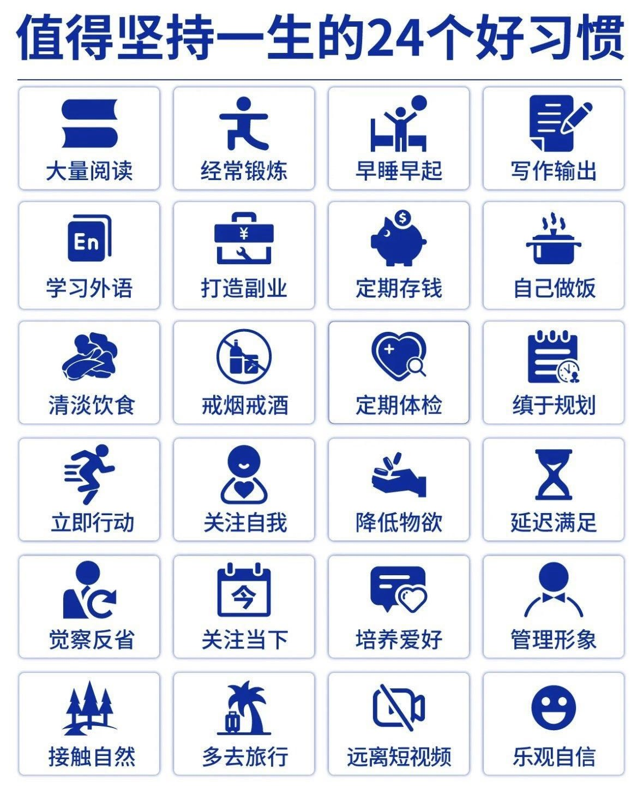
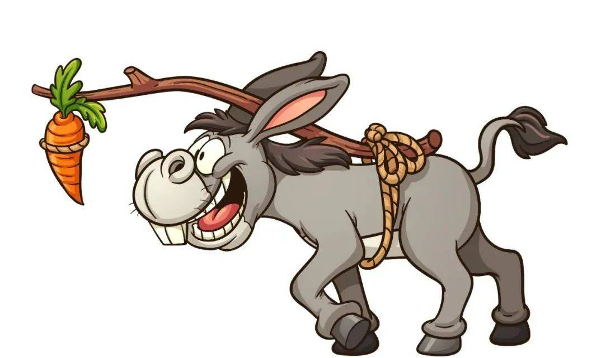

# 2024-2025

> [!note]
> 所谓的长大啊，到底是什么呢？

一个男孩来到了这个世界，自此一个名为人生的游戏正式开服。

2024年，这个游戏已经运行了21年，虽然一度差点停服，仍是跌跌撞撞地进入了第22个年头，但我还是没有搞清楚这个游戏的逻辑，无法果决，无法自信。

我多么期待长大，直到能用双翼为家人遮风挡雨，直到能自由地在这个世间行走，做自己想做的事。

可是我真的有自己想做的事吗？

如果把这一切交由我最厌恶的纯粹感性去决断，交由这些脑中的纷繁的反应去选择，交由这安安稳稳的柴米油盐和一生平凡，我愿意吗？

如今我已在燕园度过了3个学期，但我仍然是那个迷茫无知的我，不曾知晓何去何从。

我渴望与他人交互，来一场场没有目的的对话，到头来却只能缅怀小时候一个念头就能上门找别人玩的直率。

我感叹社交网络给人们带来的深刻而不可阻挡的关系变革，但有时还在询问自己到底什么是朋友的确切定义。

变化实在太快了，让我有种无所适从的感觉。我望着聊天软件动辄上百人的通讯录，却在最孤独的时候不知要给谁发消息。

我看着形形色色的人们在朋友圈中分享着他们的生活，却惧怕仅凭自己的喜好和冲动将自己的生活暴露在他人面前。

一张很好的图片，想要分享，但是却担心会被以异样的眼光观看。

我不清楚是不是只有我有这个想法，抑或是他人都很享受这种技术带来的社会关系革新。

到头来，人们还是在为这脑中那点兴奋性神经递质的奖励而活着，就像是用胡萝卜自我驱动的毛驴。

如果只是承认我就是被这根胡萝卜给吸引着前进的，我无法控制我周围的一切，那我是否还需要做出努力和相应的行为来改变我现在所处的状态？

你可能会认为心中的想法都是由特定的机制产生的，没有任何创新或者超出你的理解之外的东西。

那么我们能做什么呢？在这个步步为营的社会，在这个优绩主义横行的时代，作为一个三无人员（没钱没能力没地位），我们就应该袖手旁观吗？

不知道你的选择如何，我的选择是我不能接受全然地被排除在外，用尽我有限的智慧，不管是多么的微末和渺小，做出一点我的贡献。

我们很容易被受限于自己的专业，自己的社会身份，自己的文化水平，总觉得很多事只有少数人能做，我能做的仅仅是我所知的，所掌握的部分，而不是去打破这层并不实际存在的心里的隔膜，做一些在通俗意义上来说不务正业的事。

纵然你可能不愿意接受，尝试用尽你的力量和时间去开拓自己的道路和世界，但是仍旧不可避免地在别人的路上走着，仍旧是向着最为热门，最受人尊敬的方向走着。

我们还容易迷惑于思考与学习的权衡上，认为别人的想法已经过时了，但是其中的方法有其价值，但是学习这份方法的意义在哪里？

可以这么说，知识在其发挥作用之前都是无用的，这显然是一句废话，但是放在这个情形下，确实有其意义。

学习作为一种风险投资，他的风险确实不算大，仅仅是时间和精力而已，但是我们如何克服这一份学习路上的迷茫呢？

在没有获得任何的成果，或者是分红的时候，你如何坚持下去？

在此我要深刻检讨我之前的一种观念性的错误：

我一直认为文学性的东西是无用，是不能给社会带来任何进步的。

甚至或多或少的带有一种轻蔑的态度。这是多么错误的一种观念啊！

我忘却了我自身的情感和精神的需求，仅仅看到那些硬核的实在的东西，但这些并不能构成一个健全的人，我依然会为伟大的作品感动，依然会被宏大的游戏所折服。

甚至我所需要的这份信念，这份坚持走下去的支柱，来自于人与人之间的交互，来自于文字与艺术的陪伴。

否定这一切的过程，就是在否定我小时候的快乐经历，否定父母对我的爱，否定我宝贵的友谊。

人不能全然靠着那点有限的理性活着，否则就会陷入一种意义上的虚无，毕竟这份动机是最难以描述和解释的东西。

如果仅仅是以最优路径的角度分析问题，我会懊恼于为什么没有早些接触现在的这些知识，为什么浪费时间于零散而细碎的小事上，为什么要和朋友出去吃饭，为什么要恋爱，为什么要结婚，为什么要有自己的家庭，为什么要活着？

可是学习是为了什么呢？

无论是小时候所说的想要当一名科学家的稚嫩发言，还是初中对于人工智能的畅快幻想，这无一不是极具浪漫主义色彩的故事开头。

就算要用萝卜吊着自己走，也要时不时看看周围的花。

还有一些后悔的事，比方说一直抗拒写作这件事。

我每次感叹于他人的文字带给我的震撼，却不曾将自己的想法写下来，哪怕是以最拙劣的笔法。

在大学以来的，我的认知正在发生持续且剧烈的变革，我了解的越来越多，线头越来越乱，交织缠绕，让人不知所措。

我想，如果不写作的话，应该会很容易被别人所左右吧。

自己心里的想法都是零碎且残缺的，别人一说，带着这种从上到下的加工，我自然觉得是对的。

理所当然的凭此行走于世界中。那我如何是我呢？

仅仅知道学习和模仿的的人什么时候才会遇到他自己的蓝仙女呢？

还有一点可能会贯穿于整个大学生涯的一种恐惧：就业

当今平台化经济几乎击垮了实体经济，互联网科技企业与其他行业颇有一种一将功成万骨枯的感觉。

到头来这场经济的游戏只能是零和的，一人成功必定有其他人的失败。

选择很多，而我是一个典型的最大化决策者，我渴望能在我所能选择的部分中做到最好。大一all in转cs失败，现在回想起来我是不是太鲁莽了？

我害怕增加一年大学时光，自始至终就没有考虑过降转这一折中的路径。

随之而来的就是对于自身实力的严峻考验和极高的风险，因此结果也是能接受的，甚至可以说是不得不接受的。

而这条路只会越来越难。此外，我不知道互联网企业的增长点在哪里？

AI作为一门极其耗费资源的学科，注定是少数人的狂欢。那传统的计算机科学领域呢？

各种各样的互联网平台在我看来不会面临着大规模的用户增长，新功能的推出也变得越来越慢。那靠什么来维持这种高薪和庞大的体量呢？

LLM的广泛普及和跨平台开发框架比方说electron的逐渐热门将进一步降低程序员的门槛，使之不再是少数人的特权。

就算会有35岁的中年危机，但是从毕业到退休的时间仍有近10年，而新毕业的学生又能通过什么来与这些已经业务熟练出错较少的老登们竞争呢？低薪吗？那样只会引发新一轮的剧场效应。

如今的人们还有什么热爱能够奉献一生的东西吗？到头来还是顶不住社会的压力被迫走上了大多数人已经走上的路。

我们在追求什么？我们活着的意义是什么？

我感觉社会或者说是世界就是一个超大的黑箱，伸手不见五指，只是听见少数人的呼喊和炫耀。

看不清，但还是要往前走。

自从短视频平台深植大多数人的工作生活之后，我们已经被来自算法的神秘工具给深深洗脑了。

他有他的损失函数让他达到最优，而相对应的我们则会被由精确推荐的视频引发一次次的兴奋性神经递质的分泌。看似满足了无聊和空需，实则什么也没有得到。如果只是kill time的小把戏也就算了，可事实真的会有这么简单么？

那么，代价是什么呢？

随着算法获得的数据越来越多，加上神经网络的强大的拟合能力，人们性格中的卑劣的一部分被放大了，我们能看到更多人的生活，而这又只是一种幸存者偏差。那些自以为过的好的人看似随意的分享着自己的日常，而更多的人难道只是羡慕加上恭喜吗？

这种由各种各样的原因造成的不平等，缺少动机，怠于努力，坐享其成的风气只会带来更多的妒忌和邪恶。

20年前，扎克伯格的facebook以其无与伦比的传染力在短短几年时间内就席卷了全球。甚至有些地方连公路都没有，但是已经有了facebook。这种社交网络的根本性改变正如我之前所说的，让我难以适应。

但时间终究会告诉我们答案……

如今类似的社交平台已经大行其道，我们的社交方式已经在虚拟和现实中分不清界限。

这个世界上有太多土鸡变凤凰的故事，而唯有那些抹去其中的艰辛和痛苦的，更多的依赖于运气的部分才可以广泛的传播。

我相信，在一层层的神经网络中，在一个个被不断训练的参数里，我们的特征已经被深刻而准确的刻画出来了。

我们是它的环境，我们会改变，而他们也是我们的环境，他们也在改变。

我们中的觉醒者越来越少，我们中的独行者也越来越少，世界已经被科技所彻底的颠覆，新的问题也不断地暴露出来。

这可能颇有一种历史的车轮滚滚向前的气势。

于是我们寄希望于更加先进的科技，甚至于通用人工智能的出现。或许只有基于科学的无限的大脑才可以处理这种超出任何一个人的心理资源的问题。

于是便是漫长的等待与无尽的迷茫。

我想说我们是最迷茫的一代。

> [!note]
>
> - 意图生存，而太卑怯，结果就得死亡 *出自《华盖集·北京通信》*
> - 我独不解中国人何以于旧状况那么心平气和，于较新的机运就这么疾首蹙额；于已成之局那么委曲求全；于初兴之事就这么求全责备？*出自《这个与那个》一九二六年*
> - 倘若只看书，便变成书橱。 *出自《读书杂谈》*
>

