## 指令集体系结构 (ISA) 与逻辑设计

这部分内容介绍了计算机系统的软硬件接口（ISA）以及实现它的基本硬件构建块（逻辑设计）。

### 指令集体系结构 (ISA)

ISA（Instruction Set Architecture）是一种抽象层，位于编译器/操作系统和CPU 硬件设计之间。

**对上层（程序员视角）** ：它定义了机器如何被编程 。这包括：

- **处理器状态**：如寄存器、内存等。
- **指令**：如 `addq`, `pushq`, `ret` 等。
- **指令编码**：指令如何被编码为字节。

**对下层（硬件设计者视角）** ：它定义了需要构建什么样的硬件 。

- 处理器按顺序执行指令 。
- 硬件可以使用各种技巧来提高运行速度，例如同时执行多条指令。

**Y86-64 处理器状态**

Y86-64 是一种简化的、类似 x86-64 的 ISA，其处理器状态(也是**程序员可见状态**)包括：

- **程序寄存器 (RF):** 15 个64位寄存器（省略了 `%r15`），如 `%rax`, `%rsp` 等。
- **程序计数器 (PC):** 存储==下一条要执行指令==的地址 。
- **条件码 (CC):** ==3 个==单位标志位：`ZF` (零标志), `SF` (符号标志), `OF` (溢出标志) 。
- **程序状态 (Stat):** 指示程序是正常运行 (AOK) 还是出错。
  - AOK (All OK)
    - 正常操作 (Normal operation) 。这表示程序正在顺利执行，没有遇到任何错误。

  - HLT (Halt)
    - 遇到了 `halt` 指令 (Halt instruction encountered) 。这表示程序执行了 `halt` 指令，该指令的预期行为就是停止处理器。

  - ADR (Address)
    - 遇到了错误的地址 (Bad address encountered)(either instruction or data) 。这通常发生在程序试图访问一个无效的内存地址时，无论是在取指令阶段还是在读/写数据阶段。

  - INS (Instruction)
  - 遇到了无效指令 (Invalid instruction encountered) 。这发生在处理器试图执行一个不属于 Y86-64 指令集的字节编码时（例如，一个未定义的 `icode`）。

- **内存 (DMEM):** 一个大型的字节寻址存储阵列。

**Y86-64 指令集**

Y86-64 的指令编码比 x86-64 更简单，指令长度从 1 到 10 字节不等(==使用小端法==，==只有绝对寻址==) 。

- **数据传送:**
  - `irmovq V, rB` (立即数到寄存器)
  - `rrmovq rA, rB` (寄存器到寄存器) (也包括 `cmovXX` 条件传送 )
  - `rmmovq rA, D(rB)` (寄存器到内存)
  - `mrmovq D(rB), rA` (内存到寄存器)
    - `rB`==始终作为基址寄存器==,`D`==始终代表常量偏移量==
- **算术/逻辑操作:**
  - `OPq rA, rB` 。它们==会设置条件码== 。
    - `rB=rB op rA`
    - `addq`, `subq`, `andq`, `xorq`
    - 只能用于==寄存器==之间的运算
    - 对应`fn`从0到3
    - 没有单独设置条件码的指令.
- **栈操作:**
  - `pushq rA`: 将 `%rsp` 减 8，然后将 `rA` 的值存入 `%rsp` 指向的内存 。
    - 先动指针,再写数据
    - `push %rsp`会将 `%rsp` 递减 8，然后将 `%rsp` 递减前的==旧值==存入新的栈顶内存单元。
      - ==压入的是旧值==
  - `popq rA`: 从 `%rsp` 指向的内存读取值到 `rA`，然后将 `%rsp` 加 8 。
    - 先读数据,再动指针
    - `pop %rsp`等价于指令`mrmovq (%rsp), %rsp`
      - ==结果是栈里的值（覆盖了栈指针递增的效果）==
  - 栈还是由高到低存储,低位为栈顶
  - 二者占位`F`都在`rB`的位置,区别于`irmovq`占位在`rA`的位置
- **控制流:**
  - `jXX Dest` (条件跳转)
    - `jmp`,`jle`,`jl`,`je`,`jne`,`jge`,`jg`
      - 对应`fn`从0到6
    - 采用了`greater,less`,对应x86-64的有符号数
  - `call Dest`: 将返回地址压栈，并跳转到`Dest` 。
  - `ret`: 从栈中弹出返回地址，并跳转到该地址 。
- **其他:**
  - `nop` (无操作)
  - `halt` (停止指令执行)
    - x86有对应的命令,但是不能在用户态执行
    - 编码确保程序在遇到初始化为零的内存时会停止。

| **指令 (Instruction)** | **字节 0 (`icode:ifun`)** | **字节 1 (`rA:rB`)** | **字节 2-9 (常量)** | **总字节数** |
| ---------------------- | ------------------------- | -------------------- | ------------------- | ------------ |
| `halt`                 | `0:0`                     | (无)                 | (无)                | 1            |
| `nop`                  | `1:0`                     | (无)                 | (无)                | 1            |
| `cmovXX rA, rB`        | `2:fn`                    | `rA:rB`              | (无)                | 2            |
| `irmovq V, rB`         | `3:0`                     | `F:rB`               | `V`                 | 10           |
| `rmmovq rA, D(rB)`     | `4:0`                     | `rA:rB`              | `D`                 | 10           |
| `mrmovq D(rB), rA`     | `5:0`                     | `rA:rB`              | `D`                 | 10           |
| `OPq rA, rB`           | `6:fn`                    | `rA:rB`              | (无)                | 2            |
| `jXX Dest`             | `7:fn`                    | (无)                 | `Dest`              | 9            |
| `call Dest`            | `8:0`                     | (无)                 | `Dest`              | 9            |
| `ret`                  | `9:0`                     | (无)                 | (无)                | 1            |
| `pushq rA`             | `A:0`                     | `rA:F`               | (无)                | 2            |
| `popq rA`              | `B:0`                     | `rA:F`               | (无)                | 2            |

| **寄存器 (Register)** | **ID (16进制)** | **寄存器 (Register)** | **ID (16进制)** |
| --------------------- | --------------- | --------------------- | --------------- |
| `%rax`                | 0               | `%r8`                 | 8               |
| `%rcx`                | 1               | `%r9`                 | 9               |
| `%rdx`                | 2               | `%r10`                | A               |
| `%rbx`                | 3               | `%r11`                | B               |
| `%rsp`                | 4               | `%r12`                | C               |
| `%rbp`                | 5               | `%r13`                | D               |
| `%rsi`                | 6               | `%r14`                | E               |
| `%rdi`                | 7               | No Register           | F               |

**CISC vs. RISC**

- **CISC (复杂指令集计算机)** ：
  - **栈导向**：使用栈传递参数和保存程序计数器。
  - **内存访问**：算术指令**可以直接访问内存**（如 `addq %rax, 12(%rbx,%rcx,8)`），这需要复杂的地址计算以及内存读写。
  - **条件码**：作为算术和逻辑指令的副作用来设置 。

- **RISC (精简指令集计算机)** ：
  - **指令**：更少、更简单的指令 。
  - **寄存器导向** ：拥有更多寄存器（如 MIPS 有 32 个），用于参数传递、返回值和临时变量 。
  - **内存访问**：**只有 load 和 store 指令可以访问内存**（类似于 Y86-64 的 `mrmovq`/`rmmovq`）。
  - **无条件码** ：测试指令在寄存器中返回 0 或 1 。

### 逻辑设计 (Logic Design)

硬件的三个基本需求：**通信**（传递值）、**计算** 和 **存储** 。 所有这些都用比特 (0 和 1) 来表示 。

- **数字信号** ：我们使用电压阈值从连续的电压信号中提取离散的 0 和 1 值 。这使得电路设计可以简单、小巧、快速，并且不易受噪声影响。
- **逻辑门** ：计算布尔函数 。
  - `AND` (与): `out = a && b`
  - `OR` (或): `out = a || b`
  - `NOT` (非): `out = !a`
- 逻辑门的输出会持续响应输入的变化（但有微小延迟）。

**组合逻辑电路 (Combinational Logic)**

组合逻辑电路由逻辑门组成，构成一个**无环网络** (Acyclic Network) 。其输出是输入的布尔函数，并随着输入的改变而持续改变（经过==一定延迟==后）。

**HCL (硬件控制语言)**

HCL 是一种非常简单的硬件描述语言，用于描述处理器控制逻辑。

- **HCL 示例：**
  - **Bit equal** ：`bool eq = (a && b) || (!a && !b)` 。

  - **Word equal** ：`bool Eq = (A == B)` 。这是对两个64位字的所有对应位执行“位相等”操作。
    - 这是由多个位相等并起来实现的

  - **MUX** ：用于根据控制信号 `s` 选择数据输入。
    - **位 MUX** ：`bool out = (s && a) || (!s && b)` 。 (注：HCL 表达式中 `s=1` 选 `a`，`s=0` 选 `b` )。

    - **字 MUX** ：HCL 中使用**Case expression** 。
      - ==注意冒号和分号,其中分号每行都有==,用#来进行注释
      - 用1代表默认情况的匹配

      ```Terraform
      int Out = [
          s : A;  # 如果 s 为真，输出 A
          1 : B;  # 否则 (1 始终为真)，输出 B
      ];
      ```

  - **ALU (算术逻辑单元)** ：
    - 是一个组合逻辑电路 。
    - 根据控制信号（如 0, 1, 2, 3）选择执行哪种计算（如 `X+Y`, `X-Y`, `X & Y`, `X ^ Y`）。
    - 同时也会计算出条件码（OF, ZF, CF）。

**时序逻辑与存储 (Sequential Logic)**

- 寄存器 (Registers)
  - **功能**：存储一个数据字 。
  - **注意**：这里的“寄存器”是指导线上的==硬件存储元件==，不同于 ISA 层面程序员看到的“程序寄存器”（如 `%rax`）。
  - **结构**：由多个**边沿触发锁存器 (edge-triggered latches)** 集合而成 。
    - 比方说**D型触发器**

  - **操作**：在**时钟 (Clock) 的上升沿 (rising edge)** 时，加载输入数据。在其他时间，它充当输入和输出之间的屏障，保持输出稳定 。

- 随机访问存储器 (RAM)
  - **功能**：存储多个数据字 。通过**地址**输入来指定读取或写入哪个字 。(比如**虚拟内存**和**寄存器文件**)
    - **寄存器文件 (Register File)** ：
      - 是一种**特殊**的 RAM，用于保存程序寄存器（`%rax`, `%rsp` 等）。
      - 可以理解为寄存器的集合
      - 使用寄存器 ID（如 0-E）作为地址 。
      - 通常有**多个端口**（两个读端口 A/B，一个写端口 W），允许在一个周期内读写多个字 。
  - **RAM 时序 (Timing)** ：
    - **读取 (Reading)**：**类似组合逻辑** 。当地址输入（`srcA`, `srcB`）改变后，数据输出（`valA`, `valB`）会（在一定延迟后）相应改变。
    - **写入 (Writing)**：**类似寄存器** 。只有在**时钟上升沿**时，输入数据（`valW`）才会被写入到目标地址（`dstW`）。

---

## 顺序处理器实现 (SEQ)

SEQ (sequential) 是一种非实际的、严格按顺序执行指令的 Y86-64 处理器实现。

SEQ 处理器由两类基本硬件模块构成：

- **组合逻辑 (Combinational Logic):**
  - 功能：根据当前输入计算布尔函数，并持续响应输入变化 。
  - 示例：ALU (算术逻辑单元) 、MUX (多路选择器) 。
- **存储元件 (Storage Elements):**
  - 功能：存储数据位 。
  - 示例：寄存器文件 (Register file) 、条件码寄存器 (CC) 、程序计数器 (PC) 。
  - 特性：存储元件（如寄存器）仅在**时钟上升沿**才加载新值 。

### SEQ 阶段

SEQ 的执行过程被划分为六个阶段。==一条指令必须在下一个时钟周期开始前完成所有这六个阶段== ：

1. **取指 (Fetch)**

2. **译码 (Decode)**

3. **执行 (Execute)**

4. **访存 (Memory)**

5. **写回 (Write Back)**

6. **PC 更新 (PC Update)**

> [!warning]
>
> 对于SEQ,转移预测没有意义,因为本身就是顺序执行的

### 指令执行示例

> [!tip]
>
> 得会默写,结合电路理解,对于不平凡的地方理解其设计的思想

1\. 算术/逻辑操作 (`OPq rA, rB`)

| 阶段           | 计算                                                                                              |
| :------------- | :------------------------------------------------------------------------------------------------ |
| **Fetch**      | $icode:ifun \leftarrow M_{1}[PC]$ <br> $rA:rB \leftarrow M_{1}[PC+1]$ <br> $valP \leftarrow PC+2$ |
| **Decode**     | $valA \leftarrow R[rA]$ <br> $valB \leftarrow R[rB]$                                              |
| **Execute**    | $valE \leftarrow valB \text{ OP } valA$ <br> $\text{Set CC}$==别忘了这个,不常见==                 |
| **Memory**     |                                                                                                   |
| **Write back** | $R[rB] \leftarrow valE$                                                                           |
| **PC update**  | $PC \leftarrow valP$                                                                              |

2\. 写内存 (`rmmovq rA, D(rB)`)

| 阶段           | 计算                                                                                                                                  |
| :------------- | :------------------------------------------------------------------------------------------------------------------------------------ |
| **Fetch**      | $icode:ifun \leftarrow M_{1}[PC]$ <br> $rA:rB \leftarrow M_{1}[PC+1]$ <br> $valC \leftarrow M_{8}[PC+2]$ <br> $valP \leftarrow PC+10$ |
| **Decode**     | $valA \leftarrow R[rA]$ ==aluA可以使用两个值作为输入valC和rA== <br> $valB \leftarrow R[rB]$==aluB只有rB这一个输入==                   |
| **Execute**    | $valE \leftarrow valB + valC$                                                                                                         |
| **Memory**     | $M_{8}[valE] \leftarrow valA$                                                                                                         |
| **Write back** |                                                                                                                                       |
| **PC update**  | $PC \leftarrow valP$                                                                                                                  |

3\. 出栈 (`popq rA`)

| 阶段           | 计算                                                                                              |
| :------------- | :------------------------------------------------------------------------------------------------ |
| **Fetch**      | $icode:ifun \leftarrow M_{1}[PC]$ <br> $rA:rB \leftarrow M_{1}[PC+1]$ <br> $valP \leftarrow PC+2$ |
| **Decode**     | $valA \leftarrow R[\%rsp]$ <br> $valB \leftarrow R[\%rsp]$                                        |
| **Execute**    | $valE \leftarrow valB + 8$                                                                        |
| **Memory**     | $valM \leftarrow M_{8}[valA]$                                                                     |
| **Write back** | $R[\%rsp] \leftarrow valE$ <br> $R[rA] \leftarrow valM$                                           |
| **PC update**  | $PC \leftarrow valP$                                                                              |

4\. 条件跳转 (`jxx Dest`)

| 阶段           | 计算                                                                                             |
| :------------- | :----------------------------------------------------------------------------------------------- |
| **Fetch**      | $icode:ifun \leftarrow M_{1}[PC]$ <br> $valC \leftarrow M_{8}[PC+1]$ <br> $valP \leftarrow PC+9$ |
| **Decode**     |                                                                                                  |
| **Execute**    | $Cnd \leftarrow \text{Cond(CC, ifun)}$==和CMOVXX一致,都需要使用==                                |
| **Memory**     |                                                                                                  |
| **Write back** |                                                                                                  |
| **PC update**  | $PC \leftarrow Cnd ? valC : valP$                                                                |

5\. 函数调用 (`call Dest`)

| 阶段           | 计算                                                                                             |
| :------------- | :----------------------------------------------------------------------------------------------- |
| **Fetch**      | $icode:ifun \leftarrow M_{1}[PC]$ <br> $valC \leftarrow M_{8}[PC+1]$ <br> $valP \leftarrow PC+9$ |
| **Decode**     | $valB \leftarrow R[\%rsp]$                                                                       |
| **Execute**    | $valE \leftarrow valB + (-8)$==使用加负8减少电路复杂度,而不需要选择使用加法还是减法==            |
| **Memory**     | $M_{8}[valE] \leftarrow valP$                                                                    |
| **Write back** | $R[\%rsp] \leftarrow valE$                                                                       |
| **PC update**  | $PC \leftarrow valC$                                                                             |

6\. 函数返回 (`ret`)

| 阶段           | 计算                                                       |
| :------------- | :--------------------------------------------------------- |
| **Fetch**      | $icode:ifun \leftarrow M_{1}[PC]$                          |
| **Decode**     | $valA \leftarrow R[\%rsp]$ <br> $valB \leftarrow R[\%rsp]$ |
| **Execute**    | $valE \leftarrow valB + 8$                                 |
| **Memory**     | $valM \leftarrow M_{8}[valA]$                              |
| **Write back** | $R[\%rsp] \leftarrow valE$                                 |
| **PC update**  | $PC \leftarrow valM$                                       |

7\. 条件传送(`cmovxx`)

| **阶段**       | **计算**                                                                                          |
| -------------- | ------------------------------------------------------------------------------------------------- |
| **Fetch**      | $icode:ifun \leftarrow M_{1}[PC]$ <br> $rA:rB \leftarrow M_{1}[PC+1]$ <br> $valP \leftarrow PC+2$ |
| **Decode**     | $valA \leftarrow R[rA]$                                                                           |
| **Execute**    | $valE \leftarrow 0 + valA$ ==(ALU 将 valA 透传给 valE)== <br> $Cnd \leftarrow Cond(CC, ifun)$     |
| **Memory**     |                                                                                                   |
| **Write back** | $if (Cnd) R[rB] \leftarrow valE$                                                                  |
| **PC update**  | $PC \leftarrow valP$                                                                              |

8\. `irmovq`

> [!note]
>
> 使用透传的原因是因为电路中不能跨阶段使用valA或者valB(结合seq电路来理解)
>
> 跨过多个阶段的信号应该只有Cnd这样的信号
>
> 透传主要替换了aluB的值,对于aluA的值不替换

| **阶段**       | **计算**                                                                                                                       |
| -------------- | ------------------------------------------------------------------------------------------------------------------------------ |
| **Fetch**      | $icode:ifun \leftarrow M_{1}[PC]$ <br>$rA:rB \leftarrow M_{1}[PC+1]$ <br>$valC\leftarrow M_8[PC+2]$<br>$valP \leftarrow PC+10$ |
| **Decode**     |                                                                                                                                |
| **Execute**    | $valE \leftarrow 0 + valC$ ==(ALU 将 valC透传给 valE)==                                                                        |
| **Memory**     |                                                                                                                                |
| **Write back** | $R[rB] \leftarrow valE$                                                                                                        |
| **PC update**  | $PC \leftarrow valP$                                                                                                           |

9\. `rrmovq`

| **阶段**       | **计算**                                                                                        |
| -------------- | ----------------------------------------------------------------------------------------------- |
| **Fetch**      | $icode:ifun \leftarrow M_{1}[PC]$ <br>$rA:rB \leftarrow M_{1}[PC+1]$ <br>$valP \leftarrow PC+2$ |
| **Decode**     | $valA \leftarrow R[rA]$                                                                         |
| **Execute**    | $valE \leftarrow 0 + valA$ ==(ALU 将 valA透传给 valE)==                                         |
| **Memory**     |                                                                                                 |
| **Write back** | $R[rB] \leftarrow valE$                                                                         |
| **PC update**  | $PC \leftarrow valP$                                                                            |

### SEQ 控制逻辑实现 (HCL)

> [!note]
>
> 蓝色为硬件,灰色是信号

- 取指阶段
  - 

  - 从指令内存中读取指令字节 。
    - 解析出 `icode` (指令代码) 和 `ifun` (功能代码) 。
    - 根据`icode`得到的信号`need_regids`和`need_valC`确定是否读取 `rA`, `rB` (寄存器指示符) 和`valC` (立即数或地址) 。

  - 计算下一条指令的地址 `valP` 。

  - ```Terraform
      # 信号发生
      word icode = [
          imem_error: INOP; # ADR
          1: imem_icode;
      ];
      word ifun = [
          imem_error: FNONE; # ADR
          1: imem_ifun;
      ];
      # 指令是否合法
      bool instr_valid = icode in
       { INOP, IHALT, IRRMOVQ, IIRMOVQ, IRMMOVQ, IMRMOVQ, IOPQ, IJXX, ICALL, IRET, IPUSHQ, IPOPQ };
      # 是否需要寄存器
      bool need_regids =icode in
       { IRRMOVQ, IOPQ, IPUSHQ, IPOPQ, IIRMOVQ, IRMMOVQ, IMRMOVQ };
       # 需要注意的是,ICOMVXX的icode与IRRMOVQ是一致的,所以在这没有加入ICOMVXX
      # 是否需要立即数
      bool need_valC = icode in
       {IIRMOVQ, IRMMOVQ, IMRMOVQ, IJXX, ICALL};
    ```

- 译码和写回阶段
  - 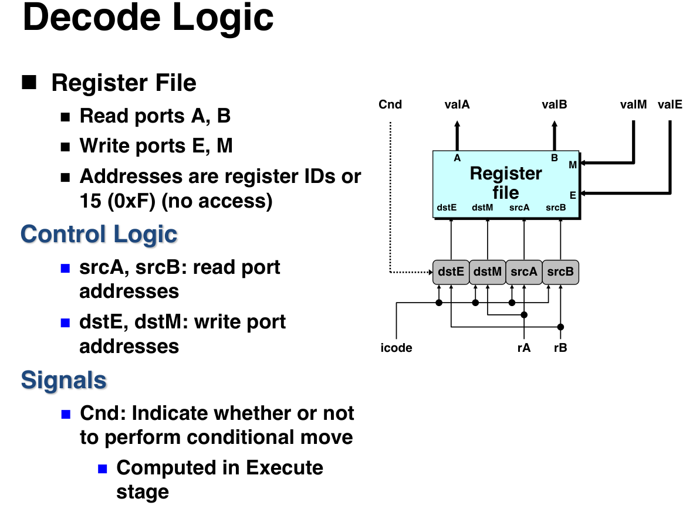

  - 如果是**译码**
    - 从寄存器文件读取操作数 。读取的值送入 `valA` 和 `valB` 。

  - 如果是**写回**
    - 将 ALU 的结果 (`valE`) 或内存的结果 (`valM`) 写回寄存器文件 。

    - > [!warning]
      >
      > 这里的写口必须一个来自于valM,一个来自于valE,而不是其他阶段
      >
      > 这也是为什么如果rrmovq指令需要经由E阶段透传的原因

  - ```Terraform
      # 信号发生

      # 哪个寄存器会被用于源A,D阶段
      word srcA = [
          icode in { IRRMOVQ, IRMMOVQ, IOPQ, IPUSHQ } : rA;
          icode in { IPOPQ, IRET } : RRSP; # 用于访问栈顶的值
          1 : RNONE;
      ];
      # 哪个寄存器会被用于源B,D阶段
      word srcB = [
          icode in {IMRMOVQ, IRMMOVQ, IOPQ} : rB;
          icode in {IPOPQ, IPUSH, ICALL, IRET} : RRSP; # 用于计算栈顶指针的新值
          1 : RNONE;
      ];
      # 哪个寄存器会被用于E阶段的目的寄存器,W阶段
      word dstE = [
          icode in { IRRMOVQ } && Cnd : rB; # 指代ICOMVXX,这是特殊的情况
          icode in { IIRMOVQ, IOPQ} : rB;
          icode in { IPUSHQ, IPOPQ, ICALL, IRET } : RRSP; # 更新栈顶指针
          1 : RNONE;
      ];
      # 哪个寄存器会被用于M阶段的目的寄存器,W阶段
      word dstM = [
          icode in {IMRMOVQ, IPOPQ} : rA;
          1 : RNONE;
      ];
    ```

- Execute 逻辑:
  - 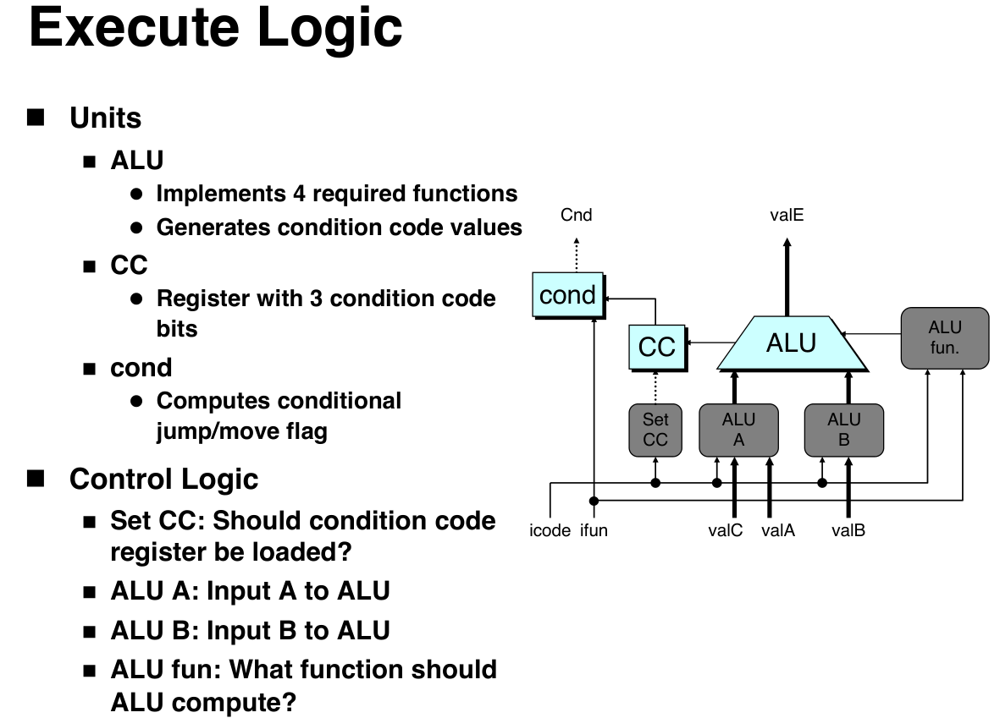

  - ALU 根据 `ifun` 和指令类型执行操作（计算值或有效地址）。

  - 结果为 `valE` 。

  - 对于算术/逻辑操作，设置条件码 (CC) 。

  - 对于条件跳转/传送，计算 `Cnd` 标志 。

  - ```Terraform
    int aluA = [
        icode in { IRRMOVQ, IOPQ } : valA; # 在IRRMOVQ中,valA要透传
        icode in { IIRMOVQ, IRMMOVQ, IMRMOVQ } : valC;
        icode in { ICALL, IPUSHQ } : -8; # 栈顶指针减
        icode in { IRET, IPOPQ } : 8; # 栈顶指针加
    ];
    int aluB = [
        icode in {IIRMOVQ, IRRMOVQ} : 0; # 为了aluA的透传,IIRMOVQ是透传valC,IRRMOVQ是透传valA
        icode in {IRMMOVQ, IOPQ, IMRMOVQ, IPUSHQ, ICALL, IPOPQ, IRET}: valB;
    ];
    int alufun = [
        icode == IOPQ : ifun; # 真实运算
        1 : ALUADD; # 只使用加法实现栈顶指针的变化,透传等等,简化了硬件设计
    ];
    # 条件码是否被更新
    bool set_cc = icode in { IOPQ };
    ```

- Memory 逻辑:
  - 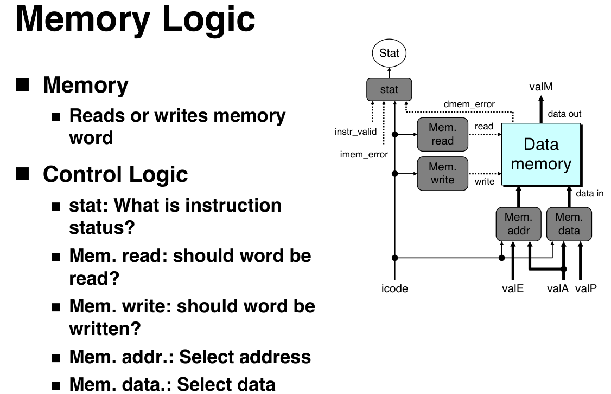

  - 从数据内存读取数据（结果为 `valM` ）或向数据内存写入数据 。

  - > [!warning]
    >
    > 这里的写入数据源可以是valP也可以是valA
    >
    > 写入地址可以是valE可以是valA

  - ```Terraform
    # 信号发生

    # 状态码
    int Stat = [
        imem_error || dmem_error : SADR;
        !instr_valid: SINS;
        icode == IHALT : SHLT;
        1 : SAOK;
    ];
    # 注意栈是在访存阶段访问的,是在内存里的
    bool mem_read = icode in { IMRMOVQ, IPOPQ, IRET };
    bool mem_write = icode in {IRMMOVQ, IPUSHQ, ICALL};
    # 写入和读取的地址,根据mem_read和mem_write来
    int mem_addr = [
        icode in { IRMMOVQ, IPUSHQ, ICALL, IMRMOVQ } : valE;
        icode in { IPOPQ, IRET } : valA;
    ];
    int mem_data = [
        icode in {IRMMOVQ, IPUSHQ} : valA;
        icode == ICALL : valP;
    ];
    ```

- PC Update 逻辑:
  - 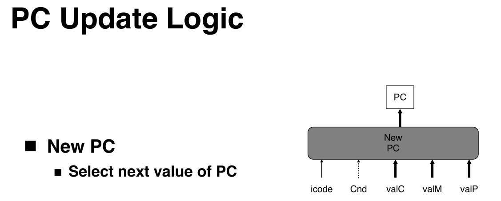

  - 将 PC 更新为下一条指令的地址 。

  - ```Terraform
    int new_pc = [
        icode == ICALL : valC;
        icode == IJXX && Cnd : valC;
        icode == IRET : valM;
        1 : valP;
    ];
    ```

### SEQ 运行与总结

**SEQ 运行机制**

SEQ 的操作是**时钟同步**的。

1. 在一个时钟周期开始时，状态元件 (PC, CC, 寄存器, 内存) 保持旧值 。
   - 原则:从不回读(处理器不需要为了完成一条指令去读由该指令更新了的状态)
     - 例子:`pushq ra`中不是先更新%rsp之后,再用更新之后的%rsp写数据,而是算出valE,一方面在W作为%rsp的更新值,一方面在M作为内存的写入地址
2. 组合逻辑 (ALU, 控制逻辑等) 根据这些旧的状态值进行计算 。
3. 信号会传播通过整个电路，从取指、译码、执行、访存到写回和 PC 更新逻辑 。
4. 在时钟周期的**结尾**（下一个时钟上升沿），所有状态元件**同时**更新为组合逻辑计算出的新值 。
   - 不影响下一条指令的执行


**总结与局限性**

- **实现:** SEQ 的设计很简单，它将每条指令视为一系列简单的步骤 ，并为所有指令类型遵循一个通用的流程 。
- **局限性:** SEQ **速度太慢**，不实用 。在一个时钟周期内，信号必须传播过所有阶段（指令内存、寄存器文件、ALU、数据内存）。这要求时钟周期必须非常长，以适应最慢的那条指令（例如 `call` 或 `ret`）的完整执行路径 。

## 流水线处理器实现 (PIPE)

流水线 (Pipelining) 是一种通过重叠执行多条指令来提高吞吐量（Throughput）的技术 。

### 流水线概念

- **类比:** 就像洗车流水线 ，将整个过程（指令执行）分解为多个独立的阶段 。
- **性能:** 假设一个操作需要 300ps，寄存器延迟 20ps。
  - _非流水线:_ 延迟 320ps，吞吐量 3.12 GIPS 。
  - _3级流水线:_ 每级 100ps+20ps 寄存器延迟 。总延迟增加到 3 \* 120 = 360ps ，但吞吐量提高到 8.33 GIPS （受限于最慢阶段）。
  - ==CPI== (Cycles Per Instruction) 的含义是“平均每条指令需要多少个时钟周期”。
    - 对于非超标量流水线,$CPI<=1$

> [!note]
>
> 吞吐量为1秒内能够处理的指令数目,与单级延迟有关
>
> 总延迟等于各个级延迟之和
>
> 流水线的目的是提高吞吐量,略微增加延迟
>
> 单位:GIPS,`1,000,000,000`,即每秒10亿次运算
>
> $1s=10^9ns=10^{12}ps$
>
> $1GIPS =10^9IPS$
>
> $$
> Throughput=1/Delay\\
> latency=\sum{Delay}
> $$

### 流水线的局限性

1. **流水段延迟不均 (Nonuniform Delays)：**
   - 流水线的时钟周期必须迁就==最慢==的那个阶段 。
2. **寄存器开销 (Register Overhead)：**
   - 为了在阶段间传递数据，流水线引入了额外的**流水线寄存器** 。
   - 随着流水线深度的增加（例如从3级到6级），寄存器延迟（如20ps）占整个时钟周期的比例会越来越高（例如从 16.67% 增加到 28.57%） 。
     - 极限吞吐量为$1/Delay_{reg}$
   - 现代处理器通过非常深的流水线来获得高速度 。但是过深反而会收益下降,因为难以充满流水线且总延迟增加.
     - 处理器设计就是在“更高的时钟频率”（来自更深的流水线）和“更低的每时钟周期指令数（IPC）”（因为流水线冒险导致的惩罚更严重）之间寻找最佳平衡点。

### Y86-64 的五级流水线

**从 SEQ 到 SEQ+**

- **SEQ 硬件** 是一种顺序实现 ，一次只处理一条指令 。其阶段包括：取指(Fetch), 译码(Decode), 执行(Execute), 访存(Memory), 写回(Write back), PC更新(PC) 。
- **SEQ+ 硬件** 仍然是顺序实现 ，但它将 PC 阶段移到了最开始 。PC 阶段的任务是根据 **上一条** 指令计算的结果来选择 **当前** 指令的 PC 地址 。

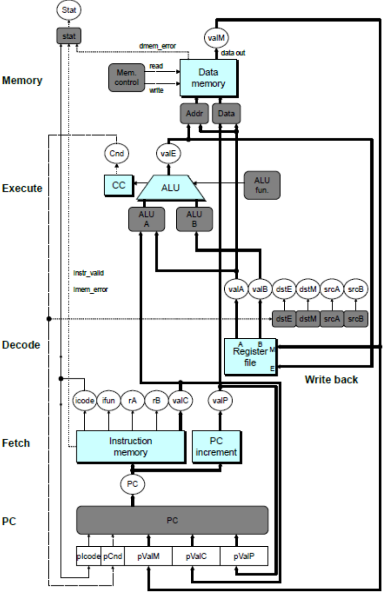

**插入流水线寄存器**

- 为了实现流水线，我们在 SEQ+ 的各个阶段之间插入寄存器 。
- 这些寄存器（F, D, E, M, W） 用于在时钟周期之间传递指令执行的中间值和状态 。

**PIPE- 的 5 个流水线阶段**

1. 取指 (Fetch, F)

- **输入**：
  - `PC`：来自程序计数器寄存器。
- **主要计算**：
  - 从指令内存中读取指令字节（`icode`, `ifun`, `rA`, `rB`, `valC`）。
  - 计算 `valP`，即 `PC` 加上已读取指令的长度。
  - **PC 预测**：根据指令（`icode`）和立即数（`valC`），_预测_下一条指令的地址。
    - 对于 `jXX`，总是预测为“跳转”，即预测地址为 `valC`。
    - 对于 `call` 和 `jmp`，预测地址为 `valC`。
    - 对于其他指令，预测地址为 `valP` 。
- **输出（到 F/D 寄存器）**：
  - `icode`, `ifun`, `rA`, `rB`, `valC`, `valP`。（这些是指令的“原始数据”，需要被传递下去）。
- **状态更新**：
  - `PC` 寄存器**立即**使用“预测”的地址进行更新，以便下一个周期能取回（可能错误的）指令。

1. 译码 (Decode, D)

- **输入（来自 D 寄存器）**：
  - `icode`, `ifun`, `rA`, `rB`。
- **主要计算**：
  - 从寄存器文件读取操作数。
  - 根据 `icode` 确定 `srcA` 和 `srcB`（要读取的寄存器ID），例如 `popq` 需要读取 `RRSP` (%rsp) 作为 `srcA` 和 `srcB`。
  - **数据转发（Forwarding）**：此阶段的逻辑必须检查后续阶段（E, M, W）是否正在计算 `srcA` 或 `srcB` 所需的值。如果存在数据冒险，它会从 E, M, W 阶段“旁路”（Bypass）获取结果，而不是使用刚从寄存器文件读出的旧值。
- **输出（到 D/E 寄存器）**：
  - `icode`, `ifun`（传递）。
  - `valC`（从 F 阶段一路透传过来）。
  - `valA`, `valB`（经过转发逻辑修正后的操作数值,==注意valP复用了valA的通路==）。
  - `dstE`, `dstM`（根据 `icode` 确定的目标寄存器ID，例如 `popq` 的 `dstM` 是 `rA` ）。

1. 执行 (Execute, E)

- **输入（来自 E 寄存器）**：
  - `icode`, `ifun`, `valA`, `valB`, `valC`。
- **主要计算**：
  - ALU 根据控制信号 `alufun`（例如 `IOPQ` 会使用 `ifun`，其他则默认为加法 `ALUADD`）执行运算。
  - ALU 的输入 `aluA` 和 `aluB` 由控制逻辑选择 。例如，`irmovq` 的 `aluA` 是 `valC`，`aluB` 是 `0` ；栈操作的 `aluA` 是 `-8` 或 `8`。
  - ALU 的输出即为 `valE`。
  - 如果指令是 `OPq`，则根据 ALU 结果设置条件码 (CC)。
  - **分支预测检查**：计算条件跳转/传送所需的 `Cnd` 标志。如果 `icode` 是 `jXX` 且 `Cnd` 标志与预测不符（例如，预测跳转但 `Cnd` 为 false），则检测到“分支预测错误”。
- **输出（到 E/M 寄存器）**：
  - `icode`（传递）。
  - `valE`（ALU 的计算结果）。
  - `valA`（**透传**：例如 `rmmovq` 和 `pushq` 在“访存”阶段需要用 `valA` 作为要写入的数据）。
  - `valP`（**透传**：例如 `call` 在“访存”阶段需要用 `valP` 作为返回地址写入栈中 ）。
  - `dstE`, `dstM`（目标寄存器 ID，一路透传）。
  - `Cnd`（条件标志，传递）。

1. 访存 (Memory, M)

- **输入（来自 M 寄存器）**：
  - `icode`, `valE`, `valA`, `valP`, `dstE`, `dstM`。
- **主要计算**：
  - 根据 `icode` 决定是读内存还是写内存。
  - **地址选择**：控制逻辑（`mem_addr`）选择访存地址。通常是 `valE`（ALU 计算出的有效地址），但对于 `popq` 和 `ret` 则是 `valA`（旧的 `%rsp` 值）。
  - **数据选择**：控制逻辑（`mem_data`）选择要写入的数据。
    - 对于 `rmmovq` 和 `pushq`，它选择 `valA`（在 D 阶段读取，一路透传至此）。
    - 对于 `call`，它选择 `valP`（在 F 阶段计算，一路透传至此）。
  - 如果执行读操作（如 `mrmovq`, `popq`, `ret`），从内存读出的值被存入 `valM`。
- **输出（到 M/W 寄存器）**：
  - `icode`（传递）。
  - `valE`（ALU 结果，一路透传）。
  - `valM`（从内存读出的值）。
  - `dstE`, `dstM`（目标寄存器 ID，一路透传）。

1. 写回 (Write Back, W)

- **输入（来自 W 寄存器）**：
  - `icode`, `valE`, `valM`, `dstE`, `dstM`。
- **主要计算**：
  - 将结果写回寄存器文件。
  - 控制逻辑根据 `dstE` 和 `dstM` 决定写入哪个寄存器。
  - 控制逻辑决定写入哪个值：
    - 写入 `valE`：对于 `irmovq`, `rrmovq/cmovXX`, `OPq` 以及栈操作（`push/pop/call/ret`）对 `%rsp` 的更新。
    - 写入 `valM`：对于 `mrmovq` 和 `popq`（写入 `rA`）。
- **输出**：
  - 无。（结果直接写入状态元件——寄存器文件）。
- **状态更新**：
  - **PC 更新**：如果 `ret` 指令到达 W 阶段，`W_valM`（即返回地址）会被用来更新 `PC`，这是解决 `ret` 控制冒险的最后一步。

> [!note]
>
> 变量命名规则
>
> 大写字母为前缀的在流水线寄存器里,小写字母为前缀的在对应阶段里

**没有转发旁路的五级流水线**

- **逻辑功能相似**： 流水线中的五个阶段（取指、译码、执行、访存、写回）所要完成的**核心计算任务**，与 SEQ 处理器中对应的各个步骤是相同的 。
- **数据来源改变**
  - **在 SEQ 中**：整个处理器是一个巨大的组合逻辑电路 。在一个时钟周期内，信号必须从头到尾（从取指到PC更新）**直接传播**过去 。
  - **在 PIPE 中**：为了将这个长周期拆分，我们在每个阶段之间插入了**流水线寄存器** (Pipeline Registers) 。这些寄存器（如 F, D, E, M）的作用就是“锁存和传递中间结果” 。
    - 信号不再跨层流动,而是由流水线寄存器做解耦合
    - 因此，`Execute` 阶段的逻辑不再是_直接_从 `Decode` 阶段的逻辑获取输入，而是从 **`D` 流水线寄存器**（它保存了_上一个周期_ `Decode` 阶段的计算结果）获取输入。


**有转发旁路的五级流水线**


### 反馈路径与 PC 预测

- 流水线中存在 **反馈路径 (Feedback Paths)** ，用于处理依赖关系。例如：
  - **寄存器更新：** W 阶段的结果需要反馈到 D 阶段的寄存器文件 。
  - **分支信息：** E 或 M 阶段计算出的跳转结果需要反馈给 F 阶段的 PC 选择逻辑 。

- **PC 预测 (PC Prediction):**
  - **原因：** 在 F 阶段刚完成时，我们没有足够的时间来可靠地确定下一条指令的地址（例如，等待条件跳转的结果） 。
  - **策略：** 我们 **猜测** 下一条指令的 PC ，并在预测错误时进行恢复 。
  - **预测规则：**
    - **普通指令：** 预测 `valP` (顺序下一条) 。
    - **Call 和无条件 Jmp：** 预测 `valC` (跳转目标) 。
    - **条件 Jmp：** **预测分支会发生 (Predict Taken)**，即预测 `valC` 。
    - **Return (ret)：** 不预测 。

- **预测错误恢复 (Recovery):**
  - **跳转预测错误：** 当指令在 M 阶段时，我们获知了

    `M_Cnd` (条件) 。如果预测错误（例如，预测跳转但实际不跳转），我们使用 `M_valA` (即 `valP`) 作为正确的 PC 。

  - **`ret` 指令：** 当 `ret` 指令在 W 阶段时，我们获知了

    `W_valM` (返回地址) ，并用它作为新的 PC。

### 各阶段HCL逻辑

```Terraform
################# Fetch Stage ###################################
# F寄存器
# predPC


## 应该在哪个地址取指令,局部信号, f_pc -> Instruction Memory
word f_pc = [
 # 分支预测错误。在 M_valA (即 valP) 处取指, 只有在E阶段完成之后才能得到Cnd,然后存入M_Cnd
 M_icode == IJXX && !M_Cnd : M_valA;
 # RET 指令完成, 在M阶段完成读取数据,存在了W_valM中
 W_icode == IRET : W_valM;
 # 默认情况：使用 PC 的预测值
 1 : F_predPC;
];

## 确定所取指令的 icode, f_icode -> D_icode
word f_icode = [
 imem_error : INOP;
 1: imem_icode;
];

# 确定 ifun, f_ifun -> D_ifun
word f_ifun = [
 imem_error : FNONE;
 1: imem_ifun;
];

# 指令是否有效？局部信号
bool instr_valid = f_icode in
 { INOP, IHALT, IRRMOVQ, IIRMOVQ, IRMMOVQ, IMRMOVQ, IOPQ, IJXX, ICALL, IRET, IPUSHQ, IPOPQ };

# 确定所取指令的状态码,都以S为首字母,SADR,SHLT,SINS,SAOK, f_stat -> D_stat
word f_stat = [
 imem_error: SADR;
 !instr_valid : SINS;
 f_icode == IHALT : SHLT;
 1 : SAOK;
];

# 所取指令是否需要寄存器ID字节？局部信号, need_regids -> Instruction Memory
bool need_regids =
 f_icode in { IRRMOVQ, IOPQ, IPUSHQ, IPOPQ, IIRMOVQ, IRMMOVQ, IMRMOVQ };

# 所取指令是否需要立即数字？局部信号, need_valC -> Instruction Memory
bool need_valC =
 f_icode in { IIRMOVQ, IRMMOVQ, IMRMOVQ, IJXX, ICALL };

# 预测 PC 的下一个值, f_predPC -> F_predPC
word f_predPC = [
 f_icode in { IJXX, ICALL } : f_valC; # always take
 1 : f_valP;
];

# 其余的D寄存器中的值来源于Instruction Memory
```

```Terraform
################ Decode Stage ######################################
# D寄存器
# stat,icode,ifun,rA,rB,valC,valP

## 哪个寄存器应该用作源 A？
word d_srcA = [
 D_icode in { IRRMOVQ, IRMMOVQ, IOPQ, IPUSHQ } : D_rA;
 D_icode in { IPOPQ, IRET } : RRSP;
 1 : RNONE; # 不需要寄存器
];

## 哪个寄存器应该用作源 B？
word d_srcB = [
 D_icode in { IOPQ, IRMMOVQ, IMRMOVQ } : D_rB;
 D_icode in { IPUSHQ, IPOPQ, ICALL, IRET } : RRSP;
 1 : RNONE; # 不需要寄存器
];

## 哪个寄存器应该用作 E (执行) 阶段的目的地？
word d_dstE = [
 D_icode in { IRRMOVQ, IIRMOVQ, IOPQ} : D_rB;
 D_icode in { IPUSHQ, IPOPQ, ICALL, IRET } : RRSP;
 1 : RNONE; # 不写入任何寄存器
];

## 哪个寄存器应该用作 M (访存) 阶段的目的地？
word d_dstM = [
 D_icode in { IMRMOVQ, IPOPQ } : D_rA;
 1 : RNONE; # 不写入任何寄存器
];

## A 的值应该是什么？
## 将 valA 转发到译码阶段,注意转发的优先级,M阶段更近,转发近的
# e优先于M,dstM优先于dstE
word d_valA = [
 # 旁路：用于 ICALL 和 IJXX（这是一个特殊的复用）
 D_icode in { ICALL, IJXX } : D_valP;
 # 优先级 1：从 E 阶段转发 ALU 结果
 d_srcA == e_dstE : e_valE;
 # 优先级 2：从 M 阶段转发内存结果,loaduse插入1个nop
 d_srcA == M_dstM : m_valM;
 # 优先级 3：从 M 阶段转发 ALU 结果, 即正常的RAW中间插入1个nop会出现
 d_srcA == M_dstE : M_valE;
 # 优先级 4：从 W 阶段转发内存结果,loaduse插入2个nop
 d_srcA == W_dstM : W_valM;
 # 优先级 5：从 W 阶段转发 ALU 结果, 即正常的RAW中间插入2个nop会出现
 d_srcA == W_dstE : W_valE;
 # 默认（无转发）：使用从寄存器文件读出的值
 1 : d_rvalA;
];

word d_valB = [
 d_srcB == e_dstE : e_valE; # 从执行阶段转发 valE

 d_srcB == M_dstM : m_valM; # 从访存阶段转发 valM
 d_srcB == M_dstE : M_valE; # 从访存阶段转发 valE

 d_srcB == W_dstM : W_valM; # 从写回阶段转发 valM
 d_srcB == W_dstE : W_valE; # 从写回阶段转发 valE

 1 : d_rvalB; # 使用从寄存器文件读取的值
];

```

```Terraform
################ Execute Stage #####################################
# E寄存器
# stat,icode,ifun,valC,valB,valA,dstE,dstM,srcA,srcB

## 选择 ALU 的输入 A
word aluA = [
 E_icode in { IRRMOVQ, IOPQ } : E_valA;
 E_icode in { IIRMOVQ, IRMMOVQ, IMRMOVQ } : E_valC;
 E_icode in { ICALL, IPUSHQ } : -8;
 E_icode in { IRET, IPOPQ } : 8;
 # 其他指令不需要 ALU
];

## 选择 ALU 的输入 B
word aluB = [
 E_icode in { IRMMOVQ, IMRMOVQ, IOPQ, ICALL,
 IPUSHQ, IRET, IPOPQ } : E_valB;
 E_icode in { IRRMOVQ, IIRMOVQ } : 0;
 # 其他指令不需要 ALU
];

## 设置 ALU 功能
word alufun = [
 E_icode == IOPQ : E_ifun;
 1 : ALUADD;
];

## 是否应该更新条件码？
bool set_cc = E_icode == IOPQ &&
 !m_stat in { SADR, SINS, SHLT } && !W_stat in { SADR, SINS, SHLT }; # 仅在正常操作期间才改变状态

## 在执行阶段传递 valA
word e_valA = E_valA; # 将 valA 传递通过此阶段

## 如果条件传送 (cmovXX) 未执行，则将 dstE 设为 RNONE
word e_dstE = [
 E_icode == IRRMOVQ && !e_Cnd : RNONE;
 1 : E_dstE;
];
```

```Terraform
################ Memory Stage ######################################
# M 寄存器
# stat,icode,Cnd,valE,valA,dstE,dstM
## 选择内存地址
word mem_addr = [
 M_icode in { IRMMOVQ, IPUSHQ, ICALL, IMRMOVQ } : M_valE;
 M_icode in { IPOPQ, IRET } : M_valA;
 # 其他指令不需要地址
];

## 设置内存读控制信号
bool mem_read = M_icode in { IMRMOVQ, IPOPQ, IRET };

## 设置内存写控制信号
bool mem_write = M_icode in { IRMMOVQ, IPUSHQ, ICALL };

## 更新状态
word m_stat = [
 dmem_error : SADR;
 1 : M_stat;
];
```

```Terraform
################ Write Back Stage ###################################

## 设置 E 端口（ALU写回）的寄存器 ID
word w_dstE = W_dstE;

## 设置 E 端口（ALU写回）的值
word w_valE = W_valE;

## 设置 M 端口（内存写回）的寄存器 ID
word w_dstM = W_dstM;

## 设置 M 端口（内存写回）的值
word w_valM = W_valM;

## 更新处理器状态
word Stat = [
 W_stat == SBUB : SAOK; # 代表出现了一个气泡,但这是正常状态
 1 : W_stat;
];
```

```Terraform
################ Pipeline Register Control #########################
## 1. 定义主要的冒险 (Hazard) 条件

# 注意,RAW冒险已经被转发所解决

# 加载/使用 冒险 (Load/Use Hazard)
# 当 E 阶段是 load 指令 (mrmovq/popq)
# 并且 D 阶段的指令需要使用 load 的目标寄存器时
bool load_use_hazard = E_icode in { IMRMOVQ, IPOPQ } && E_dstM in { d_srcA, d_srcB };

# 分支预测错误 (Mispredicted Branch)
# 当 E 阶段是条件跳转 (jXX)，且条件不满足 (预测跳转，但实际不跳转)
bool mispredicted_branch = (E_icode == IJXX && !e_Cnd);

# RET 冒险 (Return Hazard)
# 当 ret 指令正在通过 D, E, 或 M 阶段时
# 注意:这里E和M的icode中还会出现IRET,只是冲刷了后面的错误指令(下一个上升沿)
# 在D插入一个bubble,D的气泡到E了,再在D插入一个气泡,直到M阶段读取到真实地址,整个过程会多次插入气泡,直到得到真实地址,冒险解除
bool ret_hazard = IRET in { D_icode, E_icode, M_icode };


## 2. 根据冒险条件设置 暂停(stall) 和 气泡(bubble)

# 是否应该在 F 流水线寄存器中插入暂停(stall)或气泡(bubble)？
bool F_bubble = 0;
bool F_stall =
    # 加载/使用 冒险或 RET 冒险都会暂停取指
    load_use_hazard || ret_hazard;

# 是否应该在 D 流水线寄存器中插入暂停(stall)或气泡(bubble)？
bool D_stall =
    # 加载/使用 冒险会暂停译码
    load_use_hazard;

bool D_bubble =
    # 分支预测错误会注入气泡
    mispredicted_branch ||
    # RET 冒险也会注入气泡
    # 但前提是没有更高优先级的 加载/使用 冒险 (它会导致 stall,高优先级是因为它要保存状态)
    (!load_use_hazard && ret_hazard);

# 是否应该在 E 流水线寄存器中插入暂停(stall)或气泡(bubble)？
bool E_stall = 0;
bool E_bubble =
    # 分支预测错误 或 加载/使用 冒险
    # 都会在 E 阶段注入气泡
    mispredicted_branch || load_use_hazard;

# 是否应该在 M 流水线寄存器中插入暂停(stall)或气泡(bubble)？
bool M_stall = 0;
# 一旦异常通过访存阶段，就开始注入气泡
bool M_bubble = m_stat in { SADR, SINS, SHLT } || W_stat in { SADR, SINS, SHLT };

# 是否应该在 W 流水线寄存器中插入暂停(stall)或气泡(bubble)？
bool W_stall = W_stat in { SADR, SINS, SHLT };
bool W_bubble = 0;
```

**优先级**

- 转发逻辑
  - 的HCL 列表的**顺序**定义了优先级。它总是优先选择“最新”的值（E 阶段的值优先于 M 阶段，M 阶段优先于 W 阶段），这确保了串行语义的正确性 。
  - dstM优先于dstE

  - ```asm
    # d_valA的例子
    popq %rsp         # 生产者 (将内存中的值 M[rsp] 写入 rsp)
    nop               # 间隔
    popq %rax         # 使用者 (需要读取 rsp 作为 d_srcA, 用于M阶段的访存)
    # d_valB的例子
    popq %rsp         # 生产者 (将内存中的值 M[rsp] 写入 rsp)
    nop               # 间隔
    pushq %rax        # 使用者 (需要读取 rsp 才能写入 M[rsp-8])
    ```

  - `d_srcA == M_dstM` 必须优先于 `d_srcA == M_dstE`，这是为了专门处理 `popq %rsp` 这条指令。该指令同时将 `M_dstM` 和 `M_dstE` 都设为 `%rsp`，而只有 `m_valM` 才是正确的值,`m_valE`是在这个特殊情况下无用的`%rsp+8`(但是正常的pop是有用的)。
    - 对于`d_srcB`同理

### 流水线冒险 (Hazards)

**异常处理**

- bubble
  - 在下一个上升沿,把流水线寄存器中的`icode`改为`nop`,`stat`改为`SBUB`
- stall
  - 暂停流水线寄存器在时钟上升沿加载新的数据
- stall优先于bubble
  - stall保持了指令的完整新,由于不存在跨阶段的耦合,一个指令的一个阶段的初始态完全由流水线寄存器来决定,如果注入bubble则会清除状态,纠正控制流
  - 主动保留状态的情况下,stall优先级更高

流水线虽然提高了吞吐率，但也带来了新的问题：**冒险 (Hazards)**。当下一条指令需要上一条指令尚未准备好的结果时，就会发生冒险。主要分为两类：

**控制冒险 (Control Hazards)**

**问题：** 当处理器遇到**分支 (Jump)、调用 (Call) 或返回 (Return)** 指令时，它无法在“取指”阶段立即知道下一条指令的真正地址。

**解决方案：PC 预测**：我们必须_猜测_下一条指令的地址。

**Y86-64 的预测策略 ：**

- **非控制流指令：** 预测下一条指令地址为 `valP` (PC + 指令长度)。这总是正确的 。
- **Call 和 Jmp (无条件)：** 预测地址为 `valC` (指令中的目标地址)。这总是正确的 。
- **Jxx (条件跳转)：** **总是预测为“跳转” (Predict Taken)**，即预测 `valC` 。(预测正确率约 60% )。
- **Ret (返回)：** **不进行预测** 。

**处理预测错误：**

- 分支预测错误
  - **场景：** `jne target`，我们预测“跳转”，但实际上条件不满足（ZF=1），应该执行下一条指令（Fall Through）。

  - **检测：** 在 **Execute (E) 阶段**，ALU 计算条件码，发现预测错误（例如，`E_icode == IJXX` 且 `!e_Cnd`）。
    - **恢复：**
      1. 在 E 阶段检测到错误后，下一周期**取消** (Cancel) 已经进入 D 阶段和 E 阶段的 _错误_ 指令（即从 `target` 地址取来的指令）。
      2. 通过向 D 和 E 阶段注入 **`bubble` (气泡)** 来实现取消 。
      3. F 阶段开始从正确的“Fall Through”地址（`M_valA`） 重新取指。
    - **代价：** ==浪费了 2 个时钟周期==

- 返回指令
  - **场景：** `ret` 指令。

  - **问题：** 我们不预测 `ret`，所以 F 阶段会错误地取回 `ret` 之后的指令 。而 `ret` 的真正返回地址（存储在栈中）直到 **Write-back (W) 阶段** 才通过 `W_valM` 知道 。
    - **恢复：**
      1. 当 `ret` 指令处于 D, E, 或 M 阶段时 ，**暂停 (Stall)** F 阶段，使其停止取新指令 。
      2. 同时，向 D 阶段注入 `bubble`，以冲刷掉 F 阶段错误取来的指令 。
      3. 当 `ret` 到达 W 阶段，`W_valM` 准备就绪，F 阶段的暂停被释放 ，F 阶段从 `W_valM` 提供的正确地址取指。
    - **代价：** ==浪费了 3 个时钟周期==

**数据冒险 (Data Hazards)**

**问题：** 当一条指令需要读取的寄存器，其值正在被前一条尚未完成的指令修改时，会发生**写后读 (Read-After-Write, RAW)** 依赖 。

**示例 ：**

```assembly
irmovq $10, %rdx
irmovq $3, %rax
addq %rdx, %rax
```

`addq` 在 D 阶段需要读 `%rdx` 和 `%rax`，但此时 `irmovq` 可能还未将 10 和 3 写入寄存器。

**解决方案 1：暂停 (Stalling)**

- **方法：** 如果检测到 `addq` (在D阶段) 所需的源寄存器 (`srcA`, `srcB`) 正在被 E, M 或 W 阶段的指令作为目标寄存器 (`dstE`, `dstM`) 写入 ，则**暂停** D 阶段的 `addq` 指令 。
- 同时，向 E 阶段注入 `bubble` 。
- **代价：** 上述例子需要插入 3 个 `nop` (或等效的 3 个 `bubble`) 才能正确执行 。这非常慢。

**解决方案 2：数据转发 (Data Forwarding / Bypass)**

- **观察：** 我们不必等待 `irmovq` 到 W 阶段。当它在 E 阶段（ALU计算出结果 `e_valE=10`）或 M 阶段时，我们_已经_知道那个值了 。
- **方法：** 添加“旁路” (Bypass Paths) 硬件 。将 E, M, W 阶段计算出的结果 (`valE`, `valM`) **直接** 转发回 D 阶段，作为 ALU 的输入 。
- **示例 ：**
  - `addq` 在 D 阶段 (Cycle 4)。
  - `irmovq $3, %rax` 在 E 阶段。转发 `e_valE=3` 作为 `valB` 。
  - `irmovq $10, %rdx` 在 M 阶段。转发 `M_valE=10` 作为 `valA` 。
- **结果：** `addq` 无需任何暂停即可正确执行。
- **转发优先级：** 如果多个阶段（E, M, W）都要写入同一个寄存器（例如 `%rax`），为了保证串行语义，应优先转发**最早**（即程序顺序中最新）的那个阶段的值 (E \> M \> W) 。


> [!note]
>
> 这个图说明了至少要3个周期才可以不用转发
>
> 不管是Load Use Hizard还是 Read After Write Hizard

**特例：加载/使用冒险 (Load/Use Hazard)**

- **转发的局限性：** 转发并不能解决所有数据冒险。

- **场景 ：**

  ```assembly
  mrmovq 0(%rdx), %rax  # Load
  addq %rbx, %rax       # Use
  ```

- **问题：** `addq` 在 D 阶段 (Cycle 7) _结束时_ 需要 `%rax` 的值 。但是 `mrmovq`（Load指令）要到 M 阶段 (Cycle 8) 才能从内存中_读出_数据 (`m_valM`) 。数据准备得太晚，无法及时转发。

- **解决方案：Stall + Forward**
  1. **检测：** 硬件检测到 E 阶段是一条 Load 指令 (`IMRMOVQ` 或 `IPOPQ`)，并且其目标寄存器 (`E_dstM`) 是 D 阶段指令的源寄存器 (`d_srcA` 或 `d_srcB`) 。
  2. **动作：**
      - **暂停 (Stall)** F 阶段和 D 阶段一周期 。
      - 向 E 阶段注入一个 **`bubble`** 。
  3. **下一周期 (Cycle 8)：**
      - `mrmovq` (Load) 进入 M 阶段，并成功读出 `m_valM=3` 。
      - `addq` (Use) 仍停留在 D 阶段 。
      - 此时，`m_valM=3` 可以被成功**转发**给 `addq` 的 `valB` 。

- **代价：** ==浪费了 1 个时钟周期==

### 复杂的控制逻辑组合

当多种冒险同时发生时，控制逻辑必须正确处理。

- **组合 A：** Mispredicted Branch (E) + `ret` (D) 。
  - 处理：按 Mispredicted Branch 处理 (Stall F, Bubble D, Bubble E)。`ret` 指令被 `bubble` 冲刷掉 。
  - 因为ret指令还没得到目的地址(现在在d阶段),mispred在e阶段
- **组合 B：** Load/Use (Load in E, Use in D) + `ret` (D) 。
  - **冲突：** `ret` 触发 D 阶段 `bubble`，而 Load/Use 触发 D 阶段 `stall` 。
  - **解决方案：** **Load/Use hazard 具有更高优先级** 。
  - **修正逻辑：** 只有在 _没有_ Load/Use 冒险时，`ret` 才能触发 `D_bubble` 。
  - **正确动作：** F 阶段 `stall`，D 阶段 `stall`，E 阶段 `bubble` 。

> [!note]
>
> ==流水线周期数计算==
>
> - 总周期 = (执行的指令总数) + (所有惩罚周期数) + (最后一条指令的流水线排空周期数)
>   - 流水线排空周期在五级流水线中为4
>   - 惩罚周期数为冒险和预测错误带来的停顿周期数
>     - loaduse==1
>     - mis-pred==2
>     - ret==3
>       - 代码结尾的`ret`没有惩罚周期

---

## 程序优化

> CPE: 每周期处理元素数目

**优化编译器及其局限性**

- **编译器的作用**：将程序高效地映射到机器代码 ，包括：
  - 寄存器分配
  - 代码选择和排序（调度）
  - 消除死代码
  - 消除微小的效率“低下”
- **编译器的局限**：
  - **无法改进渐进效率**：选择最佳算法是程序员的责任 。
  - **受“优化妨碍因素”限制** ：编译器必须极端保守 。它不能为了优化而改变程序的任何行为 。
  - **分析范围有限**：大多数分析仅限于单个过程（函数）内 ，因为全程序分析代价过高 。
  - **依赖静态信息**：编译器很难预测程序的运行时输入 。

### **通用优化**

这些是编译器（或程序员）应该执行的基本优化（机器无关）。

**代码移动 (Code Motion)**

- **目标**：减少计算的执行频率 。
- **关键应用**：将**循环不变量**（在循环内结果不会改变的计算）移到循环体外 。
- **示例**：
  - **优化前**：`n*i` 在 `j` 循环中被反复计算。

    ```c
    for (j=0; j<n; j++)
      a[n*i + j] = b[j];
    ```

  - **优化后**：`n*i` 作为循环不变量被移出。

    ```c
    int ni = n*i;
    for (j=0; j<n; j++)
      a[ni + j] = b[j];
    ```

**强度削减 (Strength Reduction)**

- **目标**：用更“轻量级”（更快）的操作替换“昂贵”（更慢）的操作 。
- **乘法 -\> 移位**
  - `16 * x` 可以被替换为 `x << 4` 。
  - （_注意_：这取决于机器，在现代CPU上，整数乘法可能非常快，例如 Nehalem 架构上仅需 3 个周期 ）。

- **乘法 -\> 加法**
  - 在循环中识别乘积序列 。
  - **优化前**：

    ```c
    for (i=0; i<n; i++) {
      int ni = n*i;
      for (j=0; j<n; j++)
        a[ni + j] = ...;
    }
    ```

  - **优化后**：将外层循环的乘法 `n*i` 替换为累加。

    ```c
    int ni = 0;
    for (i=0; i<n; i++) {
      for (j=0; j<n; j++)
        a[ni + j] = ...;
      ni += n;
    }
    ```

**共享公共子表达式 (Share Common Subexpressions)**

- **目标**：复用表达式中相同的部分，只计算一次 。

- **示例**：
  - **优化前**：计算 `i*n`、`(i-1)*n` 和 `(i+1)*n`，总共 3 次乘法 。

    ```c
    up = val[(i-1)*n + j];
    down = val[(i+1)*n + j];
    left = val[i*n + j-1];
    right = val[i*n + j+1];
    ```

  - **优化后**：只计算 `i*n` 一次，总共 1 次乘法 。

    ```c
    long inj = i*n + j;
    up = val[inj - n];
    down = val[inj + n];
    left = val[inj - 1];
    right = val[inj + 1];
    ```

- **示例：冒泡排序 (Bubblesort)**
  - 通过一系列的消除冗余计算（子表达式）、强度削减和代码移动 。
  - **优化前**：内循环有 25 条指令 。
  - **优化后**：内循环减少到 9 条指令 。这些都是机器无关的优化 。

### 编译器自动优化

**优化妨碍因素 (Optimization Blockers)**

编译器为什么不能自动完成所有优化？因为它必须保守。

**妨碍因素 \#1：过程调用 (Procedure Calls)**

- **问题**：编译器将过程调用视为“黑盒” 。
- **示例**：在一个 `for` 循环的循环条件中调用 `strlen` 。

  ```c
  void lower(char *s) {
    for (i=0; i < strlen(s); i++) ...
  }
  ```

- **性能灾难**：`strlen` 必须每次都遍历整个字符串来寻找 `\0` 。如果字符串长度为 N，`lower` 函数的复杂度变成了 $O(N^2)$ ，导致性能曲线呈二次方增长 。
- **编译器为何无能**：编译器无法知道 `strlen` 是否有**副作用** (side effects) 。
  - 例如，`strlen` 会不会修改某个全局变量？
  - `lower` 函数内部会不会修改字符串（比如添加 `\0`），导致 `strlen` 的返回值在每次迭代中都不同？
  - 编译器无法排除这些可能性，因此**不敢**将 `strlen(s)` 移出循环。
- **解决方案**：**程序员手动进行代码移动**。

  ```c
  void lower2(char *s) {
    size_t len = strlen(s);
    for (i=0; i < len; i++) ...
  }
  ```

  - 这个简单的改动将性能提升为 $O(N)$（线性）。
- **补救措施**：使用 `inline` 函数（GCC 在 `-O1` 时会尝试），或者自己手动移出代码 。

**妨碍因素 \#2：内存别名 (Memory Aliasing)**

- **定义**：两个不同的内存引用（例如，两个指针）指向了**同一块**内存地址 。这在 C 语言中因为可以直接操作地址而很容易发生 。
- **示例**：`sum_rows1` 函数，它将中间结果 `b[i]` 存在内存中。

  ```c
  void sum_rows1(double *a, double *b, long n) {
    for (i=0; i<n; i++) {
      b[i] = 0;
      for (j=0; j<n; j++)
        b[i] += a[i*n + j];  // 每次循环都访问 b[i]
    }
  }
  ```

- **性能问题**：内循环的汇编代码在每次迭代时，都包含一次内存**加载**、一次加法和一次内存**存储** 。
- **编译器为何无能**：编译器必须假设 `a` 和 `b` 两个指针**可能指向同一区域**（即内存别名）。
  - 例如，如果程序员调用 `sum_rows1(A, A+3, 3)` ，那么 `b[i]` 和 `a` 数组就会重叠。
  - 在这种情况下，对 `b[i]` 的每次存储都可能会影响下一次循环中从 `a[...]` 读取的值。因此编译器**不敢**省略掉`b[i]`的中间存储。
- **解决方案**：**程序员引入一个临时局部变量**。

  ```c
  void sum_rows2(double *a, double *b, long n) {
    for (i=0; i<n; i++) {
      double val = 0;  // 1. 使用局部变量
      for (j=0; j<n; j++)
        val += a[i*n + j];  // 2. 累加到局部变量
      b[i] = val;  // 3. 循环结束后才写回内存
    }
  }
  ```

  - **效果**：`val` 通常会被分配到寄存器中。内循环现在只有一次加法 ，完全消除了内存存储 。这是在告诉编译器“这个累加器没有别名问题” 。

### **循环展开**

> [!warning]
>
> 浮点数均不可用
>
> 浮点数不满足结合律,会大数吞小数

> [!note]
>
> **指令级并行 (Instruction-Level Parallelism, ILP)**
>
> 这是针对现代 CPU 架构（机器相关）的优化。
>
> - **现代 CPU 设计**：
>   - **超标量 (Superscalar)**：每个时钟周期可以执行多条指令 。
>   - **多功能单元**：CPU 有多个独立的计算单元（如：4个整数单元、2个FP乘法单元、1个FP加法单元等）。
>   - **流水线 (Pipelined)**：指令执行被分为多个阶段 。
>     - **延迟 (Latency)**：完成一条指令所需的总时钟周期（例如，FP乘法需要 5 周期）。
>     - **发射时间 (Cycles/Issue)**：两个同类指令间的最小时钟间隔（例如，FP乘法为 1 周期）。
> - **瓶颈：数据依赖 (Sequential Dependency)**
>   - 考虑 `combine4`（已移除妨碍因素），它的核心是 `t = t OP d[i]` 。
>   - 这产生了一个**顺序依赖**：下一次迭代 (`t = t OP d[i+1]`) 必须等待上一次迭代 (`t = t OP d[i]`) **完全完成**（即等待整个延迟）。
>   - 因此，`combine4` 的性能（CPE，每元素周期）受限于操作的**延迟** ：
>     - 整数乘法：CPE = 3.01 (延迟 3)
>     - 双精度FP乘法：CPE = 5.01 (延迟 5)

- **目标**：通过打破顺序依赖，更好地利用CPU的多个功能单元。
- **方法 1：循环展开 (2x1)**
  - `x = (x OP d[i]) OP d[i+1];`
  - **效果**：对==整数加法==有帮助，但对乘法无效 。因为 `( ... ) OP d[i+1]` 仍然依赖于 `x OP d[i]` 的结果 。

- **方法 2：循环展开 + 重新组合 (Reassociation)**
  - `x = x OP (d[i] OP d[i+1]);`
  - **效果**：**这打破了关键的依赖链** 。`(d[i] OP d[i+1])` 的计算可以与上一次迭代的 `x OP ...` **并行执行** 。
  - 性能提升近 2 倍（CPE 接近 延迟/2）：
    - 整数乘法：3.01 -\> 1.51
    - 双精度FP乘法：5.01 -\> 2.51
  - （_注意_：这可能改变浮点数(FP)的计算结果，因为FP运算不满足结合律 ）。
- **方法 3：循环展开 + 独立累加器 (2x2)**
  - 使用两个（或更多）累加器：

    ```c
    x0 = x0 OP d[i];
    x1 = x1 OP d[i+1];
    ```

  - **效果**：这创造了两个**完全独立**的计算流 。CPU的超标量硬件可以同时执行这两个流。
  - 性能与“重新组合”一样好 ，并且对整数加法更好（因为它利用了多个加载单元）。

**性能的真正极限：吞吐量 (Throughput)**

- 通过使用 K 个累加器和 L 次展开 ，我们可以接近 CPU 功能单元的**吞吐量**限制 。

> [!note]
>
> ### 1.**$K$ (累加器数量)**：这是**最重要**的
>
> - **原理**：$K$ 决定了您有多少条**独立的计算链** 。
> - **目的**：解决**延迟（Latency）**瓶颈。如果一个计算（如浮点乘法）有 5 个周期的延迟 3，您至少需要 5 条独立的计算链（$K=5$），才能“隐藏”这 5 个周期的延迟，使 CPU 的_一个_功能单元（例如，那个乘法器）保持 100% 繁忙。
> - 如果 CPU 有 $C$ 个功能单元（例如 2 个乘法器）4，您就需要 $K = C \times \text{Latency}$ 个累加器才能使_所有_功能单元饱和。
>
> - **$L$ (循环展开次数)**：
>   - **原理**：$L$ 决定了您在一次循环迭代中执行多少次操作。
>   - **目的**：它主要有两个好处：
>     1. **减少循环开销**：减少 `i++` 和 `jmp` 指令的执行次数，从而减少了这些指令占用的 CPU 资源。
>     2. **配合 $K$**：它为 $K$ 个累加器提供了““原料””（数据）。例如， $K=2$ 的累加器和 $L=2$ 的展开 (2x2) 是一个常见的配对。
>
> ### 2. $K$ (累加器数量) 的限制
>
> $K$ 主要受限于**寄存器数量**。
>
> 1. **寄存器压力 (Register Pressure)**：
>    - 每一个累加器（`x0`, `x1`, ..., `xK`）都需要占用一个 CPU 寄存器
>    - CPU 的寄存器数量是有限的（例如，x86-64 只有 16 个通用寄存器）。
>    - 如果 $K$ 太大，编译器会耗尽所有寄存器。
> 2. **寄存器溢出 (Register Spilling)**：
>    - 一旦寄存器耗尽，编译器被迫将“多余”的累加器**存回内存（栈）**中。
>    - 这会带来灾难性的性能后果：优化本想避免内存访问，结果却因为 $K$ 太大而引入了更多的内存访问，导致性能急剧下降。
>
> ### 3. $L$ (循环展开次数) 的限制
>
> $L$ 主要受限于**指令缓存 (I-Cache)大小** 和**寄存器压力**。
>
> 1. **指令缓存大小**：
>    - `L` 次循环展开意味着循环体（loop body）的代码量会膨胀 $L$ 倍。
>    - CPU 依赖一个非常小的 L1 指令缓存（i-cache）来高速获取指令。
>    - 如果 $L$ 过大，展开后的循环体可能无法再装入 L1 i-cache。
>    - 这会导致**“i-cache 未命中”**，CPU 必须去 L2 缓存甚至主存中获取指令，这会完全抵消循环展开带来的好处。
> 2. **增加寄存器压力**：
>    - $L$ 次展开不仅需要 $K$ 个寄存器存累加器，还需要额外的寄存器来保存 $L$ 个数据指针或加载的 $L$ 个值（`d[i]`, `d[i+1]`...）。
>    - 因此，过大的 $L$ 和 $K$ 会“合谋”导致寄存器溢出。
>
> 总结：
>
> $K$ 和 $L$ 的值必须在硬件的“甜点区”（Sweet Spot）内。您需要足够的 $K$ 来隐藏延迟并利用所有功能单元，但又不能多到导致寄存器溢出。您需要足够的 $L$ 来减少循环开销并配合 $K$，但又不能大到导致指令缓存未命中。

- **延迟**限制了单个计算链的速度，而**吞吐量**限制了所有并行单元的总速度 。
  - 一个程序需要N个某种运算,处理器有C个该种计算的处理单元,这些单元的发射时间为I
    - **$I$（发射时间）**：定义为 $Cycles/Issue$ 。它代表_一个_功能单元（例如，一个乘法器）两次连续启动之间的最小时钟间隔。

  - $T=N\times \frac{I}{C}$
  - 需要通过并行均摊I的时间成本

- **SIMD (AVX)**：使用向量指令 (如 AVX2) ，CPU 可以在 32 字节的 YMM 寄存器上 并行操作多个数据（例如 4 个双精度浮点数 ），进一步榨干性能 。

### 分支预测

- **问题**：CPU 的指令控制单元必须在执行单元之前提前取指 。当遇到条件分支（如 `jge`）时，它不知道下一条指令在哪里（是跳转，还是顺序执行？）。
- **解决方案：分支预测**
  1. CPU **猜测**一个分支（例如，"预测跳转"）。
  2. 它**投机地** (speculatively) 开始取指并执行预测路径上的指令 （但不会提交结果，即不修改寄存器或内存）。
- **分支预测正确**：
  - 例如，一个循环 `for (i=0; i<100; i++)`，`i++` 后的 `jne` 分支会 99 次被正确地预测为“跳转”。
  - **结果**：CPU 流水线保持填充，没有性能损失。
- **分支预测错误 (Misprediction)**：
  - 例如，在 `i=100` 时，CPU 仍然"预测跳转"，但实际结果是“不跳转”。
  - **结果**：CPU 必须**清空**流水线中所有投机执行的错误指令 ，然后重新从正确的分支（`jne` 的下一条指令）加载指令 。
  - **代价**：**非常昂贵**。一次错误预测会浪费多个时钟周期 ，严重影响性能。
- **启示**：
  - 现代 CPU 的预测准确率极高（\>95%）。
  - 程序员应**避免无法预测的**分支 （例如，在循环中处理完全随机的数据,可以考虑先排序再处理）。

## 存储器与高速缓存

### 内存抽象与总线结构

**传统的 CPU 与内存连接结构**

- **总线 (Bus):** 是由一组并行导线构成的集合，用于传输地址、数据和控制信号 。总线通常由多个设备共享 。
- **结构组件:**
  - **CPU 芯片 (CPU chip):** 包含寄存器文件 (Register file)、ALU 和总线接口 (Bus interface) 。
  - **系统总线 (System bus):** 连接 CPU 和 I/O 桥 。
  - **I/O 桥 (I/O bridge):** 连接系统总线和内存总线 。
  - **内存总线 (Memory bus):** 连接 I/O 桥和主存 。
  - **主存 (Main memory):**
- 
- **内存读事务 (Load 操作)**
  - 以 `movq A, %rax`（从地址 A 加载数据到 %rax 寄存器）为例 ：
    1. **CPU:** CPU 将地址 A 放到内存总线上
    1. **主存:** 主存从内存总线读取地址 A，检索数据（例如字 x），然后将 x 放到总线上 。
    1. **CPU:** CPU 从总线读取数据 x，并将其复制到 %rax 寄存器中 。

- **内存写事务 (Store 操作)**
  - 以 `movq %rax, A`（将 %rax 寄存器的数据 y 存储到地址 A）为例 ：
    1. **CPU:** CPU 将地址 A 放到总线上 。
    1. **主存:** 主存读取地址 A，并等待相应的数据字到达 。
    1. **CPU:** CPU 将数据字 y 放到总线上 。
    1. **主存:** 主存从总线读取数据字 y，并将其存储在地址 A 处 。

### RAM

**随机存取内存 (RAM)**

- **两种类型:** SRAM (静态 RAM) 和 DRAM (动态 RAM) 。

| 特性               | SRAM (静态RAM)        | DRAM (动态RAM)         |
| :----------------- | :-------------------- | :--------------------- |
| **每比特晶体管数** | 6 或 8                | 1 (加 1 个电容)        |
| **相对访问时间**   | 1x (更快)             | 10x (更慢)             |
| **是否需要刷新?**  | 否，能无限期保持状态  | 是，电容需要周期性刷新 |
| **是否需要 EDC?**  | 否                    | 是                     |
| **成本**           | 100x (昂贵)           | 1x (便宜)              |
| **应用**           | 缓存 (Cache memories) | 主存、帧缓冲区         |

- **EDC:** 指错误检测和纠正 (Error detection and correction) 。
- **趋势:** SRAM 和 DRAM 的扩展都已接近其物理极限 。

**传统 DRAM 组织**

- 一个 $d \times w$ 的 DRAM 芯片，总共 `dw` bit，组织为 `d` 个大小为 `w` bit的**超单元 (supercell)** 。
- 每个DRAM芯片被连接到**内存控制器**上,该电路一次传送w位到每个DRAM芯片或者一次从每个DRAM芯片读取w位.
- **读取 DRAM 超单元 (例如 (2,1)):**
  - 这里是对d的划分
    - $i=row*len(row)+col$

  - **RAS (行访问选通):** 内存控制器发送行地址（例如 2） 。整行 (第 2 行) 被复制到**内部行缓冲区** 。
  - **CAS (列访问选通):** 内存控制器发送列地址（例如 1） 。行缓冲区中的特定超级单元 (2,1) 被复制到数据线，最终返回给 CPU 。
    - 花两步读取,减少了地址长度,增加了访问时间

**内存模块**

- 多个 DRAM 芯片组合在一起构成内存模块 。
- 例如，一个 64MB 内存模块可以由 8 个 8Mx8 的 DRAM 芯片组成 。当 CPU 需要一个 64 位的数据时，内存控制器会从 8 个芯片中==各取出 8 位==，合并成 64 位字 。

**增强型 DRAM**

- **SDRAM (同步 DRAM):** 使用传统的时钟信号，而非异步控制 。允许复用行地址（如 RAS, CAS, CAS, CAS） 。
- **DDR SDRAM (双倍数据速率同步 DRAM):**
  - 采用双边沿时钟，每个引脚每个周期发送两位数据 。
  - 不同类型（DDR, DDR2, DDR3, DDR4）的区别在于**小型预取缓冲区**的大小（分别为 2, 4, 8, 16 比特） 。

**非易失性内存**

- DRAM 和 SRAM 都是 **易失性 (volatile)** 的，断电后信息会丢失 。
- **非易失性 (Nonvolatile)** 内存即使断电也能保留信息 。
- **类型:**
  - ROM (只读存储器)、PROM (可编程 ROM)、EPROM (可擦除 PROM)、EEPROM (电可擦除 PROM) 。
  - **Flash (闪存):** 是一种 EEPROM，支持块级擦除 。约 10 万次擦除后会磨损 。
  - **3D XPoint (Intel Optane):** 新兴的非易失性内存 。
- **用途:** 固件 (BIOS)、SSD (固态硬盘)、磁盘缓存 。

### 存储

**磁性磁盘 (Magnetic Disks)**

- **原理:** 在磁性介质上存储 。访问是**机电式 (Electromechanical)** 的 。
- **磁盘几何结构:**
  - **盘片 (Platters):** 磁盘由多个盘片组成 。
  - **表面 (Surfaces):** 每个盘片有两个表面 。
  - **磁道 (Tracks):** 每个表面由同心圆环组成，称为磁道 。
  - **扇区 (Sectors):** 每个磁道由扇区组成，扇区之间有间隙 (Gaps) 。
  - **柱面 (Cylinder):** 所有盘片上对齐的磁道构成一个柱面 。
- 多区记录技术
  - 不同区的磁道拥有不同的扇区数目,靠外的区更多,靠内的区更少
  - 同一个区的不同半径的磁道拥有相同的扇区数目

- **磁盘容量:**
  - 容量由以下技术因素决定：
    - 记录密度（比特/英寸）：在一条磁道的1英寸长度内可容纳的比特数。
    - 磁道密度（磁道/英寸）：在径向1英寸范围内可容纳的磁道数量。
    - 面密度（比特/平方英寸）：记录密度与磁道密度的乘积。
  - $$
    Capacity = (bytes/sector) \times (avg.sectors/track) \times
    (tracks/surface) \times (surfaces/platter) \times
    (platters/disk)
    $$
    - 每个扇区有多少bytes(8 bit)/每个磁道有多少扇区(这里是平均值,各个磁道扇区数不一致)/每个表面有多少个磁道/每个盘片有多少个表面(1或者2)/每个磁盘有多少个盘片
    - 可以自然地记忆
  - 现代磁盘使用 **区域记录 (recording zones)**，外圈磁道比内圈磁道有更多的扇区 。
- **磁盘操作:**
  - **读/写头 (Read/write head)** 挂在**臂 (Arm)** 的末端 。所有读/写头同步移动 。
  - **寻道 (Seek):** 移动臂，将读/写头定位到目标磁道（柱面）上 。
  - **旋转延迟 (Rotational latency):** 等待目标扇区的第一个比特旋转到读/写头下方 。
  - **数据传输 (Data transfer):** 读取目标扇区中的所有比特 。
- **磁盘访问时间:**
  - $T_{access} = T_{avg~seek} + T_{avg~rotation} + T_{avg~transfer}$ 。
    - $T_{avg~seek}$为寻道时间,典型值为3-9ms
    - $T_{avg~rotation} = 1/2 \times (1/RPMs) \times 60~sec/1~min$ 。
      - 平均转半圈就可以访问到目标
    - $T_{avg~transfer} = (1/RPM) \times (1/(avg.sectors/track)) \times 60~secs/1~min$ 。
      - RPMs对应的是每分钟转圈次数,这里的时间就是转过一个扇区需要的时间
  - **关键点:** 访问时间主要由**寻道时间**和**旋转延迟**主导 。一个扇区中的第一个比特成本最高，其余比特“免费” 。
    - 解释了为什么要==磁盘碎片整理==,不建议对固态硬盘整理,白白损耗寿命
  - 磁盘访问比 SRAM 慢约 40,000 倍，比 DRAM 慢约 2,500 倍 。
- **读取磁盘扇区 (I/O 总线):**
  1. CPU 通过向与**磁盘控制器**关联的端口写入命令、逻辑块号和目标内存地址，来发起磁盘读取 。
  2. 磁盘控制器读取扇区，并执行 **DMA (直接内存访问)** 传输，将数据直接写入主存，无需 CPU 干预 。
  3. DMA 传输完成后，磁盘控制器通过 **中断 (interrupt)** 通知 CPU 。

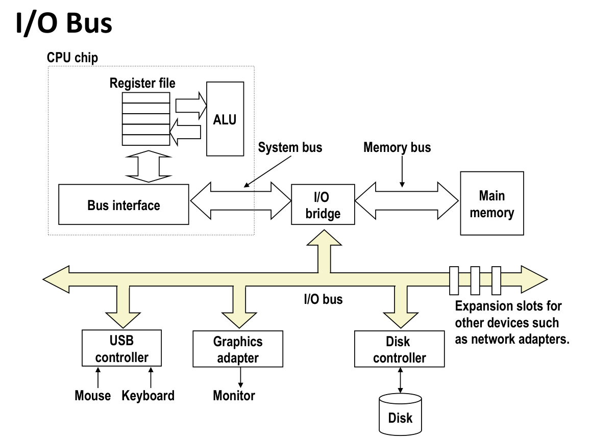

**固态硬盘 (Solid State Disks, SSDs)**

- **原理:** 基于闪存 (Flash memory) 。
- **组织:**
  - 数据以 **页 (Page)** 为单位进行读/写 (大小为 512B 到 4KB) 。
  - 页被组织成 **块 (Block)** (每块 32 到 128 页) 。
- **读/写特性:**
  - **页**只能在其所在的**块**被擦除后才能写入 。
  - 擦除一个块需要很长时间 (约 1 毫秒) 。
  - 一个块在重复写入约 10 万次后会磨损 。
- **闪存转换层 (Flash Translation Layer):** SSD 内部的控制器 ，负责将逻辑块的读写请求转换为对物理闪存的操作，并执行**磨损均衡 (wear leveling)** 逻辑 。
- **性能:** 顺序访问快于随机访问 。随机写入较慢（因为需要先擦除块） 。
- **优缺点 (与磁盘比较):**
  - **优点:** 没有移动部件，因此速度更快、功耗更低、更坚固 。
  - **缺点:** 有磨损寿命（通过磨损均衡缓解）；成本高。

### 局部性

- **局部性原则:** 程序倾向于使用那些地址与它们最近使用过的地址相近或相等的数据和指令 。
- **时间局部性 (Temporal locality):**
  - **定义:** 最近被引用的项目很可能在不久的将来再次被引用 。
  - **示例:** 循环中的 `sum` 变量在每次迭代中被引用 ；循环体中的指令被重复执行 。
- **空间局部性 (Spatial locality):**
  - **定义:** 地址相近的项目倾向于在相近的时间内被引用 。
  - **示例:** 按顺序引用数组元素 (如 `a[i]`)，这被称为**步长为 1 (stride-1)** 的引用模式 ；按顺序引用指令 。

**内存层次结构中的缓存**

**内存层次结构 (Memory Hierarchies)**

- **动机 (硬件和软件的基本属性):**
  1. 更快的存储技术每字节成本更高，容量更小 。
  2. CPU 和主存之间的速度差距在不断扩大 。
  3. 编写良好的程序倾向于表现出良好的**局部性** 。
- 这些属性互补，构成了组织内存和存储系统的基础，即**内存层次结构** 。
  - **L0:** 寄存器 (Registers)
  - **L1:** L1 缓存 (SRAM)
  - **L2:** L2 缓存 (SRAM)
  - **L3:** L3 缓存 (SRAM)
  - **L4:** 主存 (DRAM)
  - **L5:** 本地二级存储 (本地磁盘)
  - **L6:** 远程二级存储 (如 Web 服务器)

### 缓存

- **定义:** 缓存 (Caches) 是一个更小、更快的存储设备，它充当一个更大、更慢设备中数据子集的**暂存区域 (staging area)** 。
- **基本思想:** 对于第 k 层，更小更快的设备（k层）充当了第 k+1 层更大更慢设备的缓存 。
- **工作原理:**
  - 利用**局部性** 。程序访问 k 层数据的频率高于 k+1 层 。
  - 这使得 k+1 层的存储可以更慢，因此可以更大、更便宜 。
- **终极目标:** 创建一个巨大的存储池，其成本与底部的廉价存储相当，但其向程序提供数据的速率与顶部的快速存储相当 。

**缓存的一般概念**

- 数据以**块 (block)** 为大小单位在不同层级间复制 。
- **缓存命中 (Hit):**
  - 当程序需要数据块 b 时，在缓存中找到了 b 。
- **缓存未命中 (Miss):**
  - 当程序需要数据块 b 时，在缓存中**未**找到 b 。
  - **处理:**
    1. 从内存（下一级）中**获取**块 b 。
    2. 将块 b **存储**在缓存中 。
  - **相关策略:**
    - **放置策略 (Placement policy):** 决定块 b 存放到缓存的哪个位置 。
    - **替换策略 (Replacement policy):** 如果缓存已满，决定**驱逐 (evict)** 哪个旧的块（称为“牺牲者” victim） 。
      - **LRU（Least Recently Used）**，即“**最近最少使用**”策略,驱逐最后一次访问时间最久远的块
      - **LFU（Least Frequently Used）**，即“**最近最少使用**”策略,驱逐最近最少使用的块
      - 随机替换
    - 并不存在绝对意义上更好的策略,这和数据分布相关

**缓存未命中的类型**

1. **冷启动未命中 (Cold (compulsory) miss):**
    - 也称强制性未命中 。
    - 发生在缓存为空时，对数据的第一次访问必然导致未命中 。
    - 需要warmup
2. **冲突未命中 (Conflict miss):**
    - 发生在 k 层的缓存足够大，但多个数据对象（来自 k+1 层）都映射到 k 层的**同一个**缓存块位置时 。
    - 例如：如果块 `i` 必须放在 `(i mod 4)` 的位置，那么交替访问块 0 和块 8 (0 mod 4 = 0, 8 mod 4 = 0) 将导致每次都未命中 。
3. **容量未命中 (Capacity miss):**
    - 发生在程序的活动缓存块集合（即**工作集 working set**）大于缓存的容量时 。

**缓存的通用组织结构 (S, E, B)**

一个缓存的结构由三个关键参数定义 ：

- **S = $2^s$**: 缓存组 (Set) 的总数 。
- **E = $2^e$**: 组相联度 (Associativity)，即每组包含的缓存行 (Line) 数 。
- **B = $2^b$**: 块大小 (Block size)，即每个缓存行存储的数据字节数 。
- **缓存总大小 (Cache Size):** $C = S \times E \times B$ 。

> [!warning]
>
> S 和 B 需要是 2 的 n 次方，但 E 不需要。
>
> Tag 就是用来区分，当前缓存在这个位置的数据，到底是**来自物理内存中的哪一个块**。
>
> 在缓存的**单个组**中，**Tag 的数目**（以及单个Set内的数据块）**等于 E**。

> [!tip]
>
> 在计算缓存时，需要预先确定的是
>
> - 缓存大小C
> - 块大小B
> - 相联度E
>
> 根据块和相联度计算组数，确定index的位数，通过块自身的大小可以得到offset的位数，剩下都是tag

根据 E 的取值，缓存可以分为：

- **直接映射 (Direct Mapped): E = 1**
  - 每个组只有一行 。
  - 冲突缺失的风险最高。
- **E 路组相联 (E-way Set Associative): 1 < E < C/B**
  - 每个组有 E 行 。
  - 这是最常见的结构，在冲突和成本之间取得了平衡。
- **全相联 (Fully Associative): E = C/B**
  - 只有一个组，所有行都在这个组里。
  - ==不会发生冲突不命中==
  - 只会发生==容量不命中和冷不命中==

> [!warning]
>
> **全相联 (Fully Associative):**
>
> - **原理**：全并行。一瞬间启动 $N$ 个比较器（$N$=总行数）。
> - **代价**：电路极其复杂，比较器多导致占用面积大、发热大、功耗高。
> - **场景**：通常只用于**很小**的结构（如 TLB），这是为了追求极致的**低冲突率**。
>
> **直接映射 (Direct Mapped):**
>
> - **原理**：也就是 1-Way。没有选择权，位置固定。
> - **优点**：硬件最简单，而且**速度最快 (Fastest Hit Time)**。
>   - _为什么最快？_ 因为不需要多路选择器（Mux）来从多条路中选数据，也不等待比较结果就可以直接预读数据。
> - **缺点**：**冲突最严重 (High Conflict Miss)**。如果两个热门数据映射到同一个位置，就会反复互相踢出（颠簸），导致系统整体性能下降。
>
> **组相联 (Set Associative):**
>
> - **定位**：**折中方案 (The Sweet Spot)**。
> - **权衡**：
>   - 比全相联便宜（比较器少）。
>   - 比直接映射冲突少（有 $N$ 个位置可选）。
>   - 虽然单次访问比直接映射稍慢一点点（因为有 Mux 延迟），但因为它大幅减少了 Cache Miss，所以**总体效率最高**。

**地址结构与缓存读取**

一个 `m` 位的物理地址被分为三部分，用于缓存查找 ：

| t bits         | s bits                 | b bits                    |
| :------------- | :--------------------- | :------------------------ |
| **Tag (标记)** | **Set Index (组索引)** | **Block Offset (块偏移)** |

**缓存读取 (Cache Read) 流程：**

1. **定位组 (Locate Set):** 使用地址中的 **s 位 (Index, 组索引)** 解码，直接选中 Cache 中的某一行（Set）。

2. **并行比对 (Parallel Tag Comparison):** 硬件**同时 (Simultaneously)** 读取该组中所有路 (Ways) 的标记 (Tag) 和有效位 (Valid Bit)。 将地址中的 **t 位 (Tag)** 与该组内 **E 路 (E ways)** 的 Tag 进行**并行比较**（而不是遍历）。

3. **逻辑判定 (Logical AND Check):** 对于每一路，硬件执行逻辑判断：`(输入Tag == 存储Tag) AND (有效位 == 1)`。
   - 如果某一路的结果为真 (True)，则判定为 **命中 (Hit)**，并生成命中信号。

   - 如果所有路结果均为假，则为 **未命中 (Miss)**。

4. **数据选择与提取 (Data Selection & Extraction):**
   - **选择 (Select):** 根据第 3 步生成的命中信号，驱动**多路选择器 (Multiplexer)**，选通（导通）命中那一路的数据块 (Block)。

   - **提取 (Extract):** 使用地址中的 **b 位 (Block Offset, 块偏移)**，从选通的数据块中直接切片提取出所需的具体字节。

**索引策略 (Indexing)：**

- **为什么使用中间位 (s bits) 作为索引？**
- **标准方法 (中间位索引):** (TSB) 连续的内存块 (如 0000xx, 0001xx, 0010xx) 会被映射到不同的缓存组 (Set 0, Set 1, Set 2...) 。这能很好地利用**空间局部性** 。
- **错误方法 (高位索引):** (STB) 连续的内存块会映射到**同一个**缓存组 (Set 0) ，导致具有高空间局部性的程序产生大量冲突 。

**缓存写入策略 (Write Policies)**

当发生写操作时，有两个主要问题需要决定：

1. **写命中时 (Write-Hit)：**
    - **写直通 (Write-Through):** 立即将数据同时写入缓存和下一级内存 。
    - **写回 (Write-Back):** 仅将数据写入缓存。
      - 使用一个**脏位 (dirty bit)** 标记该缓存行已被修改 。
      - 当该脏行被替换（驱逐）时，才将其内容写回下一级内存 。

2. **写缺失时 (Write-Miss)：**
    - **写分配 (Write-Allocate):** 先将对应的内存块读入缓存，然后再执行写操作（如同写命中）。
      - 这通常配合**写回**使用 ，因为它假设后续可能还会有更多写入,试图利用局部性 。
    - **非写分配 (No-Write-Allocate):** 直接将数据写入下一级内存，不将块加载到缓存 。
      - 这通常配合**写直通**使用 。

**缓存性能评估**

- **缺失率 (Miss Rate):** (内存访问未命中次数) / (总访问次数) 。
  - L1 缓存的典型缺失率在 3-10% 。

- **命中时间 (Hit Time):** 从缓存交付数据到 CPU 所需的时间 。
  - L1 典型值为 4 个时钟周期 。

- **缺失代价 (Miss Penalty):** 因缓存缺失而需要的额外时间 。
  - 访问主存的代价通常为 50-200 周期 。
  - 注意**不命中惩罚**是在正常延迟(命中时间)上**额外**加的值
    - $t_{miss}=t_{hit}+t_{penalty}$

**为什么高命中率如此重要？**
一个例子：假设命中时间为 1 周期，缺失代价为 100 周期 。

- **97% 命中率：** 平均访问时间 = 1 + (0.03 \* 100) = **4 周期** 。
- **99% 命中率：** 平均访问时间 = 1 + (0.01 \* 100) = **2 周期** 。
- **结论：** 仅仅 2% 的命中率差异，带来了 2 倍的性能提升 ！

**内存山 (The Memory Mountain):**

- 这是一个用于表征内存系统性能的可视化工具 。
- 它测量**读取吞吐量 (Read Throughput, MB/s)** 作为两个变量的函数：
  1. **步长 (Stride):** 体现**空间局部性** 。步长越小，空间局部性越好。
  2. **工作集大小 (Size):** 体现**时间局部性** 。工作集越小，时间局部性越好。
- 在 3D 图表上（如 Core i7 Haswell 的图 ），可以看到：
  - **山脊 (Ridges):** 对应 L1, L2, L3 缓存 ，体现了时间局部性的影响。
  - **斜坡 (Slopes):** 体现了空间局部性的影响（步长越小，吞吐量越高）。


**编写缓存友好型代码**

- **核心：** 聚焦于核心函数的**内部循环 (inner loops)** ，并最小化其中的缓存缺失 。
- **策略 1：最大化空间局部性**
  - **方法：** 按照**步长为 1 (Stride-1)** 的模式顺序访问数据 。
  - **示例：矩阵乘法 (N x N)**
    - **C 语言数组是行主序 (Row-major) 存储的** 。
    - **按行访问** (如 `a[i][k]`, `k++`) 具有良好的空间局部性（缺失率 0.25） 。
    - **按列访问** (如 `b[k][j]`, `k++`) 空间局部性极差（缺失率 1.0） 。
  - **不同循环顺序的比较：**
    - nxn的double数组,块大小为32byte,一行4个double
    - `ijk` / `jik`: `a[i][k]` (行), `b[k][j]` (列)。
    - `kij` / `ikj`: `a[i][k]` (行), `b[k][j]` (行)。
    - `jki` / `kji`: `a[i][k]` (列), `b[k][j]` (列)。
  - **结论：** `kij` 和 `ikj` 的性能最好 ，因为它们在内循环中都是按行访问。
- **策略 2：最大化时间局部性**
  - **方法：** 访问一个数据对象后，尽可能多地使用它，然后再访问下一个 。
  - **问题：** 对于 $N \times N$ 矩阵乘法，虽然每个元素有 $O(n)$ 次的复用（固有的时间局部性） ，但如果 $N$ 很大，缓存（C）远小于 $N$ ($C << n$) ，导致数据在被重用之前就被从缓存中驱逐了。
  - **示例 (ijk)：** `b[k][j]` 的元素在内循环中被重用，但当 `j` 改变时，整个 `b` 矩阵的列需要重新加载。总缺失高达 $O(n^3)$ 。
  - **解决方案：分块 (Blocking / Tiling)** 。
    - 将 $N \times N$ 的大矩阵视为由 $B \times B$ 的小块组成 。
    - 通过三重循环遍历这些**块 (i, j, k)**，然后在最内层循环中对 $B \times B$ 的**子矩阵** (i1, j1, k1) 进行乘法 。
    - **优势：** 只要 3 个 $B \times B$ 的块能装入缓存 ($3B^2 < C$) ，程序就可以在驱逐它们之前，充分利用其时间局部性。
    - **结果：** 总缺失次数从 $O(n^3)$ 降低到 $O(n^3 / B)$ ，性能显著提升。

## 链接(Linking)

### 编译工具链

程序从源代码（`.c`文件）到可执行文件（例如 `hello`）需要经过一个工具链，以 GCC 为例，它包含四个主要阶段 ：

1. **预处理器 (cpp):**
    - **输入:** `hello.c` (程序源码)
    - **输出:** `hello.i` (修改过的源码)
    - **工作:** 执行文本替换 。处理所有以 `#` 开头的指令，例如 `#include`（插入头文件内容）和 `#define`（宏展开）。
    - ==头文件在这里导入==
    - > `extern` 是 C 和 C++ 语言中的一个关键字，它的核心含义是：
      >
      > **“这个东西（变量或函数）在这里被\*声明\*，但它是在\*别处\*被\*定义\*的。”**
2. **编译器 (cc1):**
    - **输入:** `hello.i`
    - **输出:** `hello.s` (汇编代码)
    - **工作:** 将高级 C 代码翻译成特定于平台的汇编语言代码 。
    - ==如果上一步导入头文件中的声明与源代码文件的定义不符,则这一步无法通过==
3. **汇编器 (as/gas):**
    - **输入:** `hello.s`
    - **输出:** `hello.o` (可重定位目标代码)
    - **工作:** 将汇编代码翻译成机器可读的二进制指令（目标代码）。

4. **链接器 (ld):**
    - **输入:** `hello.o` (以及其他 `.o` 文件，如 `sum.o`)
    - **输出:** `hello` (可执行代码)
    - **工作:** 将所有必需的可重定位目标文件和库文件组合起来，生成最终的可执行文件 。

---

### 为什么需要链接器？

链接器的存在主要基于两个原因：模块化和效率 。

- **原因 1: 模块化 (Modularity)**
  - 允许程序由多个小的、易于管理的源文件集合构成，而不是一个庞大的单体文件 。
  - 可以构建标准函数的**库** (Libraries)，例如数学库 (`libm.a`) 或标准 C 库 (`libc.a`)，供多个程序共享 。

- **原因 2: 效率 (Efficiency)**
  - **时间效率：**
    - **分离编译 (Separate Compilation):** 当你只修改了一个源文件（例如 `main.c`）时，你只需要重新编译那一个文件（生成 `main.o`），然后重新链接，而不需要重新编译所有其他未改变的源文件（例如 `sum.c`）。
    - 允许并行编译（同时编译多个文件）。
  - **空间效率 (通过库实现):**
    - **静态链接 (Static Linking):** 可执行文件只包含它们**实际使用**的库代码 。
    - **动态链接 (Dynamic Linking):** 可执行文件不包含库代码 。在执行时，内存中可以只有一份库代码的副本，被所有正在运行的进程共享 。

---

### 链接器的两大核心任务

链接器主要执行两个关键步骤：符号解析和重定位 。

**任务一：符号解析 (Symbol Resolution)**

- **符号 (Symbol):** 指的是程序中定义和引用的**全局变量**,**静态变量**,**全局函数**,**静态函数**。
  - 局部变量存储在栈上,不归符号来管
  - 全局函数指的是不带static属性的函数

- **符号表 (Symbol Table):** 每个 `.o` 文件都有一个符号表，存储了**在该文件中定义和引用的符号信息(名称、位置等)**。
- **目标:** 链接器的目标是**将每一个符号引用与有且仅有的一个符号定义关联起来** 。

**符号的三种类型：**

1. **全局符号 (Global):** 由当前模块定义，并能被其他模块引用（全局变量,全局函数）。
2. **外部符号 (External):** 被当前模块引用，但在其他模块中定义（在别处定义的全局符号）。
3. **本地符号 (Local):** 由当前模块定义，且只能被当前模块引用（静态变量,静态函数）。

**强符号与弱符号 (Strong vs. Weak Symbols)**
链接器使用这个概念来处理==不同模块==的==多重**定义**==的符号：

> [!note]
>
> 同一个模块中多重定义的情况无法通过编译器

- **强符号 (Strong):** 函数和**已初始化**的变量 。(==全局==,否则无法对外可见)
- **弱符号 (Weak):** **未初始化**的全局变量 。

**符号解析规则：**

1. **规则 1:** 不允许多个同名的强符号 。
2. **规则 2:** 如果有一个强符号和多个同名弱符号，链接器会选择**强符号** 。
3. **规则 3:** 如果有多个同名弱符号，链接器**任选其一** 。

> **重要陷阱：** 链接器**不进行类型检查** 。如果一个文件定义了 `int x=7;` (强)，另一个文件定义了 `double x;` (弱)，链接器会选择 `int x` 。这会导致 `double x` 的访问错误地读写了 `int x` 的内存，甚至可能覆盖相邻的变量（例如 `y`），导致灾难性的运行时错误。实践中用引用同一头文件+extern声明强制在编译时报错.
>
> **最佳实践：**
>
> - 尽量避免全局变量，多使用 `static`。
> - 在头文件中使用 `extern` 来声明全局变量。
> - 不带参数的函数应声明为 `(void)` 来启用类型检查。

**任务二：重定位 (Relocation)**

- **目标:** 将所有 `.o` 文件中的代码和数据合并，并为所有符号分配最终的运行时内存地址，然后修改代码中的引用，使其指向正确的地址 。
- **步骤：**
  1. **合并节 (Sections):** 将所有输入模块中同类型的节（例如所有 `.text` 节）合并成一个新的聚合节 。
  2. **分配地址:** 为新的聚合节、输入模块的每个节以及每个符号分配运行时的绝对内存地址 。
  3. **更新引用:** 修改代码和数据节中的符号引用，使其指向新分配的运行时地址 。
- **重定位条目 (Relocation Entries):**
  - 当**汇编器**生成 `.o` 文件时，如果遇到对未知位置（如外部符号或全局变量）的引用，它会生成一个**重定位条目** 。
    - 重定位条目由汇编器生成
  - 这个条目告诉链接器：“当程序链接时，请回过头来修改这个位置（`r_offset`），将符号（`r_info`） 的最终地址 + 一个常量（`r_addend`） 填入。”
    - r.offset表示**需要被重定位的引用（Reference）相对于包含它的节（Section）的起始位置**的字节偏移量。
    - 这里指的是==链接前的可重定位目标文件==

  - **两种关键类型：**
    - **`R_X86_64_32` (绝对地址):** 用于引用全局变量 。链接器将计算 `ADDR(symbol) + r.addend` 并填入 。
    - **`R_X86_64_PC32` (PC相对地址):** 用于函数调用 。链接器将计算 `ADDR(symbol) + r.addend - refaddr` (引用本身的地址) 并填入 。
      - refaddr指的是引用本身的地址,但由于执行到引用处PC已经指向了下一条指令,故为下一条指令的起始地址
      - r.addend是一个常量,暂时不知道用途
  - > [!warning]
    >
    > 注意小端法
- **示例 (main.o 调用 sum)：**
  - 在 `main.o` 中，`callq sum` 指令的地址是未知的，汇编器会将其编码为 `e8 00 00 00 00`（`e8` 是 `callq` 的操作码，后面是0）。
  - 同时，它会生成一个 `R_X86_64_PC32` 类型的重定位条目，指向 `sum` 符号 。
  - 在链接时，假设 `main` 在 `0xbabf18`，`sum` 在 `0xbabf40` 。
  - 链接器计算 `sum` 相对于 `callq` 指令的偏移量 (`0xbabf40 - 0xbabf32 - 4 = 0x0a`) 。
  - 链接器将 `main.o` 中的 `e8 00 00 00 00` **修补 (patch)** 为 `e8 0a 00 00 00` ，使其正确地调用 `sum` 函数。

---

### 目标文件格式 (ELF)

有三种主要的目标文件类型 ：

1. **可重定位目标文件 (.o):** 可被链接器用于创建可执行文件 。
2. **可执行目标文件 (a.out):** 可被加载器直接加载到内存并执行 。
3. **共享目标文件 (.so):** 可在加载时或运行时被动态链接 。

它们都使用 **ELF (Executable and Linkable Format)** 格式 。

下面是可重定位目标文件


你的程序只知道 PLT 在哪里；PLT 负责去查 GOT；如果 GOT 是空的，PLT 就叫人（链接器）把地址填进 GOT，下次就能直接用了。

> [!tip]
>
> 需要记忆各个部分存了啥东西,要求看代码可以说出来代码的各个部分存在什么位置

| **段名称 (Section)** | **存放内容 (Contents)**               | **主要用途与特点**                                                                               |
| -------------------- | ------------------------------------- | ------------------------------------------------------------------------------------------------ |
| **`.text`**          | 编译后的机器指令（代码）              | **只读, 可执行**。 存放函数体等所有可执行代码。                                                  |
| **`.rodata`**        | 只读数据 (Read-Only Data)             | **只读**。 存放字符串字面量 (如 `"Hello"`) 和 `const` 常量。                                     |
| **`.data`**          | 已初始化的全局变量和静态变量 (非零值) | **可读可写**。 程序加载时，这些值从文件拷贝到内存。 例如: `int g = 10;`                          |
| **`.bss`**           | 未初始化或初始化为零的全局/静态变量   | **可读可写**。 **在文件中不占空间** (只是一个占位符)。 程序加载时，操作系统将此段内存全部清零。  |
| **`.symtab`**        | 符号表 (Symbol Table)                 | 存放==本文件中**定义和引用**的符号==（函数/变量名）。 链接器（Linker）的核心，用于解析符号引用。 |
| **`.rel.text`**      | `.text` 段的重定位信息                | 告诉链接器 `.text` 段中哪些地址需要被“修补”。 例如：调用外部函数 `printf` 的指令地址。           |
| **`.rel.data`**      | `.data` 段的重定位信息                | 告诉链接器 `.data` 段中哪些地址需要被“修补”。 例如：一个指向外部变量的全局指针。                 |

> 数据的重定位条目放在`.rel.data`
>
> 代码的重定位条目放在`.rel.text`
>
> ```c
> typedef struct{
>     long offset; // 相对于节的偏移量
>     long type:32; // 重定义类型,相对还是绝对
>     long symbol:32; // 符号表索引
>     long addend; // 常量
> } Elf64_Rela;
> ```

> [!note]
>
> 在生成的目标文件（`.o`）中，变量和函数通常存放在具体的“节”（Section）中，比如 `.text`（代码）、`.data`（已初始化数据）。
>
> 但是，有三个特殊的标记，它们被称为“伪节”。它们在文件头中没有真正的存储空间，只是作为一种**标记**或**状态说明**：
>
> - **`ABS` (Absolute)**:
>   - **含义**: 代表不需要被重定位的符号。
>   - **解释**: 它的地址是绝对固定的，链接器在合并文件时不需要修改它。这在普通的应用程序代码中很少见，通常用于某些特殊的系统编程或硬件地址映射。
> - **`UNDEF` (Undefined)**:
>   - **含义**: 未定义的符号。
>   - **解释**: 本文件引用了这个符号（比如调用了一个函数 `func()` 或使用了变量 `extern int x;`），但是这个符号的定义在**其他文件**中。链接器看到 `UNDEF`，就知道它需要去别的 `.o` 文件里找这个符号的定义。
> - **`COMMON`**:
>   - **含义**: 还未分配位置的未初始化的数据。
>   - **解释**: 这是一个“暂存区”。它用于存放那些**未初始化的全局变量**。
>   - **细节**: 此时编译器还不知道这个变量最终会放在哪里，也不知道是否会有其他文件定义了同名的变量。这里记录了变量的对齐要求（`value`字段）和大小（`size`字段）。
>
> > **注意**: 这些伪节只存在于编译过程中的中间文件（`.o` 文件）。一旦链接完成生成可执行文件，这些符号都会被安置到真正的节（如 `.bss` 或 `.data`）中。
>
> | **变量类型**                      | **存放位置** | **解释**                                                                                                                                      |
> | --------------------------------- | ------------ | --------------------------------------------------------------------------------------------------------------------------------------------- |
> | ==**未初始化的全局变量**==        | **`COMMON`** | 因为它是全局的，可能在其他文件中有同名的强符号（即已初始化的定义）。编译器暂时把它放在 `COMMON`，把决定权交给链接器。这是一个“**弱符号**”。   |
> | **未初始化的静态变量** (`static`) | **`.bss`**   | 因为 `static` 限制了变量只能在本文件内访问，不可能与其他文件的同名变量冲突。所以编译器确定它就是属于本文件的，直接分配到 `.bss`。             |
> | **初始化为 0 的全局/静态变量**    | **`.bss`**   | 这是一个优化。因为 `.bss` 节原本就是用来存放默认值为 0 的数据的，显式初始化为 0 和不初始化（默认是 0）在结果上是一样的，所以直接放入 `.bss`。 |

### 库 (Libraries)

库是打包常用函数（如 `printf`, `malloc`, `sin`）的标准方式 。

**静态库 (Static Libraries, .a)**

- **概念:** 静态库是 `.o` 文件的存档 (Archive) 。

- **创建:** 使用 `ar` 工具将多个 `.o` 文件打包成一个 `.a` 文件 。例如：`ar rs libc.a atoi.o printf.o ...` 。
  - 没有压缩,只是归档

- **链接:** 链接器在处理 `.o` 文件时，会跟踪未解析的符号 。然后，它会扫描静态库，如果库中的某个 `.o` 成员（如 `printf.o`）定义了该符号，链接器就会将**该 `.o` 文件**（而不是整个库）复制到最终的可执行文件中 。

- **缺点:**
  - 可执行文件体积大，因为库代码被复制进去了 。
  - 内存浪费，多个进程运行时，内存中有多份相同的库代码 。
  - 库更新困难，库的 bug 修复需要重新链接所有使用它的程序 。
- **重要规则:** ==链接器是按顺序扫描的==

  - ```bash
      gcc main.o -lA my_code.o -lB
    ```

    - 如果 `main.o` 依赖 `libA`，而 `my_code.o` 依赖 `libB`，这条命令 _仍然_ 可以成功。这里 `libA` 就不在“结尾处”。
  - 如果库之间存在依赖关系（不是相互独立的），它们**必须**按照依赖顺序“排序”，**依赖者（调用者）在前，被依赖者（被调用者）在后**。
    - 即在前一个库发现未定义的符号,它的定义在后一个库里,颠倒顺序就会出错

  - **静态链接器和动态链接器都具有“顺序解析”的特点**，“第一个匹配”的符号会“获胜”。
  - 库==不一定==在命令行中只出现一次,当存在循环依赖的时候,比方说a依赖b,b依赖a,则a会出现两次
    - 画出依赖图,然后拓扑排序

**共享库 (Shared Libraries, .so)**

- **概念:** 共享库是现代的解决方案，旨在克服静态库的缺点 。它是一个目标文件，在**加载时 (load-time)** 或 **运行时 (run-time)** 才被动态地链接和加载 。
- **创建:**
  1. `gcc -fpic -c addvec.c` (创建位置无关代码, Position-Independent Code) 。
  2. `gcc -shared -o libvector.so addvec.o multvec.o` (打包成 `.so` 文件) 。

- **加载时链接 (Load-time Linking):**
  - 这是最常见的方式 。
  - `gcc -o prog2l main.o ./libvector.so` 。
  - 链接器**不会**复制库代码，而是创建一个**部分链接的可执行文件** 。该文件包含一个条目，指明它依赖 `libvector.so` 。
  - 当程序被执行时，操作系统的加载器会运行一个**动态链接器** (如 `ld-linux.so`) 。
  - 动态链接器负责加载 `.so` 文件，并完成重定位，然后才开始执行程序 。

- **运行时链接 (Run-time Linking):**
  - 程序可以在开始执行后，使用 `dlopen()` 接口显式加载共享库 。
  - `handle = dlopen("./libvector.so", ...)`: 加载库 。
  - `addvec = dlsym(handle, "addvec")`: 获取函数指针 。
  - `addvec(...)`: 像普通函数一样调用 。
  - `dlclose(handle)`: 卸载库 。

---

### 库打桩 (Library Interpositioning)

- **概念:** 一种强大的技术，允许你**拦截 (intercept)** 对任意函数（特别是库函数）的调用 。
- **应用:** 调试 (跟踪 Facebook 的 bug) 、安全 (沙箱) 、监控和性能分析 (跟踪 `malloc` 和 `free` 的调用) 。

**有三种实现方式：**

1. **编译时打桩 (Compile-time):**
    - **方法:** 通过 C 预处理器的 `#define`，将目标函数调用（如 `malloc`）替换为你自己的包装函数（如 `mymalloc`）。
    - **示例:** 在 `malloc.h` 中：`#define malloc(size) mymalloc(size)` 。
    - **限制:** 必须拥有并修改源代码，然后重新编译 。

2. **链接时打桩 (Link-time):**
    - **方法:** 使用链接器的 `--wrap` 标志 (e.g., `-Wl,--wrap,malloc`) 。
    - **工作原理:** 链接器会自动：
      - 将所有对 `malloc` 的引用解析为 `__wrap_malloc` (你的包装函数) 。
      - 将所有对 `__real_malloc` 的引用解析为真正的 `malloc` (库函数) 。
    - 你的 `__wrap_malloc` 函数就可以在内部调用 `__real_malloc` 。

3. **加载/运行时打桩 (Load/Run-time):**
    - **方法:** 这是最灵活的方法。
      - ==利用了链接器是按顺序扫描的这一特性,拦截对于正常库的链接==
    - **步骤:**
      1. 创建一个包含你自己的 `malloc` 和 `free` 包装函数的共享库 (e.g., `mymalloc.so`) 。
      2. 在你的 `malloc` 包装函数中，使用 `dlsym(RTLD_NEXT, "malloc")` 来获取**下一个**（即 libc 中的）`malloc` 函数的地址 。
      3. 使用 `LD_PRELOAD` 环境变量运行你的程序 。
    - **示例:** `env LD_PRELOAD=./mymalloc.so ./my_program` 。
    - **工作原理:** `LD_PRELOAD` 告诉动态链接器，在加载任何其他库（包括 `libc.so`）之前，**首先加载 `mymalloc.so`** 。这样，当 `my_program` 调用 `malloc` 时，它会首先解析到 `mymalloc.so` 中的版本，从而实现拦截。
    - **优势:** 无需源码，无需重新编译或重新链接，可以用于==任何动态链接的二进制程序== 。

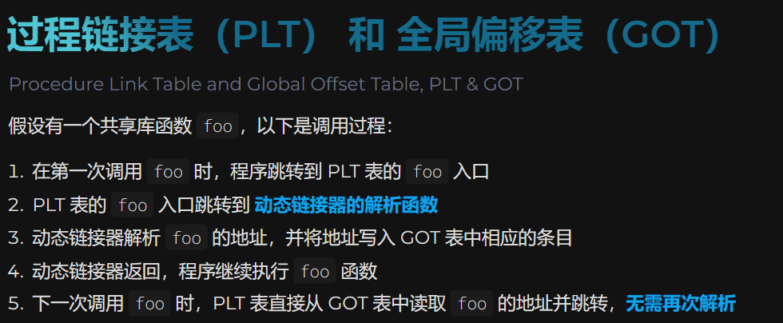

## 异常控制流(ECF)

### 控制流

**控制流 (Control Flow)**

- CPU 从启动到关机，只做一件事：**一次一条地读取和执行（解释）指令序列** 。
- 这个指令序列就是 CPU 的**控制流** 。

**改变控制流 (Altering the Control Flow)**

- **常规机制：**
  - **跳转 (Jumps) 和 分支 (branches)**
  - **调用 (Call) 和 返回 (Return)**
  - 这些机制都是为了响应**程序状态**的变化 。
- **常规机制的局限性：**
  - 上述机制不足以构建一个有用的系统，因为它们难以响应**系统状态**的变化 。
  - **系统状态变化示例：**
    - 数据从磁盘或网络适配器到达
    - 指令除以零
    - 用户在键盘上按下 `Ctrl-C`
    - 系统计时器到期
- **解决方案：** 系统需要**“异常控制流” (Exceptional Control Flow, ECF)** 机制 。


**ECF 的机制层级**

1. **低级机制：**
    - **异常 (Exceptions)：** 响应系统事件（系统状态改变）的控制流变化 。由硬件和操作系统 (OS) 软件结合实现 。
2. **高级机制：**
    - **进程上下文切换 (Process context switch)：** 由 OS 软件和硬件计时器实现 。
    - **信号 (Signals)：** 由 OS 软件实现 。
    - **非本地跳转 (Nonlocal jumps)：** 如 C 语言的 `setjmp()` 和 `longjmp()`，由 C 运行时库实现 。

---

### 异常

**什么是异常？**

- **定义：** 异常(Exceptions)是为响应某个事件（即**处理器状态的改变**），而将**控制权转移给操作系统内核 (Kernel)** 。(控制流的突变)
- **内核：** 指的是操作系统在内存中的常驻部分 。
- **事件示例：**
  - 处理器: 除以0、算术溢出、页错误 (Page Fault)
  - 内核: I/O 请求完成、键入 `Ctrl-C` 。

**异常处理流程**
当一个事件发生时 ：

1. 执行中的用户代码 (User code) 被中断 。
2. 控制权转移到内核 (Kernel code) 中的**异常处理程序 (Exception handler)** 。
    - 这一步是通过**异常表**来实现的
3. 处理器完成后，根据异常类型，可能会：
    - 返回到**当前**指令 (I_current)，即重新执行 。
    - 返回到**下一条**指令 (I_next) 。
    - **中止 (Abort)** 用户程序 。

**异常表 (Exception Table)**

- 每种事件类型（异常）都有一个唯一的非负整数编号 。
- 这个编号是**异常表**（也称为**中断向量 (Interrupt Vector)**）的索引 。
- 当编号为 $k$ 的异常发生时，系统会调用异常表中第 $k$ 项指向的**异常处理程序** 。
- 异常表的起始地址放在异常表基址寄存器中

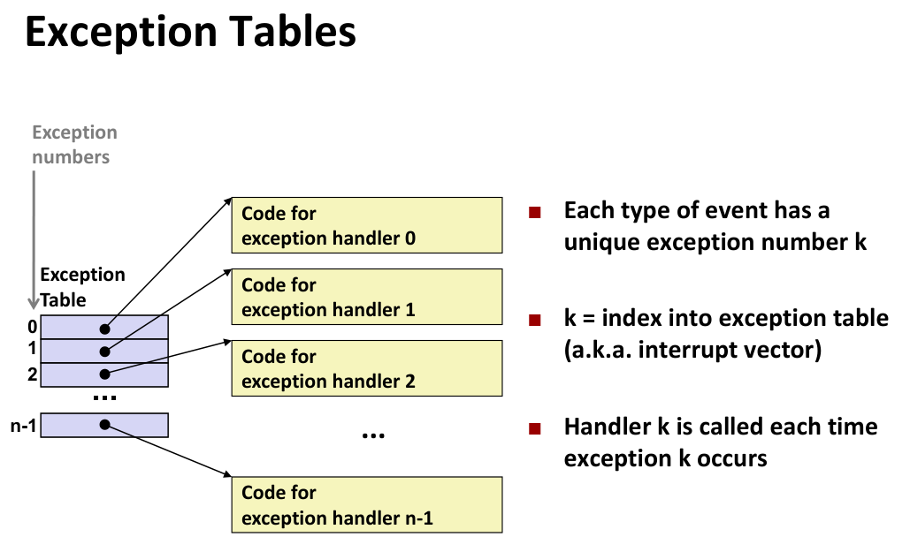

**异常的分类 (Taxonomy of ECF)**

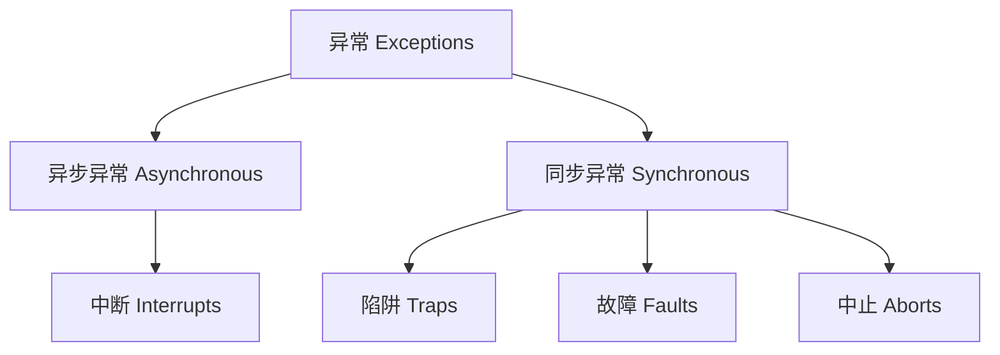

| **类别**             | **1. 触发源 (为什么?)**      | **2. 意图 (故意的吗?)**     | **3. 返回行为 (接下来呢?)**        |
| -------------------- | ---------------------------- | --------------------------- | ---------------------------------- |
| **中断 (Interrupt)** | **外部**事件 (如I/O, 计时器) | **异步** (与指令无关)       | **返回下一条** (`I_next`)          |
| **陷阱 (Trap)**      | **内部**事件 (当前指令)      | **有意的** (例如 `syscall`) | **返回下一条** (`I_next`)          |
| **故障 (Fault)**     | **内部**事件 (当前指令)      | **无意的** (但_可恢复_)     | **==可能==返回当前** (`I_current`) |
| **中止 (Abort)**     | **内部**事件 (当前指令)      | **无意的** (且_不可恢复_)   | **终止程序** (不返回)              |

#### Interrupt

这是一种由**处理器外部**的事件引起的异常。

- **“异步”的含义**： “异步”意味着事件的发生与 CPU 当前正在执行的任何指令（`I_current`）**在时间上没有关系**（即不是由该指令引起的）。
- **触发方式**： 外部设备（如计时器、键盘）通过设置处理器上的一个物理引脚，即**“中断引脚”（interrupt pin）**，来通知 CPU 有事件发生。
  - 该引脚电压升高,代表触发了中断
- **返回行为**： 当内核中的异常处理器（Handler）处理完这个中断后，CPU 会**返回到下一条指令（"next" instruction）**继续执行。这是因为当前指令是无辜的，它已经被成功执行了。

**示例**

- 计时器中断 (Timer interrupt)
  - 这是一个由外部计时器芯片**每隔几毫秒**触发一次的中断。

  - **关键用途**：这是操作系统（OS）实现多任务处理（multitasking）的基础。内核使用这个中断来定期**从用户程序手中夺回控制权**，以便内核可以决定是继续运行当前程序，还是切换到另一个等待运行的进程。

- 来自外部设备的 I/O 中断
  - 当 I/O 设备（如键盘、网络、磁盘）完成了某个任务或有新数据到达时，它会触发一个中断。

  - **示例**：
    - 用户在键盘上按下 **Ctrl-C**。
      - 网络适配器收到了一个**网络数据包**。
      - 磁盘控制器完成了**数据读取**，数据已准备就绪。

#### Trap


- 用于实现系统调用,几乎与函数调用一样
  - **控制权转移**：两者都会将 CPU 的控制权从当前指令转移到另一段代码（即函数体或内核代码）。

  - **返回后执行下一条指令**：当调用完成后，两者都会返回到调用指令的**下一条**指令继续执行。

  - **使用调用约定传递参数**：两者都使用一套规则（通常是寄存器，如 `%rdi`, `%rsi` 等）来传递参数。

  - **在 `%rax` 中获取结果**：两者通常都将返回值（或错误码）放在 `%rax` 寄存器中。

- 关键区别
  - **由内核执行**：常规函数调用在与调用者相同的权限（即**用户模式**）下运行。而系统调用是**有意触发的异常** ，它会使 CPU 切换到**内核模式**（Kernel Mode），由操作系统（OS）来执行。

  - **不同的权限集**：一旦进入内核模式，代码就拥有了更高的权限，可以执行 I/O 操作、访问所有内存等用户程序不能执行的特权操作。

- 其他差异
  - **“函数地址”在 `%rax` 中**：
    - 常规函数调用（如 `callq <label>`）是跳转到一个内存地址。
    - 系统调用（如 `syscall` 指令）是通用的。您要请求的**具体服务**（例如 `open` 或 `read`）并不是一个内存地址，而是通过一个**系统调用编号**（一个整数）来指定的，这个编号必须在执行 `syscall` 指令前放入 `%rax` 寄存器。

  - **使用 `errno`**：
    - 这是错误处理上的区别。常规函数出错可能返回 `NULL`。
      - 系统调用有一套标准化的错误处理：如果出错，它会在 `%rax` 中返回一个负数（通常是 -1），并设置一个名为 `errno` 的全局变量来指明具体的错误类型（例如“文件未找到”或“权限不足”）。

#### Fault


**页错误- 可恢复的Fault**

**发生了什么？**

- 用户代码 `a[500] = 13;` 尝试访问一个**合法的**、属于该程序的内存地址。
- **问题**：这块内存（Page）当前为了节省空间，被临时存放在**磁盘**上，而不在物理 RAM 中。

**内核如何处理？**

1. **“修复”问题**：内核的页错误处理器（Page handler）介入，从磁盘将对应的数据页复制回物理内存中。
2. **“重试”指令**：修复完成后，内核将控制权**返回**给导致故障的**同一条 `movl` 指令**，让它重新执行。

**最终结果**：

- `movl` 指令在第二次尝试时，数据已在内存中，指令**成功完成**。
- 整个过程对用户程序来说是透明的（它只是变慢了一点）。这符合“故障”的定义：**返回并重新执行当前指令 (`I_current`)**。


**无效内存引用 - 不可恢复的Fault**

- **发生了什么？**
  - 用户代码 `a[5000] = 13;` 尝试访问一个**非法的**内存地址（数组越界），这个地址不属于该程序。
- **内核如何处理？**
  1. **“检测”问题**：内核的页错误处理器介入，检测到这是一个**无效地址**。
  2. **“无法修复”**：内核无法“修复”这个编程错误。
  3. **“中止”程序**：内核决定**中止**这个程序，它向该进程发送一个 **`SIGSEGV`** 信号。
- **最终结果**：
  - 用户进程收到 `SIGSEGV` 信号，强制退出，并报告“**段错误 (Segmentation fault)**”。
  - 这符合“中止”的定义：**程序被终止，永不返回**。

#### Abort

- **路径 A (Fault -> Abort)**：一个**故障 (Fault)** 发生了（例如页错误），但内核的故障处理器发现它无法修复，于是导致程序**中止** 。
- **路径 B (Direct Abort)**：一个**中止 (Abort)** 发生了（例如非法指令），这是一个**直接的**、灾难性的、不可恢复的事件，它不经过“故障”阶段 。
  - DRAM或者SRAM位被损坏时发生的奇偶校验错误

---

> 异常允许操作系统内核提供进程概念的基本构造块

### 进程

**什么是进程(Processes)？**

- **定义：** 进程是**一个正在运行的程序**的实例 。
- 进程是计算机科学中最深刻的概念之一 。

**进程提供的两个关键抽象**

1. **逻辑控制流 (Logical Control Flow)：**
    - 让每个程序看起来都好像**独占 CPU** 。
    - 这是通过内核机制**“上下文切换” (Context Switching)** 实现的 。
2. **私有地址空间 (Private Address Space)：**
    - 让每个程序看起来都好像**独占主存** 。
    - 这是通过内核机制**“虚拟内存” (Virtual Memory)** 实现的 。
    - 每个进程都有自己独立的栈、堆、数据和代码区域 。

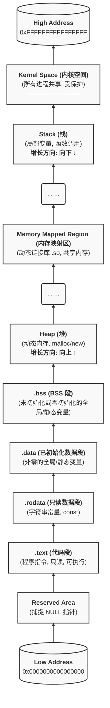

> [!note]
>
> 各个部分的详细说明
>
> ### 1.用户空间 (User Space)
>
> 这是程序“看得见、摸得着”的部分，从最低地址开始：
>
> - **保留区 (Reserved)：**
>   - 地址空间的最低部分（例如从 0 开始的第一个页）通常是**保留且不可访问**的。
>   - **目的：** 为了捕捉 **NULL 指针**解引用。如果程序试图访问 `*NULL`（即地址 0），会立即触发一个段错误（Segmentation Fault），这有助于快速定位 bug。
> - **`.text` (代码段)：**
>   - **存放内容：** 您程序中所有函数的已编译**机器指令**。
>   - **属性：** **只读 (Read-Only)** 和 **可执行 (Executable)**。
>   - **只读**是为了防止程序（或恶意代码）在运行时修改自己的执行指令。
> - **`.rodata` (只读数据段)：**
>   - **存放内容：** 程序中的**常量数据**。
>   - **例子：** 字符串字面量 (如 `"Hello, world!"`)、`const` 修饰的全局变量。
>   - **属性：** **只读 (Read-Only)**。与 `.text` 分开存放，因为数据是不可执行的。
> - **`.data` (已初始化数据段)：**
>   - **存放内容：** 已经**显式初始化**且**值非零**的**全局变量**和**静态变量**。
>   - **例子：** `int global_var = 100;`
>   - **属性：** **可读可写 (Read-Write)**。
> - **`.bss` (BSS 段)：**
>   - **存放内容：** **未初始化**或**初始化为 0** 的**全局变量**和**静态变量**。
>   - **例子：** `static int uninit_var;`
>   - **属性：** **可读可写 (Read-Write)**。它在可执行文件中不占空间，程序加载时由内核分配并**全部清零**。
> - **堆 (Heap)：**
>   - **存放内容：** 程序员在程序运行时**动态分配**的内存。
>   - **例子：** C 中的 `malloc()`、C++ 中的 `new`。
>   - **属性：** **可读可写 (Read-Write)**。
>   - **增长方向：** **从低地址向高地址增长**（“向上长”）。
> - **内存映射区 (Mmap Segment)：**
>   - **存放内容：** 这是一个非常重要的区域，用于映射**动态链接库**（如 C 语言的 `libc.so`）、共享内存，或通过 `mmap()` 系统调用映射的文件。
>   - **属性：** 属性可变（可读、可写、可执行，取决于映射内容）。
>   - **位置：** 它通常位于堆和栈之间的巨大“空洞”中。
> - **栈 (Stack)：**
>   - **存放内容：** **局部变量**、函数参数、函数调用的返回地址。
>   - **例子：** `void func() { int local_var = 10; }` 中的 `local_var`。
>   - **属性：** **可读可写 (Read-Write)**。
>   - **增长方向：** **从高地址向低地址增长**（“向下长”）。
>   - **“堆栈碰撞”：** 堆和栈一个向上长、一个向下长，它们之间的巨大空闲区域就是进程可用的虚拟内存。如果堆分配太多或栈递归太深，两者就有可能“撞上”，导致内存耗尽。
>
> #### 2. 内核空间 (Kernel Space)
>
> - **位置：** 位于虚拟地址空间的**最高部分**。
> - **存放内容：** 操作系统内核的代码、内核数据、所有进程的**进程上下文**（==**信号待处理表**和**信号阻塞表**==）、物理内存的**页表**（Page Tables）等。
> - **属性：** **受保护**。用户态的代码**绝对不能**直接访问内核空间。
> - **访问方式：** 进程只能通过**系统调用 (System Call)**、**异常 (Exception)** 或**中断 (Interrupt)**（这些都是“陷阱 Trap”）的方式，**“请求”** 内核来为它执行某些操作。此时 CPU 会从“用户态”切换到“内核态”，才能访问内核空间。
> - **共享特性：** 内核空间在**所有进程**的虚拟地址空间中都是**共享**的，它被映射到同样的高地址。这样做效率极高：当发生系统调用时，CPU 只需要切换权限（从用户态到内核态），而**不需要**切换整个内存地址空间（页表），因为内核代码已经在那里了。

**多进程 (Multiprocessing)**

- **幻觉 (Illusion)：** 系统似乎同时运行多个进程，每个进程都有自己的 CPU 和内存 。
- **传统现实 (Traditional Reality) (单核CPU)：**
  - 单个处理器通过**交错执行**（称为**多任务 Multitasking**）来并发执行多个进程 。
  - 当一个进程不执行时，其寄存器值被保存在内存中 。
- **现代现实 (Modern Reality) (多核CPU)：**
  - **多核处理器 (Multicore processors)** 在单个芯片上有多个 CPU（核心） 。
  - 它们共享主存（和部分缓存） 。
  - 每个核心可以**真正并行地**执行一个独立的进程 。

**并发进程 (Concurrent Processes)**

- **定义：** 如果两个进程的控制流在**时间上重叠**，则它们是**并发的 (Concurrent)** 。否则是**顺序的 (Sequential)** 。
- 在单核上，并发是通过在时间上交错执行来实现的 。

> [!note]
>
> - 区分物理控制流和逻辑控制流
>   - 逻辑控制流是单个程序执行过程中的PC值的序列
>   - 物理控制流则是cpu执行的指令的PC值序列,只代表了一种时序关系,实际上可以无限加速
>   - 上面说的流是逻辑控制流
>
> 两个流并发地运行在不同的处理器核或者计算机上,称为==并行流==,这是并发流的一个真子集.
>
> 一个进程和其他进程轮流运行的概念称为==多任务==
>
> 一个进程执行它的控制流的一部分的每一时间段叫做==时间片==
>
> 因此,多任务也叫==时间分片==

**上下文切换 (Context Switching)**

- ==上下文==就是内核重新**启动一个被抢占的进程**所需要的**状态**
  - 它由一些的对象的值组成
    - 通用目的寄存器
    - 浮点寄存器
    - 程序计数器
    - 用户栈
    - 状态寄存器
    - 内核栈
    - 各种内核数据结构
      - 描述地址空间的页表
      - 包含有关当前进程信息的进程表
      - 包含进程已打开文件的信息的文件表
  - > [!note]
    >
    > 我觉得可以类比流水线寄存器和stall的关系:即cpu是无状态的,我只要给出相同的上下文就可以再次复现一样的控制流

- **上下文切换的流程**
  1. 保存当前进程的上下文
  2. 恢复某个先前被抢占的进程被保存的上下文
  3. 将控制传递给这个新恢复的进程
- 进程由内核（OS的内存常驻代码）管理 。
  - **重要：** 内核**不是**一个独立的进程。它总是作为某个**现有进程**（用户进程）的一部分运行 。

- 控制流通过**上下文切换**从一个进程（如进程A）传递到另一个进程（如进程B） 。
- 切换过程：进程A (用户代码) -> (陷入) -> 内核代码 -> (上下文切换) -> 进程B (用户代码) -> (陷入) -> 内核代码 -> (上下文切换) -> 进程A (用户代码)。
- 

**调度**

在进程执行的某些时刻,内核可以决定抢占当前的进程,并重新开始一个先前被抢占的进程,这个决策就叫做调度.是由内核中称为调度器的代码处理的

当内核选择了一个新的进程运行时,我们就说内核调度了这个进程,在内核调度了一个进程后,它就会抢占当前进程,并使用一种称为上下文切换的机制来将控制转移到新的进程

---

### 进程控制

**系统调用错误处理**

- **规则：** 必须检查**每一个**系统级函数（如 `fork`, `wait`）的返回值 。
- **惯例：** Linux 系统函数出错时，通常返回 -1 并设置全局变量 `errno` 。
- **示例：** `if ((pid = fork()) < 0) { ... }`
- 可以使用错误处理包装函数来简化调用,避免遗忘错误处理

**进程ID (PID)**

- `pid_t getpid(void)`：返回**当前**进程的 PID 。
- `pid_t getppid(void)`：返回**父**进程的 PID 。

**进程状态**

1. **运行 (Running)：** 进程正在CPU上执行，或正在等待被调度执行 。
2. **停止 (Stopped)：** 进程执行被挂起，在收到通知前不会被调度 。
    1. 收到信号`SIGSTOP`,`SIGTSTP`,`STGTTOU`,`SIGTTIN`其中任意一个,进程停止,直到收到`SIGCONT`开始重新运行

3. **终止 (Terminated)：** 进程被永久停止 。
    1. 收到一个信号,该信号的默认行为是终止进程
    2. 从主程序返回
    3. 调用exit函数

#### 1. 创建进程: `fork()`

- **函数：** `int fork(void)`
- **功能：** 父进程调用 `fork` 创建一个新的、正在运行的子进程 。
- **核心特性：调用一次，返回两次** 。
  - 在**父进程**中：`fork` 返回**子进程的 PID** 。
  - 在**子进程**中：`fork` 返回 **0** 。
- **并发执行**：调用`fork()`后，父进程和子进程都会从`fork()`调用的==_下一行_代码==开始并发执行。
- **子进程的特点：**
  - 子进程获得父进程虚拟地址空间的**相同（但独立的）副本** 。
  - 子进程获得父进程打开的文件描述符的**相同副本**（意味着它们共享文件表项） 。
    - > [!note]
      >
      > 我觉得直接理解为==复制==上下文可能会更好

  - 子进程拥有一个与父进程**不同**的 PID 。

- **执行顺序：** 父进程和子进程并发执行，它们的执行顺序==**无法预测**== 。
- **进程图 (Process Graphs)：** 一种用于捕捉并发程序语句偏序关系的工具 。
  - `fork` 在图中表现为一个节点分裂成两条平行的执行路径 。
  - 其余函数是节点,`exit`是终点
  - 对于单处理器,所有顶点的拓扑排序是一个可行的全序排列
  - 
  - 

> [!note]
>
> 可能会考一个输出是否是可行输出,虽然并发的子进程和父进程无法得知执行顺序,但是不同代码行触发的fork的顺序是已知的
>
> ==简单方法是检查是否违背已知的顺序,而不是写出所有可行解==
>
> `fork()` 系统调用在子进程的上下文中恢复执行时，其**返回值为 0**。
>
> 即fork()为子进程的第一句话,但是已经被执行完毕,返回值为0
>
> 这个 `0` 是一个**约定（Convention）**，用于在程序逻辑中标识当前进程是子进程，它**不等同于**子进程的**真实进程标识符 (PID)**。
>
> 子进程的真实 PID 是由操作系统内核分配的一个**唯一的、非零的正整数**，该 PID 可通过 `getpid()` 系统调用获取。

#### 2. 终止进程: `exit()`

- **函数：** `void exit(int status)`
- **功能：** 进程以 `status` 作为退出状态终止 。
- **终止原因：**
  1. 调用 `exit()` 。
  2. 从 `main` 函数 `return`（返回值即为退出状态） 。
  3. 收到一个默认动作为终止的信号 。
- **核心特性：调用一次，永不返回** 。

#### 3. 回收子进程 (Reaping)

- **僵尸进程 (Zombie)：**
  - **问题：** 进程终止后，它仍然会消耗系统资源（如退出状态、OS表条目） 。
  - **定义：** 这种已终止但尚未被回收的进程称为“僵尸进程” 。
- **回收 (Reaping)：**
  - **定义：** 父进程通过调用 `wait` 或 `waitpid` 来回收（Reap）其已终止的子进程 。
  - **作用：** 父进程获取子进程的退出状态 ，内核随后删除该僵尸进程，释放其资源 。
  - > [!note]
    >
    > 为什么要父进程来回收?
    >
    > **因为父进程需要知道子进程“是怎么死的”（即它的退出状态）。**
    >
    > 如果子进程一终止就立即被内核彻底清除，那么父进程将永远无法知道它派出去的“任务”是成功完成了，还是失败了（以及为什么失败）。
- **如果父进程不回收？**
  - 如果父进程在子进程之前终止，这些“孤儿进程”会被 **`init` 进程 (PID == 1)** 领养并回收 。
  - 因此，只有**长时运行**的进程（如 Shell 和服务器）才需要显式地编写回收代码 。

#### 4. 等待子进程: `wait()` 和 `waitpid()`

- **`int wait(int *child_status)`**
  - **功能：** 挂起当前进程（父进程），直到其**任一个**子进程终止 。
  - **返回值：** 返回已终止子进程的 PID 。
  - `child_status`：如果不为 NULL，将用于存储子进程的退出状态信息 。可以使用 `WIFEXITED`, `WEXITSTATUS` 等宏来解析它 。

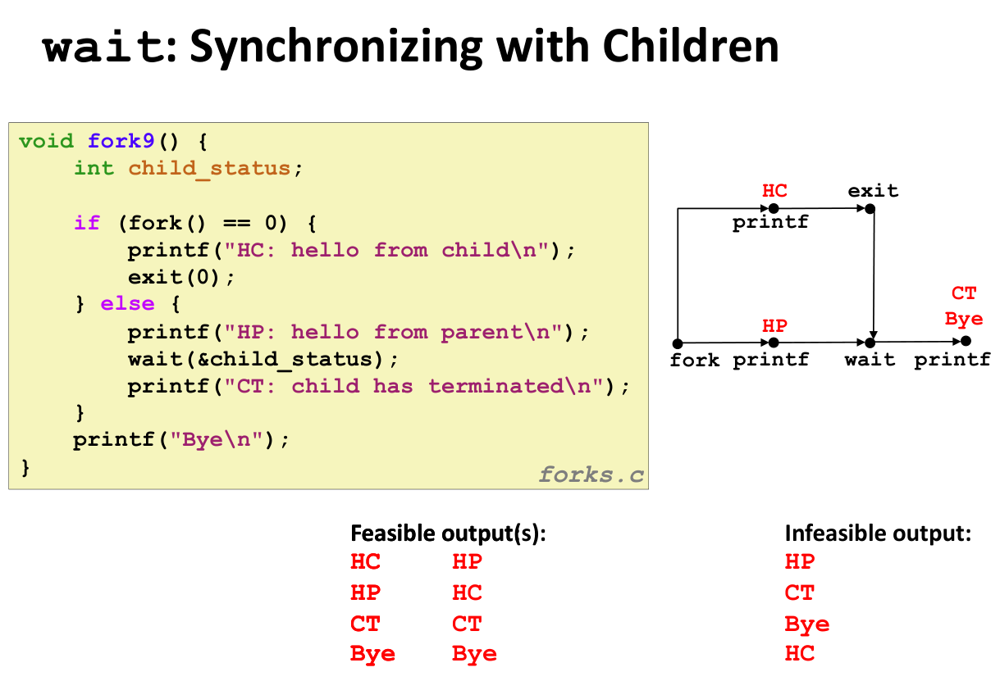

- **`pid_t waitpid(pid_t pid, int *status, int options)`**
  - **功能：** 挂起当前进程，直到 **PID 指定的**子进程终止 。
  - 它提供了比 `wait` 更灵活的选项 。

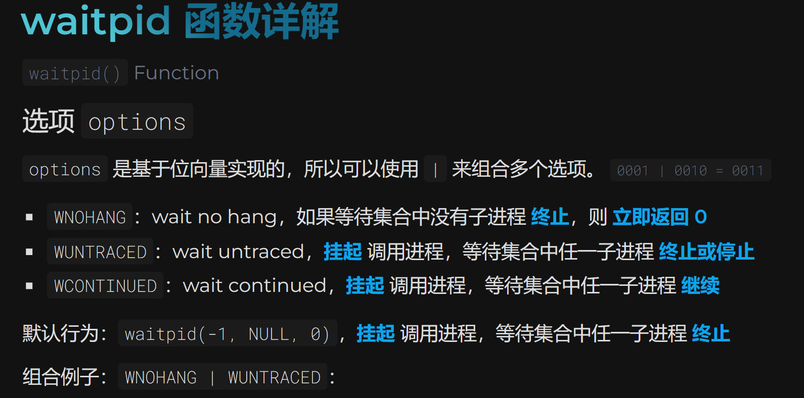

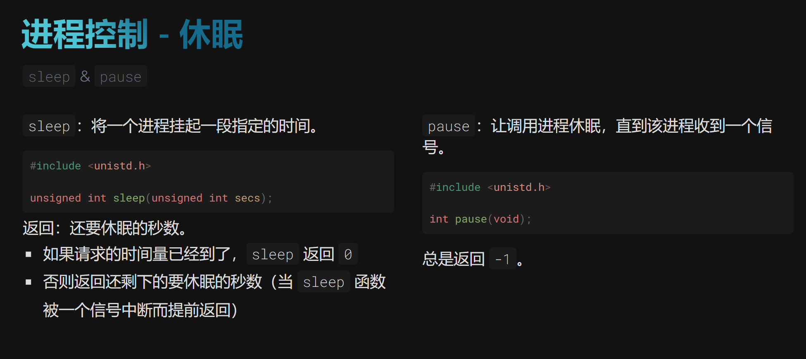

#### 5. 加载和运行程序: `execve()`

- **函数：** `int execve(char *filename, char *argv[], char *envp[])`
- **功能：** 在**当前进程**的上下文中，加载并运行 `filename` 指定的可执行文件 。
- **参数：** `argv` 是参数列表（约定 `argv[0]` 为可执行文件名） ，`envp` 是环境变量列表 。
- **核心特性：**
  - 它会**覆盖**当前进程的代码、数据和栈 。
  - 但**保留**当前的 PID、打开的文件和信号上下文 。
  - **调用一次，（正常情况下）永不返回** 。只有在出错时才会返回 。
- **典型用法：** `fork()` 创建子进程后，子进程立即调用 `execve()` 来加载并运行一个新程序 。


### shell

Shell 是一个应用程序，它代表用户来运行其他程序 。常见的例子有 `sh`, `csh/tcsh` 和 `bash` 。

Linux 进程层级 (Process Hierarchy)

- 在Linux系统中，所有进程都源自一个祖先进程，即 `init` (进程ID为 1) 。
- 可以使用 `pstree` 命令来查看进程树 。

简单 Shell (shellex.c) 的实现

Shell 的核心是一个循环，不断地read和eval用户输入的命令 。

```c
int main(int argc, char** argv)
{
    char cmdline[MAXLINE]; /* command line */

    while (1) {
        /* read */
        printf(">");
        Fgets(cmdline, MAXLINE, stdin);
        if (feof(stdin))
            exit(0);

        /* evaluate */
        eval(cmdline);
    }
}
```

**`eval` 函数的逻辑：**

1. **解析**: `parseline` 函数解析命令行字符串，构建 `argv` 数组，并判断作业是前台 (fg) 还是后台 (bg) 。
   1. 看最后一个字符是不是&,是的话则为后台程序

2. **检查内置命令**: 如果是内置命令（如 `quit`），则立即执行 。
   1. 在if的条件判断里就执行完成了

3. **运行程序**:
   - **`Fork`**: 父进程使用 `Fork()` 创建一个子进程 。
   - **`execve`**: 子进程调用 `execve()` 来加载并运行用户请求的程序 。`execve` 只有在出错时才会返回 。
   - **`waitpid`**:
     - 如果作业是**前台 (fg)**，父进程必须调用 `waitpid` 等待，直到子进程终止 。
     - 如果作业是**后台 (bg)**，父进程不等待，而是打印子进程的PID并继续 。

```c
void eval(char *cmdline)
{
    char *argv[MAXARGS]; /* Argument list execve() */
    char buf[MAXLINE];   /* Holds modified command line */
    int bg;              /* Should the job run in bg or fg? */
    pid_t pid;             /* Process id */

    strcpy(buf, cmdline);
    bg = parseline(buf, argv);
    if (argv[0] == NULL)
        return; /* Ignore empty lines */

    if (!builtin_command(argv)) {
        if ((pid = Fork()) == 0) { /* Child runs user job */
            if (execve(argv[0], argv, environ) < 0) {
                printf("%s: Command not found.\n", argv[0]);
                exit(0);
            }
        }

        /* Parent waits for foreground job to terminate */
        if (!bg) {
            int status;
            if (waitpid(pid, &status, 0) < 0)
                unix_error("waitfg: waitpid error");
        }
        else
            printf("%d %s", pid, cmdline); // 没有后台程序处理逻辑
    }
    return;
}
```

**Shell 实现中的问题**

- 这个简单的 Shell 可以正确地等待并回收前台作业 。
- **问题在于后台作业** 。当一个后台作业终止时，它会变成一个“僵尸”(zombie) 进程 。
- 由于 Shell (父进程) 永远不会显式地等待它，这个僵尸进程将永远不会被回收 。
- 这会导致**内存泄漏**，最终可能耗尽内核内存资源 。

**解决方案：ECF**

- **解决方案**：使用异常控制流 (ECF) 。
- 当后台进程（子进程）终止时，内核会中断 Shell（父进程），通过发送一个**信号 (Signal)** 来通知它。

### 信号

什么是信号？

- 信号是一种**小消息**，用于通知一个进程在系统中发生了某种类型的事件 。它类似于异常和中断 。
- 信号由**内核**发送给==进程== 。
  - 信号存储在进程的上下文中

- 信号由一个小的整数 ID (1-30) 标识 。
- 信号包含的唯一信息就是它的 ID 以及它已到达这个事实 。
- 在 ECF 分类中，信号是**异步**的 (Asynchronous)，由**用户进程**处理 。

**常见信号示例**:

| ID  | 名称    | 默认动作 | 对应事件                     |
| :-- | :------ | :------- | :--------------------------- |
| 2   | SIGINT  | 终止     | 用户键入 `ctrl-c`            |
| 9   | SIGKILL | 终止     | Kill 程序 (不可被捕获或忽略) |
| 11  | SIGSEGV | 终止     | 段违例 (无效内存引用)        |
| 17  | SIGCHLD | 忽略     | 子进程停止或终止             |

**信号的关键概念**

**1. 待处理 (Pending) 与 阻塞 (Blocked)**

- **待处理 (Pending)**: 信号已被发送，但尚未被进程接收 。

- **重要：==信号不会排队==** 。

- 任何特定类型的待处理信号**最多只有一个** 。如果一个 k 类型的信号正待处理，那么后续发送到该进程的 k 类型信号将被**丢弃** 。

- 一个待处理信号最多只会被接收一次 。

- **阻塞 (Blocked)**: 进程可以阻塞某些信号的接收 。被阻塞的信号可以被内核传递，但直到进程取消阻塞，该信号才会被接收 。

> 信号操作函数。
>
> 首先，所有这些函数都围绕一个核心数据类型 `sigset_t` 工作。你可以把 `sigset_t` 想象成一个“信号的集合”，它用来表示一组信号（比如 `SIGINT`, `SIGTERM` 等）。
>
> ---
>
> ### 1\. 信号集初始化
>
> ```c
> int sigemptyset(sigset_t *set);
> int sigfillset(sigset_t *set);
> ```
>
> - **`sigemptyset(sigset_t *set)`**:
>   - **作用**：初始化 `set` 指向的信号集，将其**清空**，使其不包含任何信号。
>   - **何时使用**：在你想构建一个只包含特定几个信号的集合时，这是第一步。
>   - **返回值**：成功返回 0，失败返回 -1。
>
> - **`sigfillset(sigset_t *set)`**:
>   - **作用**：初始化 `set` 指向的信号集，使其包含**所有**系统支持的信号。
>   - **何时使用**：当你希望阻塞（或解除阻塞）几乎所有信号时。
>   - **返回值**：成功返回 0，失败返回 -1。
>
> ---
>
> ### 2\. 向信号集添加信号
>
> ```c
> int sigaddset(sigset_t *set, int signum);
> ```
>
> - **作用**：将指定的信号 `signum`（例如 `SIGINT`）**添加**到 `set` 指向的信号集中。
> - **前提**：`set` 应该已经被 `sigemptyset` 或 `sigfillset` 初始化过了。
> - **返回值**：成功返回 0，失败返回 -1。
>
> ---
>
> ### 3\. 从信号集移除信号
>
> ```c
> int sigdelset(sigset_t *set, int signum);
> ```
>
> - **作用**：将指定的信号 `signum` 从 `set` 指向的信号集中**移除**。
> - **前提**：`set` 应该已经被 `sigemptyset` 或 `sigfillset` 初始化过了。
> - **返回值**：成功返回 0，失败返回 -1。
>
> ---
>
> ### 4\. 检查信号集成否包含某信号
>
> ```c
> int sigismember(const sigset_t *set, int signum);
> ```
>
> - **作用**：检查信号 `signum` **是否**在 `set` 信号集中。
> - **返回值**：
>   - **1**：`signum` 是 `set` 的成员。
>   - **0**：`signum` 不是 `set` 的成员。
>   - **-1**：发生错误。
>
> ---
>
> ### 5\. 应用信号集（修改进程的信号掩码）
>
> ```c
> int sigprocmask(int how, const sigset_t *set, sigset_t *oldset);
> ```
>
> 这是最关键的函数，它用来读取或修改当前进程的**信号掩码**（Signal Mask）。信号掩码定义了当前进程会**阻塞**（即暂时不递送）哪些信号。
>
> - **`how` 参数（如何修改）**：
>   - **`SIG_BLOCK`**: 阻塞 `set` 中的信号。newmask = mask || set。
>   - **`SIG_UNBLOCK`**: 解除对 `set` 中信号的阻塞。newmask = mask & (~set)。
>   - **`SIG_SETMASK`**: newmask = set。
> - **`set` 参数（用哪个集合操作）**：
>   - 指向一个 `sigset_t` 变量，包含了你希望根据 `how` 参数进行操作的信号。
> - **`oldset` 参数（保存旧的掩码）**：
>   - 如果 `oldset` 不是 `NULL`，`sigprocmask` 会在修改掩码**之前**，将当前进程的旧掩码保存到 `oldset` 中。
>   - **这非常重要**：它允许你在执行完“关键代码区域”后，使用 `SIG_SETMASK` 和 `oldset` 完整地恢复进程之前的状态（如图片中示例代码所示）。
>
> - **返回值**：成功返回 0，失败返回 -1。

**2. 内核数据结构**

- 内核为每个进程在**上下文**中维护两个位向量：
  - `pending` (待处理向量): 标记哪些信号是待处理的 。

  - `blocked` (阻塞向量): 标记哪些信号被阻塞 。这也称为**信号掩码 (signal mask)** 。

**3. 发送信号 (Sending)**

- 内核通过更新目标进程上下文中的 `pending` 位向量来“传递”或“发送”一个信号 。

- 发送信号的原因：
  1. **内核**检测到系统事件，例如子进程终止 (发送 SIGCHLD) 。

  2. **其他进程**调用 `kill` 系统调用 。

```c
int kill(pid_t pid, int sig);
```

- 用于向目标进程或进程组分发一个由 `sig` 参数指定的信号的系统调用。
- 该函数通过 `pid` 参数的值来确定分发目标：
  - 若 `pid` 大于零，信号被发送给该特定进程 ID；
  - 若 `pid` 等于零，信号被发送给调用者所在进程组的全部成员；
  - 若 `pid` 小于零，信号则被发送给进程组 ID 等于 `pid` 绝对值（`|pid|`）的全体成员进程。

**4. 进程组 (Process Groups)**

- 每个进程都只属于一个进程组 。

- `/bin/kill` 命令可以向单个进程 (如 `kill -9 24818`) 或一个进程组中的所有进程 (如 `kill -9 -24817`) 发送信号 。

- **从键盘发送**:
  - `ctrl-c` 会发送 `SIGINT` (默认终止) 到**前台进程组**中的每个进程 。

  - `ctrl-z` 会发送 `SIGTSTP` (默认停止/挂起) 到前台进程组 。

**5. 接收信号 (Receiving)**

- 当内核准备将控制权交还给进程 `p` 时，它会检查该进程的**未阻塞待处理信号**集 (`pnb = pending & ~blocked`) 。

- 如果 `pnb` 为空，则正常继续 。

- 如果 `pnb` 非空，内核会**强制**进程 `p` 接收一个信号，并触发一个动作 。


**6. 接收信号的动作**

- **默认动作**：由信号类型决定 ，可能是：
  - 进程终止
  - 进程终止并转储内存
  - 进程停止 (stop)，直到被 `SIGCONT` 重启 。
  - 进程忽略该信号 。

- **捕获信号**：进程可以安装一个**信号处理程序 (signal handler)**，这是一个用户级函数，用于在收到信号时执行 。

- 使用 `signal()` 函数来安装处理程序 。

> ### 1\. 信号处理程序（Handler）的类型定义
>
> ```c
> typedef void (*sighandler_t)(int);
> ```
>
> - **`typedef void (*sighandler_t)(int);`**
> - **作用**：这是一个 `typedef`（类型定义）。它为一种复杂的类型创建了一个更简洁、更易读的别名，名为 `sighandler_t`。
> - **含义**：`sighandler_t` 这个新类型代表一个\*\*“指向函数的指针”\*\*。这个函数必须满足以下条件：
>   1. 它接受一个 `int` 类型的参数（这个 `int` 就是触发它的信号编号，例如 `SIGINT`）。
>   2. 它返回 `void`（即不返回任何值）。
> - **用途**：这个别名主要用于简化 `signal` 函数（见下文）的声明。它清楚地表明 `signal` 函数的第二个参数和它的返回值都是这种特定类型的“信号处理函数指针”。
>
> ---
>
> ### 2\. 设置信号处理方式（signal 函数）
>
> ```c
> sighandler_t signal(int signum, sighandler_t handler);
> ```
>
> - **作用**：`signal` 函数用于\*\*“安装”**或**“修改”**一个进程对于特定信号 `signum` 的**响应行为\*\*（也称为“处置”，disposition）。
> - **参数 `signum`**：
>   - 你希望为其设置响应行为的信号编号。例如 `SIGINT` (Ctrl+C 中断), `SIGCHLD` (子进程退出), `SIGSEGV` (段错误) 等。
>
> - **参数 `handler`**：
>   - 这是你希望进程在收到 `signum` 信号时**做什么**。它有三种主要可能值：
>   - **1. `SIG_IGN`**：这是一个特殊的宏（常量），表示\*\*“忽略”\*\* (Ignore) 这个信号。如果进程收到此信号，它会简单地将其丢弃，不做任何处理。
>   - **2. `SIG_DFL`**：这是一个特殊的宏，表示恢复到\*\*“默认”\*\* (Default) 行为。每个信号都有一个系统默认的处置方式（例如，`SIGINT` 的默认行为是终止进程）。
>   - **3. 一个自定义函数的地址**：这就是一个 `sighandler_t` 类型的指针。当你提供一个自己编写的函数（例如 `void my_handler(int sig) { ... }`）的地址时，这被称为\*\*“捕获”\*\* (Catching) 信号。
>
> - **返回值 (`sighandler_t`)**：
>   - **成功时**：返回**上一次**（调用此函数之前）为 `signum` 设置的信号处理程序指针。这个返回值可能是 `SIG_IGN`、`SIG_DFL` 或之前安装的某个函数指针。
>   - **失败时**：返回 `SIG_ERR`（一个特殊的宏），并且**不会**设置 `errno`（根据图片描述）。
>
> ---
>
> ### 3\. 信号处理的执行流程
>
> 当你使用 `signal(signum, my_handler)` 安装一个自定义函数 `my_handler` 后：
>
> - **捕获 (Catching)**：当一个类型为 `signum` 的信号发送给该进程时，操作系统会暂停进程的当前执行流程。
> - **处理 (Handling)**：操作系统转而调用你设置的 `my_handler` 函数。
> - **参数传递**：`my_handler` 会接收到导致它被调用的信号编号（`signum`）作为它的 `int` 参数。这允许同一个处理函数区分并处理多种不同类型的信号。
> - **返回 (Returning)**：当 `my_handler` 函数执行完毕并返回时，控制权\*\*“通常”\*\*会返回到进程被信号中断时正在执行的那条指令，然后继续执行。
> - **“通常”的例外**：图片中提到“通常”是因为，如果信号中断了一个正在阻塞的系统调用（例如 `read`、`wait`），在某些系统上，该系统调用可能会在信号处理程序返回后失败，并返回一个错误（例如 `EINTR`）。

| **信号类别**      | **示例信号**                                                                                    | **能否被捕获？ (使用 signal() 安装处理函数)** | **能否被忽略？ (设置为 SIG_IGN)** |                                **关键说明**                                |
| ----------------- | ----------------------------------------------------------------------------------------------- | --------------------------------------------- | --------------------------------- | :------------------------------------------------------------------------: |
| **强制控制信号**  | `SIGKILL` `SIGSTOP`                                                                             | **否** ❌                                     | **否** ❌                         |            系统的“最后手段”。用于确保进程总是可以被终止或暂停。            |
| **标准/通知信号** | `SIGINT` (Ctrl+C) `SIGTERM` (kill 默认) `SIGHUP` (挂起) `SIGCHLD` (子进程) `SIGUSR1`, `SIGUSR2` | **是** ✅                                     | **是** ✅                         |              这是最常见的信号，设计用来与进程交互或通知事件。              |
| **严重错误信号**  | `SIGSEGV` (段错误) `SIGFPE` (浮点异常) `SIGILL` (非法指令)                                      | **是** ✅                                     | **是** (但**极不推荐**) ⚠️        | 捕获它们通常用于日志记录或崩溃前清理。忽略它们会导致程序在错误状态下运行。 |
| **特殊行为信号**  | `SIGCONT` (继续)                                                                                | **是** ✅                                     | **是** ✅                         |        其唤醒暂停进程的默认行为_总会_发生，_无论_是否被捕获或忽略。        |

**信号处理的并发性**

- 信号处理程序是一个**单独的逻辑流**，与主程序并发运行 。它不是一个新进程 。

- 处理程序可以被其他类型的信号中断，导致**嵌套处理** 。
  - 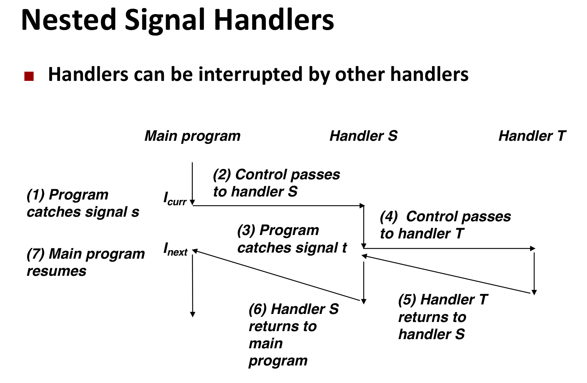

- **隐式阻塞**: 当进程正在处理一个 k 类型的信号时，内核会自动阻塞后续的 k 类型信号 。
  - 只保留一个

- **显式阻塞**: 程序员可以使用 `sigprocmask` 函数来显式地阻塞和解除阻塞信号 。

**安全的信号处理**

处理程序很棘手，因为它们与主程序并发并共享全局数据 。

**安全处理指南：**

- **G0**: 保持处理程序尽可能简单。例如，只设置一个全局标志并立即返回 。

- **G1**: 在处理程序中只调用**异步信号安全 (async-signal-safe)** 的函数 。
  - **不安全**的函数包括 `printf`, `sprintf`, `malloc`, `exit` 。
  - **安全**的函数包括 `_exit`, `write`, `waitpid`, `kill` 。
  - `write` 是唯一安全的I/O函数 。课程推荐使用 `csapp.c` 中的 SIO (Safe I/O) 库，如 `sio_puts` 和 `sio_printf` 。
  - 要么可重入,要么不能被信号处理程序中断

- **G2**: 在进入和退出处理程序时，**保存和恢复 `errno`** 。

- **G3**: 访问全局数据结构时，应临时**阻塞所有信号** (`sigprocmask`)，以防止数据损坏 。

- **G4**: 将全局变量声明为 `volatile`，防止编译器将其优化到寄存器中 。

- **G5**: 将全局标志声明为 `volatile sig_atomic_t`，确保读写是原子的 。

**信号处理陷阱与同步**

**陷阱 1：用信号计数**

- **错误代码**：依赖 `SIGCHLD` 信号来递减一个计数器 。

- **原因**：信号是**不排队**的 。如果 5 个子进程同时终止，内核可能只传递 1 个 `SIGCHLD` 信号 。

- **正确做法**：`SIGCHLD` 处理程序必须准备好回收**所有**已终止的子进程。应使用 `while ((pid = wait(NULL)) > 0)` 循环来回收，直到 `wait` 返回 -1 且 `errno` 为 `ECHILD` 。

**陷阱 2：竞争条件 (Race Condition)**

- **问题**：在 Shell 中，子进程可能在父进程将其 PID 添加到“作业列表”_之前_就终止了，并发送了 `SIGCHLD` 。这会导致处理程序试图删除一个不存在的作业。

- **解决方案**：

1. 在 `fork()` **之前**，父进程阻塞 `SIGCHLD` 。

2. `fork()` 之后，父进程将子进程 PID 添加到作业列表 。

3. 添加完成后，父进程**解除**对 `SIGCHLD` 的阻塞 。

> [!note]
>
> ### ==job==
>
> job是 **Shell 自己定义的一个抽象概念**，用来追踪用户提交的命令行任务。
>
> - **定义**：通常，一个命令行（Command Line）就对应一个作业。
>   - 在支持管道的 Shell 中（如 bash），`ls | grep foo | wc -l` 这一整行命令是一个作业，但它包含 3 个进程。
>     - lab要求指出不需要支持管道 ，所以1个job通常只包含 **1 个** 子进程（初始子进程）。
> - **标识符 (JID)**：Shell 为了方便用户管理，会给每个作业分配一个 **Job ID (JID)**，比如 `%1`, `%2`。这是 Shell 内部维护的，内核并不知道 JID 的存在 。
> - **状态**：作业有三种状态，这也是你需要维护的数据结构的核心 ：
>   1. **Foreground (前台)**：独占终端，Shell 等待它结束 。
>   2. **Background (后台)**：在后台运行，Shell 立即打印提示符，不等待它 。
>   3. **Stopped (挂起)**：收到 SIGTSTP (Ctrl-Z) 后暂停运行，等待被唤醒 。
>
> > `jid`和`pid`的区别是什么？
>
> | **特性**              | **PID (Process ID)**                                                    | **JID (Job ID)**                                        |
> | --------------------- | ----------------------------------------------------------------------- | ------------------------------------------------------- |
> | **全称**              | 进程 ID (Process ID)                                                    | 作业 ID (Job ID)                                        |
> | **分配者**            | Linux 操作系统内核                                                      | 你的 Shell 程序 (`tsh`)                                 |
> | **命令行表示**        | **纯数字** (例如 `5` 代表 PID 为 5 的进程)                              | **带 `%` 前缀** (例如 `%5` 代表 JID 为 5 的作业)        |
> | **数据类型**          | 整数 (通常较大，且每次运行时都会变化)                                   | 正整数 (通常较小，如 1, 2, 3...)                        |
> | **作用域**            | 全局唯一 (整个操作系统范围内有效)                                       | 局部有效 (仅在当前 Shell 进程内部有效)                  |
> | **主要目的**          | 操作系统内核用于标识和管理进程                                          | 为了方便用户在命令行中引用作业 (比输入长 PID 更方便)    |
> | **在 `tsh` 中的用法** | 可直接作为 `kill`, `fg`, `bg` 等内置命令的参数                          | 可作为 `kill`, `fg`, `bg` 等内置命令的参数 (必须加 `%`) |
> | **关联性**            | 一个作业通常对应一个主进程的 PID (但在 `tsh` 中是通过 PID 来追踪作业的) | 每个 JID 在 Shell 内部的作业列表中映射到一个对应的 PID  |
>
> > 那它是被如何管理的？
>
> 一旦作业产生，Shell 就需要通过信号处理程序、内置命令和辅助函数对其生命周期进行全方位的管理。
>
> **A. 数据结构管理**
>
> Shell 维护一个作业列表（Job List）。文档提到已经为你提供了操作这个列表的所有必要例程 ：
>
> - **`addjob`**：添加作业。
> - **`deletejob`**：删除作业。
> - **`getjobpid`** / **`getjobjid`**：根据 PID 或 JID 查找作业。
>
> **B. 状态与并发控制**
>
> 作业在 Shell 中有三种状态，你需要通过信号来管理这些状态的转换：
>
> 1. **前台运行 (Foreground)**：
>    - Shell 在 `eval` 中必须等待前台作业结束。你不能使用简单的 `wait`，而应该使用 `sigsuspend` 来挂起 Shell，直到收到 `SIGCHLD` 信号 。
>    - 同一时间最多只能有一个前台作业 。
> 2. **后台运行 (Background)**：
>    - Shell 不会等待它结束，而是直接打印命令提示符 `tsh>` 等待下一条指令 。
>    - Shell 需要在 `eval` 中打印出后台作业的信息（JID 和 PID）。
> 3. **挂起/停止 (Stopped)**：
>    - 如果前台作业收到 `SIGTSTP` (Ctrl-Z)，它会被内核挂起。Shell 的 `sigtstp_handler` 会捕获该信号，你需要更新作业列表中该作业的状态为 `ST` (Stopped) 。
>
> **C. 信号转发 (Signal Forwarding)**
>
> Shell 充当了用户和作业之间的中介：
>
> - **Ctrl-C (SIGINT)**：Shell 捕获后，通过 `kill(-PID, SIGINT)` 将信号转发给当前前台作业所在的**整个进程组** 。
> - **Ctrl-Z (SIGTSTP)**：同理，转发给前台进程组，使其挂起 。
>
> **D. 用户命令干预**
>
> 用户可以通过内置命令直接干预作业管理：
>
> - **`jobs`**：遍历作业列表并打印所有后台作业 。
> - **`bg <job>`**：向挂起的作业发送 `SIGCONT` 信号让其继续运行，并将其状态更新为后台运行 。
> - **`fg <job>`**：向挂起或后台的作业发送 `SIGCONT`，将其状态改为前台，并让 Shell 等待其结束 。
> - **`kill <job>`**：根据 JID 或 PID 找到对应作业，并发送 `SIGTERM` 信号 。
>
> **E.作业的消亡 (Termination)**
>
> 作业的生命周期在它终止或被信号杀死时结束。管理这一过程的是 `sigchld_handler` 函数 ：
>
> 1. **回收僵尸进程 (Reaping)**： 当子进程结束时，内核发送 `SIGCHLD` 给 Shell。`sigchld_handler` 必须调用 `waitpid` 来回收僵尸进程 。
> 2. **注销作业 (deletejob)**： 在成功回收（reap）子进程后，处理程序必须调用 `deletejob` 将其从作业列表中移除 。
> 3. **异常报告**： 如果作业是因为未被捕获的信号（如段错误）而终止的，Shell 需要打印 PID 和信号描述 。
>
> ```mermaid
> graph TD
>     %% 1. 定义节点样式 (配色方案)
>     classDef active fill:#e1f5fe,stroke:#0288d1,stroke-width:2px,color:#01579b;
>     classDef stopped fill:#fff3e0,stroke:#f57c00,stroke-width:2px,color:#e65100;
>     classDef dead fill:#ffebee,stroke:#d32f2f,stroke-width:2px,color:#b71c1c;
>     classDef startend fill:#f5f5f5,stroke:#bdbdbd,stroke-width:2px,color:#616161;
>
>     %% 2. 定义节点
>     Start((Start)):::startend
>     FG(Foreground):::active
>     BG(Background):::active
>     ST(Stopped):::stopped
>     Zombie[Zombie / Terminated]:::dead
>     End((Reaped)):::startend
>
>     %% 3. 初始创建流程
>     Start -- "fork & addjob" --> Check{Check &}
>     Check -- "No &" --> FG
>     Check -- "Has &" --> BG
>
>     %% 4. 状态循环 (核心逻辑)
>     FG -- "Ctrl-Z (SIGTSTP)" --> ST
>     ST -- "bg command" --> BG
>     ST -- "fg command" --> FG
>     BG -- "fg command" --> FG
>
>     %% 5. 终止流程
>     FG -- "Ctrl-C / Exit" --> Zombie
>     BG -- "Exit / Signal" --> Zombie
>     ST -- "Kill Signal" --> Zombie
>
>     %% 6. 回收
>     Zombie -- "sigchld_handler" --> End
>
>     %% 避免线交叉的隐形调整 (可选)
>     linkStyle default stroke:#607d8b,stroke-width:1px,fill:none;
> ```
>
> ### ==process group==
>
> “进程组”是 **Linux 内核（OS）层面的机制**，用于简化信号的发送。
>
> - **定义**：一个或多个进程的集合。每个进程组都有一个唯一的 **进程组 ID (PGID)**。
> - **核心作用**：**群发信号**。
>   - 如果你想杀掉一个作业（可能包含多个进程），你不需要知道里面每个进程的 PID。你只需要向这个“进程组”发送信号，组内所有进程都会收到。
>   - 在 Linux 中，`kill` 函数如果 PID 参数传 **负数**（如 `-15213`），表示向 PGID 为 `15213` 的 **整个进程组** 发送信号 。
> - **终端行为**：当你在键盘上按 **Ctrl-C** 时，Linux 内核不仅仅是发信号给某一个进程，而是发给 **当前前台进程组** 中的 **每一个** 进程 。
>
> > 那它是如何产生的呢？
>
> 进程组的产生和归属主要通过 `fork` 和 `setpgid` 两个系统调用来控制。
>
> **A. 默认情况：继承 (Inheritance)**
>
> 当父进程调用 `fork()` 创建子进程时，子进程默认会**继承**父进程的进程组 ID 。
>
> - **场景**：如果在你的 Shell (`tsh`) 中运行 `ls`，如果不做特殊处理，`ls` 就会属于 `tsh` 的进程组。
> - **后果**：这会导致“同归于尽”的问题。因为终端产生的信号（如 Ctrl-C）是发给前台进程组的所有成员的。如果 `tsh` 和 `ls` 在同一个组，Ctrl-C 会同时杀死它们 。
>
> **B. 主动创建：`setpgid` (本次作业的关键)**
>
> 为了避免上述问题，我们需要让子进程“自立门户”，创建一个新的进程组。
>
> - **函数**：`setpgid(pid_t pid, pid_t pgid)`。
> - **用法**：在 `fork` 之后、`execve` 之前，子进程调用 `setpgid(0, 0)` 。
>   - 第一个 `0` 表示“当前进程”（即子进程自己）。
>   - 第二个 `0` 表示“使用当前进程的 PID 作为新的 PGID”。
> - **结果**：子进程变成了一个新进程组的组长，其 PGID 等于它自己的 PID。
>
> > `pid`和`pgid`有什么区别？
>
> | **特性**   | **PID (Process ID)**                          | **PGID (Process Group ID)**                                   |
> | ---------- | --------------------------------------------- | ------------------------------------------------------------- |
> | **定义**   | **进程 ID**。每个进程在系统中唯一的身份证号。 | **进程组 ID**。一个进程组的标识符，通常等于该组“组长”的 PID。 |
> | **唯一性** | 绝对唯一。                                    | 多个进程可以共享同一个 PGID。                                 |
> | **作用**   | 用于精准操作某**一个**特定进程。              | 用于批量操作（如发信号）给**一组**协作的进程。                |

**显式等待信号**

> ==等待一个“异步事件”==
>
> **主程序（例如父进程）需要等待一个“信号处理程序”（例如 `SIGCHLD` 处理器）去完成某项工作**
>
> 例子:修改一个全局变量 `pid`
>
> - **主程序**：运行在正常的控制流中。
> - **信号处理程序**：是一个“异步”事件。它可能在主程序执行_任何_两条指令的间隙中**突然插入**执行。

- **忙等待** (`while (!pid);`): 浪费 CPU 资源 。

- **`pause()`**: `while (!pid) pause();` 存在竞争条件。信号可能在 `while` 检查和 `pause()` 调用_之间_到达 。
  - > **[主程序]**：执行 `while (!pid)`。`pid` 此时是 0，条件为**真**。
    >
    > **[主程序]**：准备执行下一条指令，即 `pause()`。
    >
    > **[中断！]**：就在主程序即将调用 `pause()` **之前**的这一个纳秒，**内核调度器介入**。
    >
    > **[子进程]**：子进程在此时刚好退出，内核向父进程发送 `SIGCHLD` 信号。
    >
    > **[信号处理器]**：父进程的 `SIGCHLD` 处理器**被触发执行**。它调用 `wait()`，并成功将 `pid` 设置为 1234。
    >
    > **[信号处理器]**：**处理器执行完毕**，返回。
    >
    > **[主程序]**：现在**恢复执行**。它从第 2 步被打断的地方继续，执行 `pause()` 调用。
    >
    > **[灾难！]**：进程现在**挂起**了，等待“任何一个信号”。但是，它**唯一在等待的 `SIGCHLD` 信号**，在第 5 步**已经来过并且处理完了**！
    >
    > **[结果]**：进程将**永远卡在 `pause()`**，除非用户手动 `Ctrl+C`（发送另一个信号）才能“踢”它一下。

- **`sleep(1)`**: 安全，但响应太慢 。

- **最佳方案：`sigsuspend`**
  - `sigsuspend` 函数在**原子上**（不可中断地）执行以下操作：
    1. 临时设置信号掩码（例如，解除对 `SIGCHLD` 的阻塞）。
    2. 挂起进程，等待信号（`pause`）。
    3. 信号到达并处理后，恢复原始的信号掩码。

  - 这完美地避免了 `pause()` 的竞争条件 。

### 非本地跳转

`setjmp` 和 `longjmp` (非本地跳转, Nonlocal Jumps)是一种功能强大（但危险）的用户级 ECF 机制。

- 它们允许程序打破标准的==过程调用/返回规则==(FILO) 。

- 常用于错误恢复，允许从深度嵌套的函数调用中立即返回到高层 。

```c
int setjmp(jmp_buf j)
```

- **功能**: 在 `jmp_buf` 缓冲区 `j` 中保存当前执行环境（寄存器、栈指针、PC）。

- **调用**: 必须在 `longjmp` 之前调用 。

- **返回**:
- 当**直接调用**时，`setjmp` 返回 **0** 。
- 当通过 `longjmp` "返回"时，`setjmp` 返回一个**非零**值

```c
void longjmp(jmp_buf j, int i)
```

- **功能**: 从缓冲区 `j` 中恢复 `setjmp` 保存的环境 。

- **调用**: `longjmp` 被调用一次，但**永不返回** 。

- **效果**: 导致程序控制流跳转回 `setjmp` 被调用的地方，`setjmp` 此时返回 `i`（如果 `i` 为 0，则返回 1）。

```c
#include <stdio.h>
#include <setjmp.h>

jmp_buf error_handler_buf;

void funcC() {
    printf("  Entering funcC... Found a fatal error!\n");
    // "Loads save file" immediately, transports back to main, and sends error code 101
    longjmp(error_handler_buf, 101);

    // --- This line is never executed ---
    printf("  Exiting funcC.\n");
}

void funcB() {
    printf(" Entering funcB...\n");
    funcC();
    // --- This line is skipped when longjmp occurs ---
    printf(" Exiting funcB.\n");
}

void funcA() {
    printf("Entering funcA...\n");
    funcB();
    // --- This line is skipped when longjmp occurs ---
    printf("Exiting funcA.\n");
}

int main() {
    int error_code;

    // 1. Set the "save point"
    //    - When called directly the first time, ret == 0
    //    - If returning via longjmp, ret == 101
    if ((error_code = setjmp(error_handler_buf)) == 0) { // <=== Jumps back here, and setjmp returns its second value
        // --- Normal execution path (Save successful) ---
        printf("Save point set successfully. Starting execution...\n");
        funcA();
        printf("...Execution finished.\n"); // (This line executes if no error occurred)
    } else {
        // --- Error recovery path (Returned from "loading save") ---
        printf("!!! Emergency transport back! Caught error code: %d\n", error_code);
        // Perform cleanup work here...
    }

    printf("Program finishing normally in main.\n");
    return 0;
}
```

**局限性**

- `setjmp/longjmp` 必须在**栈规则**内工作 。

- 只能 `longjmp` 到一个**已经调用但尚未返回**的函数所建立的环境中 。

**信号处理中的应用**

`sigsetjmp` 和 `siglongjmp` 是用于信号处理程序中的安全版本。一个例子是，可以编写一个程序，当用户按下 `ctrl-c` (SIGINT) 时，信号处理程序调用 `siglongjmp` 来跳转回 `main` 函数的开头，从而"重启"程序 。
