# System IO

## Unix I/O

Unix I/O 是操作系统内核提供的一组用于输入输出的低级系统调用接口。

**核心概念**

- **文件即字节序列**：Linux 文件仅仅是 $m$ 个字节的序列 ($B_0, B_1, ..., B_m$)。
- **万物皆文件**：所有的 I/O 设备都被模型化为文件，包括：
  - 网络、磁盘分区 (`/dev/sda2`)
  - 终端 (`/dev/tty2`)
  - 甚至内核数据结构 (`/proc`)
- **统一接口**：这种优雅的映射允许内核导出一个简单的 Unix I/O 接口来处理所有设备：
  - 打开 (`open`) / 关闭 (`close`)
  - 读 (`read`) / 写 (`write`)
  - 改变当前文件位置 (`lseek`)

## 文件类型与目录层次

#### 文件类型

1. **普通文件 (Regular file)**：包含任意数据。
    - **文本文件**：只包含 ASCII 或 Unicode 字符。
      - Linux/Mac 换行符：`\n` (0xa, LF)
      - Windows/网络协议换行符：`\r\n` (0xd 0xa, CR+LF)
    - **二进制文件**：除文本文件外的所有文件（如目标文件、JPEG）。
    - _注意_：内核不区分文本和二进制，这是应用程序层面的区分。
2. **目录 (Directory)**：包含一组链接的文件索引。
3. **套接字 (Socket)**：用于跨机器进程通信。
4. **其他**：命名管道 (FIFOs)、符号链接、字符/块设备。

#### 目录操作

- **结构**：目录也是文件，包含链接数组。
  - `.` (dot)：链接到当前目录。
  - `..` (dot dot)：链接到父目录。
- **路径名**：
  - **绝对路径**：以 `/` 开头（如 `/home/droh/hello.c`）。
  - **相对路径**：相对于当前工作目录 (cwd)。
- **API**：`opendir`, `readdir`, `closedir`。建议只使用这些函数读取目录条目，不要直接写入。

## Unix I/O

#### 打开与关闭文件

- **`open()`**：将文件名转换为文件描述符 (File Descriptor, fd)。
  - 返回一个小的整数 fd，若出错返回 -1。
  - **标准文件描述符**：
    - 0: 标准输入 (stdin)
    - 1: 标准输出 (stdout)
    - 2: 标准错误 (stderr)
- **`close()`**：通知内核结束访问。
  - _重要_：必须检查返回值，即使是 `close()` 也可能出错（尤其是在多线程程序中）。

#### 读写文件

- **`read(fd, buf, sizeof(buf))`**：从当前文件位置复制字节到内存，并更新文件位置。
  - 返回读取的字节数 (`ssize_t`)。
  - 若返回 0，表示遇到 EOF (End of File)。
  - 若返回 -1，表示出错。
- **`write(fd, buf, sizeof(buf))`**：从内存复制字节到文件当前位置，并更新位置。

> [!note]
>
> 更新文件位置指的是**当前文件偏移量” (Current File Offset)**
>
> 当调用 `read` 或 `write` 时，操作系统内核（Kernel）会在与该文件描述符 (`fd`) 关联的**打开文件描述（Open File Description）**表格中维护一个偏移量。
>
> - **初始状态：** 打开文件时（除非使用了 `O_APPEND`），偏移量通常为 0。
> - **自动累加：**
>   - 如果你执行 `read(fd, buf, 100)` 并成功读取了 100 字节，内核会自动将该偏移量加 100。
>   - 下一次调用 `read` 或 `write` 时，操作将从第 101 个字节开始。
> - **原子性：** 这个更新过程是由内核管理的，对于调用者来说是透明且自动的。

#### 短计数值

即**读写的字节数小于请求的字节数** 。

- **可能发生的情况**：
  1. 读操作遇到 EOF。
  2. 从终端读取文本行。
  3. 读写网络套接字 (Network Sockets)。
- **绝不会发生的情况**：
  1. 读磁盘文件（除非遇到 EOF）。
  2. 写磁盘文件。
- **最佳实践**：编写代码时始终要处理短计数值，特别是在网络编程中。

## 文件元数据与共享

#### Metadata

`struct stat` 是内核向用户程序传递文件属性的标准容器。虽然不同架构的具体定义略有不同，但 POSIX 标准定义了以下核心字段。

| 字段类型    | 字段名           | 描述                      | 关键用途                                                |
| :---------- | :--------------- | :------------------------ | :------------------------------------------------------ |
| `dev_t`     | **`st_dev`**     | 包含该文件的设备 ID       | 识别文件存储在哪个物理/逻辑设备上                       |
| `ino_t`     | **`st_ino`**     | Inode 编号                | **文件的唯一标识** (在同一设备内)                       |
| `mode_t`    | **`st_mode`**    | **文件类型与权限**        | 这是一个位掩码（Bitmask），非常重要                     |
| `nlink_t`   | **`st_nlink`**   | 硬链接计数                | 只有当此值为 0 时，文件数据块才会被释放                 |
| `uid_t`     | **`st_uid`**     | 所有者用户 ID             | 权限检查依据                                            |
| `gid_t`     | **`st_gid`**     | 所有者组 ID               | 权限检查依据                                            |
| `off_t`     | **`st_size`**    | 文件大小 (字节)           | **仅对普通文件有效**；符号链接则是路径长度              |
| `blksize_t` | **`st_blksize`** | 文件系统 I/O 的最佳块大小 | 用于优化读写缓冲区大小                                  |
| `blkcnt_t`  | **`st_blocks`**  | 分配的 512B 块数量        | **实际磁盘占用** (可能大于或小于 `st_size`，如稀疏文件) |
| `time_t`    | **`st_atime`**   | 最后访问时间 (Access)     | 最近一次 `read` 的时间                                  |
| `time_t`    | **`st_mtime`**   | 最后修改时间 (Modify)     | 最近一次文件**内容**被写入的时间                        |
| `time_t`    | **`st_ctime`**   | 最后状态改变时间 (Change) | 最近一次 **元数据** (如权限、所有者) 改变的时间         |

`st_mode` 是一个 16 位的位图，它混合存储了**文件类型**和**访问权限**。不要直接比较它的值，而应该使用系统提供的宏。

**1. 判断文件类型（高 7 位）：**
使用宏 `S_ISxxx(m)` 进行判断：

- `S_ISREG(st.st_mode)`: 是否为普通文件 (-)
- `S_ISDIR(st.st_mode)`: 是否为目录 (d)
- `S_ISLNK(st.st_mode)`: 是否为符号链接 (l)
- `S_ISSOCK(st.st_mode)`: 是否为套接字 (s)

**2. 判断权限（低 9 位）：**
对应 `rwx` (读/写/执行) 对于 User, Group, Others 的权限位。例如 `S_IRUSR` (用户读), `S_IWGRP` (组写) 等。

> **注意 `mtime` vs `ctime`：**
>
> - 修改文件内容（`write`）会同时更新 `mtime` 和 `ctime`（因为文件大小变了，元数据也就变了）。
> - 修改文件权限（`chmod`）只会更新 `ctime`，不会更新 `mtime`。

#### chmod

`chmod` (Change Mode) 用于修改 `struct stat` 中的 `st_mode` 字段的低 9 位（即权限位）。它可以是 Shell 命令，也可以是 C 语言的系统调用。

场景 A：命令行 (Shell) 使用（最常用）

有两种模式：**符号模式** (Symbolic) 和 **八进制模式** (Octal)。

1\. 八进制模式 (绝对赋值)

将权限看作 3 位二进制数（读=4, 写=2, 执行=1）。

- **格式：** `chmod [XYZ] file`
  - X: Owner, Y: Group, Z: Others
- **示例：**

  ```bash
  chmod 755 script.sh  # rwxr-xr-x (拥有者全权，其他人只读执行)
  chmod 644 data.txt   # rw-r--r-- (标准数据文件权限)
  chmod 600 key.pem    # rw------- (私钥文件，仅拥有者可读写)
  ```

2\. 符号模式 (增量修改)

更直观地增加或删除权限。

- **对象：** `u`(User), `g`(Group), `o`(Others), `a`(All)
- **操作：** `+`(添加), `-`(删除), `=` (设置为)
- **权限：** `r`, `w`, `x`
- **示例：**

  ```bash
  chmod +x app         # 给所有用户添加执行权限 (等同于 a+x)
  chmod u+w file.txt   # 仅给拥有者添加写权限
  chmod go-rwx secret  # 移除组和其他人的所有权限
  ```

场景 B：C 语言系统编程 (`chmod` 函数)

在 C 语言中，使用 `chmod` 系统调用直接修改文件权限。这里不做展开。

#### 内核如何表示打开的文件 (三张表)

这是理解文件共享和重定向的关键：

1. **描述符表 (Descriptor table)**：**每个进程独有**。
    - 包含指向“打开文件表”表项的指针。
2. **打开文件表 (Open file table)**：**所有进程共享**。
    - 包含：当前文件位置 (File pos)、引用计数 (refcnt)。
    - 这意味着如果**两个进程共享同一个打开文件表项，它们也共享文件读取位置**。
3. **v-node 表 (v-node table)**：**所有进程共享**。
    - 包含：文件元数据（如 `stat` 结构中的信息）。

```mermaid
graph LR
    %% 定义样式
    classDef descTable fill:#e3f2fd,stroke:#1565c0,stroke-width:2px;
    classDef fileTable fill:#fff9c4,stroke:#fbc02d,stroke-width:2px;
    classDef vnodeTable fill:#e8f5e9,stroke:#2e7d32,stroke-width:2px;

    %% 1. 描述符表
    subgraph DT ["描述符表"]
        direction TB
        subgraph ProcessA ["进程 A"]
            pa_fd1["fd 1 (stdout)"]
            pa_fd3["fd 3"]
        end

        subgraph ProcessB ["进程 B"]
            pb_fd1["fd 1 (stdout)"]
        end
    end

    %% 2. 打开文件表
    subgraph OFT ["打开文件表"]
        direction TB
        subgraph FileEntry1 ["表项 #1"]
            fe1_info["当前位置 (Pos): 100 <br> 引用计数 (refcnt): 2 <br> 模式: Write"]
        end

        subgraph FileEntry2 ["表项 #2"]
            fe2_info["当前位置 (Pos): 0 <br> 引用计数 (refcnt): 1 <br> 模式: Read"]
        end
    end

    %% 3. v-node 表
    subgraph VNT ["v-node表"]
        subgraph VnodeX ["v-node X (文件 foo.txt)"]
            vn_info["文件大小: 2048 <br> 所有者: Root <br> 物理磁盘地址"]
        end
    end

    %% 连接关系
    %% 场景 1: 共享 (例如通过 fork)
    pa_fd1 -->|指针| FileEntry1
    pb_fd1 -->|指针| FileEntry1

    %% 场景 2: 独立打开同一个文件
    pa_fd3 -->|指针| FileEntry2

    %% 连接到 v-node
    FileEntry1 -->|指针| VnodeX
    FileEntry2 -->|指针| VnodeX

    %% 应用样式
    class ProcessA,ProcessB descTable;
    class FileEntry1,FileEntry2 fileTable;
    class VnodeX vnodeTable;
```

#### 文件共享的几种场景

1. **同一个进程两次 `open` 同一个文件**：
    - 也就是 `fd1 = open("f.txt"); fd2 = open("f.txt");`
    - 结果：两个不同的描述符，指向**两个不同**的打开文件表项。
    - _特点_：它们有各自独立的文件位置 (file pos)，互不干扰。

```mermaid
graph LR
    %% 样式定义
    classDef dt fill:#e3f2fd,stroke:#1565c0,stroke-width:2px;
    classDef oft fill:#fff9c4,stroke:#fbc02d,stroke-width:2px;
    classDef vnt fill:#e8f5e9,stroke:#2e7d32,stroke-width:2px;

    %% 描述符表
    subgraph DT ["描述符表 (进程 P1)"]
        direction TB
        fd3["fd 3 = open('A.txt')"]
        fd4["fd 4 = open('A.txt')"]
    end

    %% 打开文件表
    subgraph OFT ["打开文件表 (OFT)"]
        direction TB
        oe1["表项 #1 <br> Pos: 100 <br> ref: 1"]
        oe2["表项 #2 <br> Pos: 0 <br> ref: 1"]
    end

    %% v-node 表
    subgraph VNT ["v-node 表"]
        vn["v-node (A.txt)"]
    end

    %% 连接
    fd3 --> oe1
    fd4 --> oe2
    oe1 --> vn
    oe2 --> vn

    %% 应用样式
    class DT dt;
    class OFT oft;
    class VNT vnt;
```

1. **`fork()` 后的父子进程**：
    - 子进程继承父进程的描述符表。
    - 结果：父子进程的相同 fd 指向**同一个**打开文件表项。
    - _特点_：父子进程**共享**文件位置。引用计数 (refcnt) 会增加。

```mermaid
graph LR
    %% 样式定义
    classDef dt fill:#e3f2fd,stroke:#1565c0,stroke-width:2px;
    classDef oft fill:#fff9c4,stroke:#fbc02d,stroke-width:2px;
    classDef vnt fill:#e8f5e9,stroke:#2e7d32,stroke-width:2px;

    %% 描述符表 (父子)
    subgraph DT_Parent ["父进程描述符"]
        p_fd3["fd 3"]
    end

    subgraph DT_Child ["子进程描述符"]
        c_fd3["fd 3"]
    end

    %% 打开文件表
    subgraph OFT ["打开文件表 (OFT)"]
        oe["表项 #Shared <br> Pos: 50 <br> ref: 2 (父+子)"]
    end

    %% v-node 表
    subgraph VNT ["v-node 表"]
        vn["v-node (B.txt)"]
    end

    %% 连接
    p_fd3 --> oe
    c_fd3 --> oe
    oe --> vn

    %% 应用样式
    class DT_Parent,DT_Child dt;
    class OFT oft;
    class VNT vnt;
```

1. **I/O 重定向 (`dup2`)**：
    - `dup2(oldfd, newfd)`：将描述符表中的 `oldfd` 条目复制并覆盖 `newfd` 条目。
    - 例如 `dup2(4, 1)` 会让标准输出 (fd 1) 指向 fd 4 对应的文件（如磁盘文件）。
    - 这是 Shell 实现重定向（如 `ls > foo.txt`）的原理。

```mermaid
graph LR
    %% 样式定义
    classDef dt fill:#e3f2fd,stroke:#1565c0,stroke-width:2px;
    classDef oft fill:#fff9c4,stroke:#fbc02d,stroke-width:2px;
    classDef vnt fill:#e8f5e9,stroke:#2e7d32,stroke-width:2px;

    %% 描述符表
    subgraph DT ["描述符表 (进程 P3)"]
        direction TB
        fd4["fd 4 (LogFile)"]
        fd1["fd 1 (Stdout)"]
    end

    %% 打开文件表
    subgraph OFT ["打开文件表 (OFT)"]
        oe_file["表项 #File <br> (磁盘文件) <br> ref: 2"]
        oe_term["表项 #Term <br> (屏幕终端) <br> ref: 0 (引用归零)"]
    end

    %% v-node 表
    subgraph VNT ["v-node 表"]
        vn_file["v-node (out.log)"]
        vn_term["v-node (终端)"]
    end

    %% 连接
    fd4 --> oe_file

    %% 重定向逻辑
    fd1 -.->|断开| oe_term
    fd1 -->|重定向| oe_file

    oe_file --> vn_file
    oe_term --> vn_term

    %% 应用样式
    class DT dt;
    class OFT oft;
    class VNT vnt;
```

---

### Standard I/O

C 标准库 (`libc`) 提供的更高级别的 I/O 函数 (`stdio.h`)。

- **流 (Stream)**：标准 I/O 将打开的文件模型化为流。是一个指向 `FILE` 类型的指针，是对 fd 和内存缓冲区的抽象。
- **缓冲 (Buffering)**：
  - **动机**：Unix I/O 系统调用 (`read`/`write`) 开销大（>10,000 时钟周期）。
  - **机制**：使用 `printf` 或 `fputc` 时，数据先写入用户空间的缓冲区。只有当缓冲区满、遇到换行符 (`\n`)、调用 `fflush` 或程序结束时，才真正调用 Unix `write` 写入内核。
  - **问题**：`strace` 追踪时会发现 `write` 调用次数远少于 `printf` 调用次数。

| **特性**     | **底层 I/O (Unbuffered)** | **标准 I/O (Buffered)**                        |
| ------------ | ------------------------- | ---------------------------------------------- |
| **句柄类型** | `int` (文件描述符)        | `FILE *` (文件流指针)                          |
| **打开**     | `open()`                  | `fopen()`                                      |
| **读/写**    | `read()`, `write()`       | `fread()`, `fwrite()`, `fprintf()`, `fscanf()` |
| **关闭**     | `close()`                 | `fclose()` (会自动刷新缓冲区)                  |
| **主要位置** | `<unistd.h>`              | `<stdio.h>`                                    |
| **典型代表** | `STDIN_FILENO` (0)        | `stdin`                                        |

> [!important]
>
> 和文件描述符的区别在于有没有buffer。

```mermaid
graph TD
    %% === 样式定义 ===
    classDef userSpace fill:#e1f5fe,stroke:#01579b,stroke-width:2px;
    classDef structFile fill:#fff9c4,stroke:#fbc02d,stroke-width:2px,stroke-dasharray: 5 5;
    classDef bufferBlock fill:#ffcc80,stroke:#e65100,stroke-width:1px;
    classDef kernelSpace fill:#ffebee,stroke:#b71c1c,stroke-width:2px;
    classDef sysCall fill:#b0bec5,stroke:#37474f,stroke-width:1px;

    %% ==========================================
    %% 1. 用户空间 (User Space)
    %% ==========================================
    subgraph US ["用户空间 (User Space)"]
        direction TB

        %% 应用程序
        App["你的代码 (Application) <br> fprintf(fp, 'A');"]

        %% FILE 结构体 (C标准库)
        subgraph FILE_Struct ["FILE 结构体 (fp)"]
            direction TB

            %% 核心组件
            subgraph Buffer ["用户级缓冲区 (User Buffer)"]
                Content["[ 'A' | 'B' | ...空闲... ]"]
            end

            Vars["指针: ptr (当前位置)<br>计数器: cnt (剩余空间)<br>标志: flags (EOF/ERR)"]

            FD_Holder["底层描述符: _fileno = 3"]
        end
    end

    %% ==========================================
    %% 2. 系统调用接口
    %% ==========================================
    SysWrite(("系统调用<br>write(3, buf, ...)"))

    %% ==========================================
    %% 3. 内核空间 (Kernel Space)
    %% ==========================================
    subgraph KS ["内核空间 (Kernel Space)"]
        direction TB

        DT["描述符表"]
        OFT["打开文件表<br>(Offset)"]
        Disk[("磁盘 / 硬件")]
    end

    %% === 连接关系与数据流 ===

    %% 1. 写入缓冲
    App -->|复制数据| Content

    %% 变量控制缓冲
    Vars -.->|管理| Buffer

    %% 2. 刷新缓冲 (Buffer Flush)
    Vars -->|"触发刷新 (Flush)"| SysWrite

    %% 3. 数据传入内核
    FD_Holder -.->|提供 fd| SysWrite
    Content -->|数据搬运| SysWrite

    %% 4. 内核处理
    SysWrite -->|写入| OFT
    DT -.-> OFT
    OFT --> Disk

    %% === 应用样式 ===
    class US userSpace;
    class FILE_Struct structFile;
    class Content bufferBlock;
    class KS kernelSpace;
    class SysWrite sysCall;
```

### Robust I/O

CS:APP 课程专门开发的 I/O 包 (`csapp.c`)，用于解决 Unix I/O 的短计数问题和标准 I/O 在网络编程中的局限性。

**两种类型**

1. **无缓冲 RIO (Unbuffered RIO)**：
    - `rio_readn`, `rio_writen`。
    - 用于二进制数据传输。
    - **特性**：自动处理短计数（循环调用 `read`/`write` 直到完成），处理被信号中断 (`EINTR`) 的情况。
    - `rio_writen` 保证写完所有字节；`rio_readn` 仅在 EOF 时返回短计数。
2. **带缓冲 RIO (Buffered RIO)**：
    - `rio_readinitb`, `rio_readlineb` (读文本行), `rio_readnb` (读二进制)。
    - **特性**：线程安全，带内部缓冲区，减少系统调用。
    - 允许在同一个描述符上交叉调用 `rio_readlineb` 和 `rio_readnb`。
    - _警告_：不要将带缓冲 RIO 和无缓冲 RIO 混用在同一个描述符上。

### 应该使用哪种 I/O？

| 特性           | Unix I/O (open/read/write)                 | 标准 I/O (fopen/fprintf)            | RIO (rio_readn/readlineb) |
| :------------- | :----------------------------------------- | :---------------------------------- | :------------------------ |
| **抽象层级**   | 低级 (系统调用)                            | 高级 (C 库)                         | 高级 (CS:APP 封装)        |
| **缓冲**       | 无                                         | 有 (用户级缓冲)                     | 有/无 可选                |
| **短计数处理** | 需手动处理 (麻烦且易错)                    | 自动处理                            | 自动处理                  |
| **元数据访问** | 支持 (`stat`)                              | 不支持                              | 不支持                    |
| **信号安全性** | Async-signal-safe (可在信号处理程序中使用) | 不安全                              | 不安全                    |
| **网络套接字** | 适用                                       | **不推荐** (流限制与套接字限制冲突) | **推荐** (专门设计)       |

**选用原则**

1. **首选高级 I/O**：尽可能使用标准 I/O（处理磁盘/终端文件时），因为效率高且简单。
2. **信号处理程序 (Signal Handlers)**：必须使用 **Unix I/O**，因为它是异步信号安全的。
3. **网络套接字 (Network Sockets)**：
    - 使用 **RIO** 或 **Unix I/O**。
    - **避免使用标准 I/O** 处理套接字（由于输入输出流的交互问题）。
4. **二进制文件**：
    - 不要使用面向文本的函数（如 `fgets`, `scanf`, `rio_readlineb`），因为它们会错误解释 `0x00` 字节或换行符。
    - 使用 `rio_readn` 或 `rio_readnb`。

# Virtual Memory


> 为什么要使用虚拟内存？
>
> 虚拟内存是一层很关键的抽象：
>
> - 它隐藏了物理内存的细节，为程序提供了一个抽象的、一致的内存视图。
> - 它保证了每个进程地址空间的独立性，使得进程之间不会相互干扰。
> - 可以分配超过物理内存的地址空间，充分利用物理内存（物理地址是唯一的，不能多次分配）

## 寻址模式与地址空间

- **物理寻址 (Physical Addressing):**
  - **机制：** CPU直接生成物理地址（PA）访问主存 。
  - **应用场景：** 简单的嵌入式系统、微控制器（如汽车控制、电梯、数字相框） 。
- **虚拟寻址 (Virtual Addressing):**
  - **机制：** CPU生成虚拟地址（VA），通过**MMU（内存管理单元）** 翻译成物理地址（PA）再访问主存 。
  - **应用场景：** 现代服务器、笔记本电脑、智能手机 。
- **地址空间的数学定义：**
  - **线性地址空间：** 连续的非负整数地址集合 $\{0, 1, 2, ...\}$ 。
  - **虚拟地址空间 ($V$):** 大小为 $N=2^n$ 的集合 $\{0, 1, ..., N-1\}$ 。
  - **物理地址空间 ($P$):** 大小为 $M=2^m$ 的集合 $\{0, 1, ..., M-1\}$ 。
  - **核心理念：** 清晰区分了数据（字节）和它们的属性（地址），使得主存中的每个字节可以**拥有一个物理地址和多个虚拟地址** 。

## 虚拟内存

- **概念模型：** 虚拟内存被视为存储在磁盘上的 $N$ 个连续字节的数组，而物理内存（DRAM）是这个磁盘数组的**缓存** 。
- 任何时刻，虚拟内存的集合分为三个**不相交**的子集：
  - 未分配的：完全没在虚拟内存中分配（用不到、省下来）
  - 已分配的
    - 已缓存的：已经在物理内存中缓存，不需要到硬盘去取
    - 未缓存的：不在物理内存中缓存，需要到硬盘中取

- **页 (Page) 的结构：**
  - 磁盘上的数据块称为**虚拟页 (VP)**，内存中的缓存块称为**物理页 (PP)**或页帧 。
  - 页大小 $P = 2^p$ 字节，通常为 4KB 。
  - Linux 支持 "Huge Pages"（2MB 到 1GB） 。
- **DRAM 缓存的特性（由巨大的性能差异决定）：**
  - **性能鸿沟：** DRAM 比 SRAM 慢 10倍，但磁盘比 DRAM 慢 **10,000倍** 。从磁盘加载一个块需要 >1ms（百万个时钟周期） 。
  - **全相联 (Fully Associative):** 任何 VP 都可以放置在任何 PP 中，以最大限度利用内存 。(只有一个set)
  - **替换算法：** 使用非常复杂、精密的替换算法（由操作系统软件实现），因为硬件无法处理这种复杂性 。
  - **写策略：** 必须使用**写回 (Write-back)** 而非直写，避免频繁写磁盘 。
- **页表 (Page Table):**
  - 是一个常驻内存（DRAM）的数据结构，每个进程独有 。
  - **PTE (Page Table Entry):** 包含一个有效位 (Valid bit) 和物理页号/磁盘地址。
    - `Valid=1`: VP 缓存在 DRAM 中，地址字段指向物理页号 (PPN) 。
    - `Valid=0, Address!=null`: VP 未缓存，地址字段指向磁盘位置 。
    - `Valid=0, Address=null`: VP 未分配 。

---

## 缺页处理

> [!important]
>
> 缺页异常是**故障**，是**同步**的，如果能从异常处理程序中恢复，则恢复到**当前指令**。

- **定义：** 引用了不在物理内存中的虚拟页（即 DRAM 缓存未命中） 。
- **详细处理流程：**
  1. **触发：** 例如 `movl` 指令访问地址 `0x8049d10`，该页在磁盘上 。
  2. **异常：** MMU 检测到 Valid 位为 0，触发缺页异常（Page Fault Exception） 。
  3. **陷入内核：** 权限提升至监管者模式 (Supervisor Mode)，调用内核的缺页处理程序 。
  4. **驱逐 (Evict):** 处理程序选择一个受害者页面（Victim Page），如果该页是脏的（Dirty），则将其写回磁盘 。
  5. **加载 (Page-in):** 从磁盘复制新页面到内存中的物理页 。
  6. **更新：** 更新内存中的 PTE（设置 Valid=1，更新 PPN） 。
  7. **恢复：** 执行 `iret` 指令返回，**重新执行** 导致缺页的那条 `movl` 指令 。
- 
- **按需调页 (Demand Paging):** 直到发生未命中（Miss）时才将页面从磁盘复制到 DRAM 的策略 。
- **局部性与颠簸 (Locality & Thrashing):**
  - **工作集 (Working Set):** 程序在任意时刻倾向于访问的一组活跃虚拟页 。
  - **颠簸 (Thrashing):** 当所有活跃进程的工作集总大小 > 物理内存大小时，页面不断被换入换出，导致性能“熔断” 。
    - 正常情况下，冷不命中之后，就会有很好的性能。

---

## 管理

- 核心机制：操作系统为系统中的每个进程都维护一个独立的页表 (Global Single Page Table -> Per-Process Page Table)。
  这提供了一个核心假象：每个进程都独占所有物理内存。
- 这一机制带来了四个主要简化：
  1. 简化链接 (Simplifying Linking)
     - 机制：每个进程使用独立的地址空间，因此可以使用统一的内存格式（例如：代码段总是从 0x400000 开始）。
     - 优势：链接器 (Linker) 的设计和实现被大大简化。它不需要考虑物理内存的实际位置，只需要生成基于标准虚拟地址 (VA) 的可重定位目标文件。
  2. 简化加载 (Simplifying Loading)
     - 机制：加载器 (Loader) 不需要真正将数据从磁盘复制到内存。它只需分配虚拟页，并将页表条目 (PTE) 指向目标文件中对应的位置。
     - 优势：这是“按需调页 (Demand Paging)”的基础。直到代码真正执行或数据被访问（即发生缺页异常）时，数据才会被拷贝到物理内存中。
  3. 简化共享 (Simplifying Sharing)
     - 机制：一般情况下，不同进程的虚拟页映射到不同的物理页（通过独立的页表实现隔离）。
     - 共享实现：操作系统可以将不同进程中适当的虚拟页映射到**同一个物理页 (Physical Page)**。
     - 应用：
       - 共享库 (如 libc.so) 的代码段只需在物理内存中存在一份，即可被多个进程共享。
         
  4. 简化内存分配 (Simplifying Memory Allocation)
     - 机制：当进程通过 malloc 请求一段连续的堆内存（如 k 个连续的虚拟页）时。
     - 优势：操作系统可以在物理内存中随机分配 k 个**不连续**的物理页，然后通过页表将它们映射为连续的虚拟页。物理内存不需要连续，这消除了外部碎片的问题。
- **内存映射布局 (Linux示例):**
  - `0x400000`: 代码段 (.text) 起始位置 。
  - **栈 (Stack):** 向下增长，由 `%rsp` 指向，位于用户空间顶部（约 `0x7FFF...`） 。
  - **堆 (Heap):** 向上增长，由 `brk` 指针管理，通过 `malloc` 创建 。
  - **共享库:** 位于堆和栈之间的内存映射区域 。


- **加载器 (Loading):** `execve` 在加载程序时，并未真正复制数据，只是分配了虚拟页并在页表中标记为“无效”。代码数据是在运行时通过**缺页机制**“按需”复制的 。

---

## 保护

- **机制：** 在 PTE 中扩展权限位，MMU 硬件在每次访问时自动检查 。
- **常见权限位：**
  - `SUP`: 是否需要内核（Supervisor）权限 。
  - `READ` / `WRITE`: 读写权限 。
  - `EXEC`: 执行权限（防止缓冲区溢出攻击执行数据段代码） 。
- **示例：**
  - 进程 i 的 VP 0: `SUP=No`, `READ=Yes`, `WRITE=No` (只读数据)。
  - 进程 i 的 VP 1: `SUP=No`, `READ=Yes`, `WRITE=Yes` (读写数据)。
- Linux Shell一般报告为Segmentation Fault

---

## 地址翻译硬件机制

- $M\rightarrow P \or \{\phi\}$

- **参数符号：**
  - $N=2^n$ (虚拟地址空间), $M=2^m$ (物理地址空间), $P=2^p$ (页大小)。

- **地址分解：**
  - **VA (虚拟地址):** 被分为 **VPN (虚拟页号)** (Virtual page number)和 **VPO (虚拟页偏移)**(Virtual page offset)。
  - **PA (物理地址):** 被分为 **PPN (物理页号)** 和 **PPO (物理页偏移)**。
  - **关键特性：** $VPO = PPO$。因为页内偏移量在翻译过程中是不变的 。

- **硬件组件：**
  - **PTBR (Page Table Base Register):** 指向当前进程页表的物理基地址 。

  

**命中 (Page Hit)**

1. 处理器生成一个虚拟地址 (**VA**)，并把它传送给 **MMU**。
2. MMU 利用PTBR和虚拟地址中的VPN计算出该虚拟页对应的PTEA。

- MMU 向高速缓存/主存发送这个 **PTEA**，请求读取页表项。

1. 高速缓存/主存响应该请求，向 MMU 返回 PTE。

2. MMU 读取 PTE，检查 有效位 为 1。 MMU 从 PTE 中提取PPN，将其与原始的VPO拼接，构造出最终的PA。

3. MMU 将构造好的 **PA** 发送给高速缓存/主存。

4. 高速缓存/主存读取 **PA** 处的内容，将所请求的 **数据字** 返回给处理器。

> **回忆：** 页表是常驻在物理内存中的，所以请求页表一定会触发一次访存，且（此时）必然命中。


**缺页 (Page Fault)**

1. 处理器生成虚拟地址 (VA) 并将其发送给 MMU。

2. MMU 利用页表基址寄存器 (PTBR) 和虚拟页号 (VPN) 计算出PTEA。
   - _公式：PTEA = PTBR + (VPN \* PTE大小)_

   - MMU 向高速缓存/主存发送这个 PTEA，请求读取对应的页表项。

3. 高速缓存/主存向 MMU 返回请求的 **PTE**。
4. MMU 检查 PTE，发现 **有效位为 0**，因此触发缺页异常 (Page Fault Exception)，将控制权从 CPU 移交给内核的缺页处理程序。
5. 缺页处理程序在物理内存中选择一个 **牺牲页 (Victim Page)**。如果该页是“脏”的 (Dirty，即被修改过)，则先将其写回磁盘。
6. 缺页处理程序从磁盘将新页面调入物理内存，并更新内存中的 PTE (设置 Valid=1，填入新的 PPN)。
7. 缺页处理程序返回到原来的进程，重启导致缺页的那条指令 (此时再次执行步骤 1，将会命中)。

> **回忆：** 页表是常驻在物理内存中的，所以请求页表一定会触发一次访存，且（此时）必然命中。**但是，页表在不代表页在。**


## 术语表

| **符号** | **全称 (Full Name)**     | **中文含义**       | **详细解释与功能**                                                                                                 |
| -------- | :----------------------- | ------------------ | ------------------------------------------------------------------------------------------------------------------ |
| **PTBR** | Page Table Base Register | **页表基址寄存器** | 指向当前进程页表在物理内存中的起始位置。CPU 使用它来定位页表。                                                     |
| **PTEA** | Page Table Entry Address | **页表项地址**     | 這是指向特定 PTE 的==物理地址==。MMU 通过结合 PTBR 和虚拟页号 (VPN) 计算出 PTEA，从而在内存中找到对应的页表项。    |
| **PTE**  | Page Table Entry         | **页表项**         | 页表中的一个条目（数组元素）。它包含物理页号 (PPN) 和有效位 (Valid bit) 等控制信息。                               |
| **PA**   | Physical Address         | **物理地址**       | 最终发送给主存（DRAM）的地址。它由物理页号 (PPN) 和物理页偏移 (PPO) 拼接而成。                                     |
| **PPN**  | Physical Page Number     | **物理页号**       | 物理地址的高位部分。它存储在 PTE 中（如果 Valid=1），表示虚拟页被映射到了物理内存的哪一页。                        |
| **VPO**  | Virtual Page Offset      | **虚拟页偏移**     | 虚拟地址的低位部分。它表示数据在页面内的偏移量。在地址翻译过程中，VPO 直接变为物理页偏移 (PPO)，即 **VPO = PPO**。 |
| **PPO**  | Physical Page Offset     | **物理页偏移**     | 物理地址的低位部分。它与 VPO 完全相同，无需翻译，直接从虚拟地址复制而来。                                          |

#### 它们在地址翻译流程中的关系

1. **VA (虚拟地址)** 被拆分为 **VPN (虚拟页号)** 和 **VPO**。
2. **PTBR** 指向页表开头，结合 VPN 计算出 **PTEA**。
3. MMU 访问内存地址 PTEA，读取 **PTE**。
4. 如果 PTE 有效，MMU 从中提取 **PPN**。
5. **PPN** 与原始的 **VPO** (即 PPO) 拼接，形成最终的 **PA**。

```mermaid
graph TD
    %% 定义样式
    classDef register fill:#ff9999,stroke:#333,stroke-width:2px;
    classDef memory fill:#99ccff,stroke:#333,stroke-width:2px;
    classDef address fill:#ccffcc,stroke:#333,stroke-width:2px;
    classDef process fill:#ffffcc,stroke:#333,stroke-dasharray: 5 5;

    subgraph Virtual_Address ["虚拟地址 (VA) 分解"]
        direction LR
        VPN["VPN (虚拟页号)"]:::address
        VPO["VPO (虚拟页偏移)"]:::address
    end

    subgraph Translation_Process ["地址翻译过程 (MMU)"]
        PTBR[("PTBR<br>(页表基址寄存器)")]:::register

        Calc_PTEA{"计算页表项地址<br>PTEA = PTBR + (VPN * PTE大小)"}:::process

        Memory_Access[("访问内存中的页表")]:::memory

        PTE_Content["PTE (页表项内容)<br>[有效位 | 权限 | PPN]"]:::memory
    end

    subgraph Physical_Address ["物理地址 (PA) 合成"]
        direction LR
        PPN["PPN (物理页号)"]:::address
        PPO["PPO (物理页偏移)"]:::address
        Final_PA["最终物理地址 (PA)"]:::address
    end

    %% 关系连线
    PTBR -->|"提供基址"| Calc_PTEA
    VPN -->|"作为索引"| Calc_PTEA

    Calc_PTEA -->|"指向内存地址 (PTEA)"| Memory_Access
    Memory_Access -->|"读取内容"| PTE_Content

    PTE_Content -->|"提取 (如果 Valid=1)"| PPN
    VPO -->|"直接复制 (无需翻译)<br>VPO = PPO"| PPO

    PPN --> Final_PA
    PPO --> Final_PA


```

---

## TLB

> Translation Lookaside Buffer

> [!important]
>
> | **计算步骤**              | **TLB (页表缓存)**                                            | **Cache (数据缓存)**                                                                      |
> | ------------------------- | ------------------------------------------------------------- | ----------------------------------------------------------------------------------------- |
> | **输入参数**              | 1. TLB总项数 ($N_{entries}$) 2. 相联度 ($E$) 3. **VPN总位数** | 1. 缓存总容量 ($C_{bytes}$) 2. 块大小 ($B_{bytes}$) 3. 相联度 ($E$) 4. **物理地址总位数** |
> | **第一步：算 Offset**     | **无** (TLB不处理Offset，直接旁路)                            | **$\text{Offset} = \log_2(B)$** (由块大小决定)                                            |
> | **第二步：算组数 (Sets)** | $$S = \frac{N_{entries}}{E}$$ (总条目 / 路数)                 | $$S = \frac{C_{bytes}}{B \times E}$$ (总容量 / 一行的大小)                                |
> | **第三步：算 Index**      | $$\text{Index} = \log_2(S)$$                                  | $$\text{Index} = \log_2(S)$$                                                              |
> | **第四步：算 Tag**        | $$\text{Tag} = \text{VPN} - \text{Index}$$                    | $$\text{Tag} = \text{PA} - \text{Index} - \text{Offset}$$                                 |

- **动机：** 每次普通的地址翻译都需要一次额外的内存访问（读取 PTE），导致指令执行变慢 。
- **定义：** MMU 内的一个小型、全相联或组相联的硬件缓存，专门用于存储 ==VPN 到 PPN 的映射== 。
  - 加速从VPN到PPN的映射速度。
- **TLB 寻址：**
  - 将 VPN 进一步拆分为 **TLB Tag (TLBT)** 和 **TLB Index (TLBI)** 。
  - $T = 2^t$ 组，TLBI用于选择组，TLBT用于匹配组内的行 。
- **性能影响：**
  - **TLB Hit:** 消除了一次内存访问，直接得到 PPN 。
  - **TLB Miss:** 需要访问内存获取 PTE，然后更新 TLB。所幸由于局部性，Miss 很少见 。

```mermaid
graph TD
    %% ================= 样式定义 =================
    classDef addrBit fill:#d5e8d4,stroke:#82b366,stroke-width:2px;
    classDef fastPath fill:#fff2cc,stroke:#d6b656,stroke-width:2px;
    classDef slowPath fill:#f8cecc,stroke:#b85450,stroke-width:2px,stroke-dasharray: 5 5;
    classDef memory fill:#dae8fc,stroke:#6c8ebf,stroke-width:2px;
    classDef finalResult fill:#e1d5e7,stroke:#9673a6,stroke-width:3px;

    %% ================= 1. 虚拟地址输入 =================
    subgraph Virtual_Address ["虚拟地址 (VA) 分解"]
        direction TB
        subgraph VPN_Group ["VPN (虚拟页号)"]
            TLBT("TLBT<br>TLB 标记"):::addrBit
            TLBI("TLBI<br>TLB 索引"):::addrBit
        end
        VPO("VPO<br>虚拟页偏移"):::addrBit
    end

    %% ================= 2. MMU 硬件处理 (TLB) =================
    subgraph MMU_Hardware ["MMU 地址翻译"]
        direction TB

        %% TLB 逻辑
        subgraph TLB_Logic ["TLB (快表)"]
            Lookup["利用 TLBI<br>选择组 Set"]:::fastPath
            TagCheck{"TLBT<br>匹配 Tag?"}:::fastPath
            HitOrMiss{"Valid=1<br>& 命中?"}:::fastPath
        end

        %% 结果暂存
        Extracted_PPN("提取 PPN"):::fastPath
    end

    %% ================= 3. 内存处理 (Miss 路径) =================
    subgraph Physical_Memory ["物理内存 (页表)"]
        direction TB
        PTBR["PTBR<br>页表基址"]:::memory
        PageTable["页表查询<br>PTE Access"]:::memory
        Mem_PPN("从内存<br>读取 PPN"):::memory
    end

    %% ================= 4. 物理地址输出 =================
    subgraph Physical_Address ["物理地址 (PA) 合成"]
        direction TB
        Final_PPN("PPN<br>物理页号"):::finalResult
        PPO("PPO<br>物理页偏移"):::finalResult
        PA_Out["最终物理地址<br>PA"]:::finalResult
    end

    %% ================= 连线逻辑 =================

    %% --- 1. TLB 快速路径 (主线) ---
    TLBI --> Lookup
    TLBT --> TagCheck
    Lookup --> TagCheck
    TagCheck --> HitOrMiss

    HitOrMiss == "Yes (Hit)" ==> Extracted_PPN
    Extracted_PPN ==> Final_PPN

    %% --- 2. 内存慢速路径 (Miss) ---
    HitOrMiss -. "No (Miss)" .-> PTBR
    VPN_Group -.-> PageTable
    PTBR -.-> PageTable
    PageTable -.-> Mem_PPN
    Mem_PPN -. "更新 TLB" .-> Extracted_PPN

    %% --- 3. 偏移量直通 (VPO -> PPO) ---
    VPO -------------------------> PPO

    %% --- 4. 结果合成 ---
    Final_PPN --> PA_Out
    PPO --> PA_Out

    %% 注释连接
    VPO -.- |"VPO = PPO"| PPO
```

> [!note]
>
> # 📝 笔记补充：大页 (Huge Pages / Superpages)
>
> ## 1. 核心逻辑：以空间换时间
>
> 大页的本质是通过**牺牲内存管理的粒度**（容易造成内部碎片），来换取**极高的 TLB 命中率**和**更短的页表查询路径**。
>
> - **一句话原理**：通过减少页表查找的层级，将原本用于查表的索引位（Index）“划归”给页内偏移（Offset），从而指数级扩大页的大小。
>
> ---
>
> ## 2. 为什么需要大页？(TLB Reach 问题)
>
> TLB 是极其昂贵的硬件资源，条目数很少（通常 64~128 项）。
>
> - 对于标准页 (4KB)：
>
>   TLB 覆盖总内存 = $64 \times 4\text{KB} = \mathbf{256\text{KB}}$。
>
>   (对于几个 GB 的现代程序，这简直是杯水车薪，导致 TLB Miss 频发)
>
> - 对于大页 (2MB)：
>
>   TLB 覆盖总内存 = $64 \times 2\text{MB} = \mathbf{128\text{MB}}$。
>
>   (覆盖范围扩大 512 倍，覆盖了大部分程序的活跃数据集)
>
> ---
>
> ## 3. 实现机制：层级短路 (Short-circuiting)
>
> 大页不需要新的页表结构，它利用了**“提前终止”**的机制。
>
> 在页表项（PTE）中通常有一个标志位（如 x86 的 PS 位），告诉 MMU：“到这就停下，别查下一级了，这就是物理页。”
>
> ### “512倍定律” (针对 64位系统/9位索引)
>
> 每**少查一级**页表，页内偏移（Offset）就增加 9 位，页大小扩大 $2^9 = 512$ 倍。
>
> | **页类型**         | **查找层级**       | **Offset 位数** | **计算逻辑 (Offset扩容)**          | **页大小** |
> | ------------------ | ------------------ | --------------- | ---------------------------------- | ---------- |
> | **标准页**         | **3级** (L1→L2→L3) | **12位**        | 原始 Offset                        | **4KB**    |
> | **大页 (Huge)**    | **2级** (L1→L2)    | **21位**        | $12 + 9 \text{ (L3 Index)}$        | **2MB**    |
> | **巨型页 (Giant)** | **1级** (L1)       | **30位**        | $12 + 9 + 9 \text{ (L2+L3 Index)}$ | **1GB**    |
>
> ---
>
> ## 4. 地址结构变化图解 (以 SV39/x86 为例)
>
> ### 场景 A：标准 4KB 页 (Offset = 12位)
>
> 需要查 3 次表才能找到物理地址。
>
> ```Plaintext
> [ VPN 2 (9) ] [ VPN 1 (9) ] [ VPN 0 (9) ] | [ Offset (12) ]
>       ↓             ↓             ↓               ↓
>     查 L1         查 L2         查 L3           页内寻址
> ```
>
> ### 场景 B：大页 2MB (Offset = 21位)
>
> 只查 2 次表，**L3 的索引位被 Offset 吞并了**。
>
> ```Plaintext
> [ VPN 2 (9) ] [ VPN 1 (9) ] | [      Offset (21位)      ]
>       ↓             ↓       | (包含原 VPN 0 + 原 Offset)
>     查 L1      查 L2 (终止)
> ```
>
> ---
>
> ## 5. 优缺点权衡 (Trade-off)
>
> ### ✅ 优势
>
> 1. **减少 TLB Miss**：这是最主要的目的。一次 TLB 命中就能覆盖 2MB 连续内存。
> 2. **减少页表漫游 (Page Walk) 开销**：查找物理地址时，少访问一次内存（少查一级表）。
> 3. **节省页表内存**：一个大页的 PTE 只要 8 字节，而要映射同样的 2MB 空间，标准页需要 512 个 PTE（4KB 大小的页表页）。
>
> ### ❌ 劣势
>
> 1. **内部碎片 (Internal Fragmentation)**：如果你只存 1KB 数据，却申请了 2MB 的页，剩下的 1.99MB 全部浪费。
> 2. **分配难度大**：操作系统很难在运行很久后找到连续的 2MB 或 1GB 物理内存（物理内存碎片化）。
> 3. **Swap 困难**：交换大页到磁盘非常笨重。
>
> ---
>
> ## 6. 适用场景
>
> - **适合**：数据库 (MySQL, Oracle SGA), 虚拟机 (KVM), AI 训练 (TensorFlow)。
> - **不适合**：大量零碎的小文件处理、内存极其紧张的嵌入式设备。

---

## 多级页表

- **动机（空间问题）：**
  - 在单级页表系统中，页表必须是连续的内存空间。对于现代的 64 位系统（甚至 32 位系统），这会导致巨大的内存浪费：
    - **内存占用过大：** 假设一个 48 位地址空间，页大小为 4KB ($2^{12}$)，PTE 为 8 字节。如果不分级，需要 $2^{48} / 2^{12} \times 8 = 2^{39}$ 字节，即 **512 GB** 的连续内存来存放一个进程的页表。这是不现实的。
    - **地址空间稀疏性 (Sparsity):** 绝大多数进程只使用了虚拟地址空间的一小部分（代码、数据、栈）。如果是单级页表，即使中间几 GB 的空间没被使用，页表中也必须留出对应的条目（虽然标记为无效），这非常浪费。
- 多级页表的原理 (Mechanism)
  - 多级页表采用**层次化**的结构来压缩页表大小。通常采用 2 级、3 级或 4 级结构（Linux x86-64 使用 4 级或 5 级）。
  - **层级结构：**
    - **一级页表 (Level 1 Page Table):** 总是常驻内存。它的每个条目 (PTE) 指向一个**二级页表**的物理基址 。
    - **二级页表 (Level 2 Page Table):** 它的每个 PTE 指向一个**三级页表**，或者直接指向最终的**物理页**（取决于层级数）。

  > [!note]
  >
  > #### 关键术语：页目录项 (PDE - Page Directory Entry)
  >
  > 在多级页表架构中，为了区分不同层级的页表项，通常引入 PDE 的概念。
  >
  > - **定义**：位于高层级页表（如页目录）中的条目。
  > - **指向对象**：PDE 存储的是**下一级页表**的物理基地址 (Page Table Base Address)，而不是最终数据的物理页号。
  > - **对比 PTE**：
  >   - **PDE (页目录项)** $\rightarrow$ 指向 **页表 (Metadata)**。
  >   - **PTE (页表项)** $\rightarrow$ 位于==最后一级==，指向 **物理页 (Data)**。
  >
  > - **结构**：与 PTE 非常相似，包含物理地址字段和属性位 (Valid, R/W, User/Supervisor)。
  > - **在稀疏内存中的作用**：
  >   - **PDE Valid=1**：表示下一级页表存在，CPU 继续查找。
  >   - **PDE Valid=0**：表示对应的整个 4MB (或更大) 虚拟地址范围未被使用。此时**不需要**创建对应的二级页表，从而实现内存节省（级联的空指针）。
  >
  > - 映射关系 (x86 32-bit 示例)：
  >
  >   $$CR3 \xrightarrow{基址} \text{页目录} \xrightarrow[\text{索引}]{\text{VA高10位}} \mathbf{PDE} \xrightarrow{基址} \text{二级页表} \xrightarrow[\text{索引}]{\text{VA中10位}} PTE \xrightarrow{PPN} \text{物理页}$$
  - **按需分配 (节约内存的关键):**
    - 如果一级页表中的某个 PTE 为空（Null/Invalid），意味着该范围内的整个虚拟地址段都未被分配。
      - 此时立刻终止。
    - 因此，**不需要创建对应的二级页表**。
    - 由于虚拟地址空间通常非常稀疏，绝大多数一级 PTE 都是空的，这使得不仅不需要连续的大内存，而且实际占用的内存总量急剧减少 。

- 地址翻译过程 (k-level Translation)

  > 以 **2级页表** 为例，虚拟地址 (VA) 被划分为三部分：**VPN 1**、**VPN 2** 和 **VPO** 。
  1. **定位一级页表：** CPU 读取 **PTBR** (页表基址寄存器)，找到一级页表的起始位置。
  2. **一级索引：** 使用 **VPN 1** 作为索引，在一级页表中找到对应的 PTE。
     - 该 PTE 包含**二级页表**的基地址（PPN）。
  3. **二级索引：** 使用 **VPN 2** 作为索引，在二级页表中找到对应的 PTE。
     - 该 PTE 包含最终数据所在的**物理页号 (PPN)**。
  4. **物理地址合成：** 将步骤 3 得到的 **PPN** 与原始的 **VPO** (页内偏移) 拼接，得到最终物理地址 (PA)。

> [!note]
>
> 多级页表机制就像一棵树：**如果树干（一级页表）的某个分支没有发芽（PTE为空），那么这个分支上所有的树枝（二级页表）和树叶（物理页）都不会生长（不会被分配）。**
>
> 这是为了解决虚拟地址的稀疏性问题： 虚拟地址空间非常大，但大多数程序实际只用了极少一部分。这导致地址空间中有巨大的“空洞”或“间隙”。
>
> 多级页表利用这种稀疏性，只为“有用”的区域分配内存。
>
> 多级页表通过**级联的空指针**，将巨大的线性空洞压缩为“不存在”。
>
> - **单级页表：** 必须把“空地”也围起来，虽然里面不盖房子，但地皮（内存）你得先占着。
> - **多级页表：** 只有你想盖房子（分配内存）的时候，我才给你一张地图（下一级页表）；如果不想盖，那里就是一片虚无，不占任何资源。

> example: 二级页表翻译流程

```mermaid
graph TD
    %% 样式定义
    classDef vaPart fill:#d5e8d4,stroke:#82b366,stroke-width:2px;
    classDef tableAction fill:#dae8fc,stroke:#6c8ebf,stroke-width:2px;
    classDef result fill:#fff2cc,stroke:#d6b656,stroke-width:2px;
    classDef final fill:#e1d5e7,stroke:#9673a6,stroke-width:3px;

    subgraph Virtual_Address ["虚拟地址 (VA) 被切分"]
        direction LR
        VPN1("VPN 1<br>(用于L1)"):::vaPart
        VPN2("VPN 2<br>(用于L2)"):::vaPart
        VPO("VPO<br>(偏移量)"):::vaPart
    end

    %% 第一跳
    subgraph Step1 [第一跳：查一级页表]
        PTBR[("PTBR寄存器<br>(L1 基址)")]:::result
        L1_Lookup[("查找 L1 表")]:::tableAction
        Get_L2_Base("获得: 二级页表基址"):::result
    end

    %% 第二跳
    subgraph Step2 [第二跳：查二级页表]
        L2_Lookup[("查找 L2 表")]:::tableAction
        Get_PPN("获得: 物理页号 (PPN)"):::result
    end

    %% 最终结果
    subgraph Step3 [结果合成]
        Final_PA("最终物理地址 (PA)"):::final
    end

    %% 连线
    PTBR --> L1_Lookup
    VPN1 -->|"索引"| L1_Lookup
    L1_Lookup --> Get_L2_Base

    Get_L2_Base -->|"指向L2开头"| L2_Lookup
    VPN2 -->|"索引"| L2_Lookup
    L2_Lookup --> Get_PPN

    Get_PPN --> Final_PA
    VPO -->|"直接拼接"| Final_PA
```

> [!important]
>
> 每一级页表就是一个 $1:2^9$ 的放大器。
>
> 一个页表的大小通常是 4KB ($2^{12}$ 字节)。每个页表项 (PTE) 是 8 字节 ($2^3$)。 因此，一个页表可以包含 $2^{12} / 2^3 = 2^9 = 512$ 个条目。 所以，需要 9 位索引来定位这 512 个条目中的某一个。
>
> 最底层页表恒定为4kb，对应的物理内存是4kb。
>
> 每一级页表的大小为4kb，可以存放512个条目（PTE）。

> [!note]
>
> ### 核心逻辑流
>
> $$\text{VA总位数} \xrightarrow{\text{减去}} \text{页内偏移} \xrightarrow{\text{得到}} \text{VPN总位数} \xrightarrow{\text{除以}} \text{每级索引位数} \xrightarrow{\text{得到}} \textbf{页表级数}$$
>
> ---
>
> ### 详细计算步骤
>
> #### 第一步：求“页内偏移位数” (Offset)
>
> 逻辑：页大小决定了我们需要多少个 bit 来在页内寻址。
>
> 公式：$\log_2(\text{页大小})$
>
> - _例子_：$4\text{KB} = 2^{12}$，所以 Offset $= 12$ 位。
>
> #### 第二步：求“VPN 总位数”
>
> 逻辑：虚拟地址中，除了页内偏移，剩下的全是用来查表的。
>
> 公式：$\text{VA位数} - \text{Offset}$
>
> - _例子_：$39 - 12 = 27$ 位。
>
> #### 第三步：求“每级页表索引位数” (Index Width)
>
> 逻辑：一个物理页（作为页表）能存多少个 PTE？这就决定了一级能索引多大范围。
>
> 公式：$\log_2(\text{页大小} / \text{PTE大小})$
>
> - _例子_：$4\text{KB} / 8\text{B} = 512 = 2^9$，所以每级索引 $= 9$ 位。
>
> #### 第四步：求“页表级数” (Levels)
>
> 逻辑：看 VPN 总位数需要切几刀才能被“每级索引位数”消化完。
>
> 公式：$\text{VPN总位数} / \text{每级索引位数}$
>
> - _例子_：$27 / 9 = 3$ 级。

## 简单内存系统示例

为了深入理解地址翻译的流程，我们来看一个具体的简化内存系统示例。

#### 1\. 系统参数

- **虚拟地址 (VA):** 14 位
- **物理地址 (PA):** 12 位
- **页大小 (Page Size):** 64 字节 ($2^6$)


**地址划分：**

- **虚拟地址分解 (14 bits):**
  - **VPO (Virtual Page Offset):** 低 6 位 (与页大小一致)。
  - **VPN (Virtual Page Number):** 高 8 位 (14 - 6)。
- **物理地址分解 (12 bits):**
  - **PPO (Physical Page Offset):** 低 6 位 (与 VPO 相同)。
  - **PPN (Physical Page Number):** 高 6 位 (12 - 6)。

#### 2\. 硬件结构

**TLB (Translation Lookaside Buffer):**

- **配置:** 16 个条目，4 路组相联 (4-way associative)。
- **组数 (Sets):** $16 / 4 = 4$ 组。
- **索引:**
  - **TLBI (Index):** 2 位 (选择 4 个组之一)。
  - **TLBT (Tag):** 6 位 (VPN 的剩余高位: 8 - 2)。


**Cache (L1):**

- **配置:** 16 行 (Lines)，块大小 4 字节，直接映射 (Direct mapped)。
- **组数 (Sets):** 16 组 (因为是直接映射，行数即组数)。
- **索引:**
  - **CO (Block Offset):** 2 位 ($2^2=4$ 字节)。
  - **CI (Index):** 4 位 ($2^4=16$ 组)。
  - **CT (Tag):** 6 位 (PA剩余位: 12 - 4 - 2)。


#### 3\. 地址翻译实例

##### 案例 A: TLB 命中，Cache 命中


##### 案例 B: TLB 未命中，Cache 未命中


## Intel Core i7/Linux内存系统

#### 1\. 硬件结构 (Core i7)

Intel Core i7 采用了复杂的层次化内存架构：

- **处理器包 (Package):** 包含 4 个核心。
- **缓存层次:**
  - **L1:** 每个核心独享，分为指令缓存 (i-cache) 和数据缓存 (d-cache)，通常 32KB，8路组相联。
  - **L2:** 每个核心独享，256KB，8路组相联。
  - **L3:** 所有核心共享，8MB，16路组相联。
- **MMU (内存管理单元):**
  - **L1 TLB:** 分离的 i-TLB (128条目) 和 d-TLB (64条目)。
  - **L2 TLB:** 统一 TLB (512条目)。


#### 2\. 4级页表结构

Core i7 使用 4 级页表层次结构来支持 48 位的虚拟地址空间。


- **CR3 寄存器:** 指向一级页表 (L1 Page Table, 或 PGD) 的物理基址。

> [!important]
>
> 注意每一个进程都有自己的物理基址，切换进程会改变CR3的值。
>
> CR3 里存的一定是**物理地址 (Physical Address)**。
>
> **进程切换的性能成本：** 当 OS 切换进程（上下文切换）时，必须更新 CR3 寄存器。这会导致 CPU **隐式冲刷（清空）TLB**（除非使用 PCID 特性）。
>
> **后果**：切换后的短时间内，新进程会面临大量的 **TLB Miss**，导致性能暂时下降（不得不去内存漫游），直到 TLB 重新被填满（Warm up）。

- **层级:**
  1. **PGD (Page Global Directory):** 索引 VPN1 (9位)。
  2. **PUD (Page Upper Directory):** 索引 VPN2 (9位)。
  3. **PMD (Page Middle Directory):** 索引 VPN3 (9位)。
  4. **PT (Page Table):** 索引 VPN4 (9位)。


- **PTE 关键位 (Page Table Entry Bits):**
  - **P (Present):** 页是否在内存中。
  - **R/W (Read/Write):** 读写权限 (0=只读)。
  - **U/S (User/Supervisor):** 用户/内核模式权限 (0=仅内核)。
  - **WT (Write-Through):** 写透或写回策略。
  - **A (Accessed):** 引用位 (用于替换算法)。
  - **D (Dirty):** 脏位 (仅在 L4 PTE 中，表示页面被修改过)。
  - **XD (Execute Disable):** 禁止执行位 (防止缓冲区溢出攻击)。


#### 3\. L1 Cache 的访问优化

- **问题:** 地址翻译 (VA -\> PA) 和 L1 Cache 访问 (使用 PA) 是串行的，可能很慢。
- **技巧:** **虚拟索引，物理标记 (Virtually Indexed, Physically Tagged, VIPT)**。
- **原理:**
  - 虚拟地址的 VPO (页内偏移) 和物理地址的 PPO 是完全相同的。
  - L1 Cache 的索引位 (CI) 通常完全包含在 VPO 的范围内。
  - 因此，CPU 可以**并行**地进行 TLB 查找 (获取 PPN) 和 L1 Cache 索引 (使用 VPO 中的位作为 CI)。
  - 当 TLB 返回 PPN (即 CT) 时，Cache 刚好读出 Tag，两者进行比较确认是否命中。


> ### 虚拟地址寻址的 Cache (Virtual Cache)
>
> - **概念:** Cache 的索引和标记都使用虚拟地址 (VIVT)。
> - **优点:** 速度最快，完全不需要等待 TLB。
> - **缺点/问题:**
>   1. **同名异物 (Homonyms):** 不同进程的相同虚拟地址映射到不同物理地址。切换进程时需清空 Cache。
>   2. **异名同物 (Synonyms/Aliasing):** 多个虚拟地址映射到同一物理地址（如共享内存）。会导致 Cache 中存在多份数据副本，引发一致性问题。
> - **实例:** 早期的 MIPS R4000 或 StrongARM 处理器曾使用 VIVT，但现代处理器多采用 VIPT。

## Linux虚拟内存系统


#### 1\. 进程的虚拟内存区域

Linux 将虚拟内存组织为一系列的“区域 (Areas)”或“段 (Segments)”。

- **`task_struct`:** 内核中表示进程的数据结构。
- **`mm_struct`:** 描述虚拟内存状态。
  - `pgd`: 指向一级页表基址。
  - `mmap`: 指向 `vm_area_struct` 链表的指针。
- **`vm_area_struct`:** 描述一个连续的虚拟内存区域 (如代码段、数据段、共享库、栈)。
  - `vm_start`, `vm_end`: 区域的起始和结束地址。
  - `vm_prot`: 读/写/执行权限。
  - `vm_flags`: 共享/私有等标志。


#### 2\. Linux 缺页异常处理流程

当发生缺页异常时，内核处理程序执行以下步骤：

1. **地址合法性检查:**
    - 访问的虚拟地址是否在某个 `vm_area_struct` 定义的区域内？
    - 如果不在 -\> **Segmentation Fault** (段错误)。
2. **权限检查:**
    - 进程是否有权限进行该操作 (如写只读页面)？
    - 如果无权限 -\> **Protection Exception** (保护异常，也报告为 Segmentation Fault)。
3. **合法缺页处理:**
    - 如果通过以上检查，说明是合法的缺页。
    - 选择牺牲页 (Victim)，换出 (如果脏)，换入新页，更新页表。


## 内存映射

#### 内存映射的概念

内存映射 (Memory Mapping) 是将虚拟内存区域与磁盘上的对象关联起来的过程。

- **映射对象类型:**
  - **普通文件 (Regular File):** 文件的一段连续字节 (如可执行文件)。
  - **匿名文件 (Anonymous File):** 由内核创建的全 0 区域 (如堆、栈)。首次访问时分配物理页并清零 (Demand-zero page)。

#### 共享对象与私有对象

- **共享对象 (Shared Objects):**
  - 使用 `MAP_SHARED` 标志。
  - 多个进程映射同一个对象，共享相同的物理页面。
  - 一个进程的修改对其他进程**可见**。
- **私有写时复制对象 (Private Copy-on-write Objects):**
  - 使用 `MAP_PRIVATE` 标志。
  - **COW (Copy-On-Write) 机制:**
    - 两个进程最初共享相同的物理页面，但在页表中标记为**只读**。
    - 当任一进程尝试**写**该页面时，触发保护故障。
    - 内核在物理内存中创建该页面的**新副本**，更新页表指向新副本，并恢复写权限。
  - **优势:** 尽可能推迟拷贝，节省内存。

#### `fork` 和 `execve`

- **`fork()`:**
  - 不复制物理内存。
  - 复制父进程的 `mm_struct`, `vm_area_struct` 和页表。
  - 将两个进程的所有页面都标记为 **只读 (Read-only)**。
  - 将两个进程的所有区域都标记为 **私有写时复制 (Private COW)**。
- **`execve()`:**
  - 删除当前进程的所有旧用户区域。
  - 映射新的私有区域 (代码、数据)。
  - 映射新的匿名区域 (bss、栈)。
  - 设置 PC 指向入口点。

#### 用户级内存映射 (`mmap`)

应用程序可以使用 `mmap` 系统调用手动创建映射。

```c
void *mmap(void *start, size_t length, int prot, int flags, int fd, off_t offset);
```

- **参数:**
  - `prot`: `PROT_READ`, `PROT_WRITE`, `PROT_EXEC`.
  - `flags`: `MAP_ANON`, `MAP_PRIVATE`, `MAP_SHARED`.
- **用途:**
  - 读取大文件 (避免读入用户缓冲区)。
  - 实现高性能的共享数据结构。
  - 在 Attack Lab 中分配可执行的内存区域。

# Dynamic Memory Allocation

## 1. 基础概念 (Basic Concepts)

### 1.1 动态内存分配器的作用

程序员在运行时使用动态内存分配器（如 `malloc`）获取虚拟内存。分配器管理进程虚拟内存中的**堆 (Heap)** 区域。

- **分配器类型**：
  - **显式分配器 (Explicit Allocator)**：应用显式地分配和释放空间（如 C 语言的 `malloc` 和 `free`）。
  - **隐式分配器 (Implicit Allocator)**：应用只负责分配，由分配器（垃圾回收器）负责释放（如 Java 的 `new` 和 Garbage Collection）。

### 1.2 堆的结构

- 堆是向高地址增长的区域，通常位于未初始化数据段（.bss）之上，用户栈之下。
- 内核维护一个变量 `brk` (break)，指向堆的顶部。
- 分配器将堆视为一组不同大小的**块 (blocks)**，每个块要么是**已分配的 (allocated)**，要么是**空闲的 (free)**。

### 1.3 `malloc` 接口 (C语言)

> [!warning]
>
> 按照**字节**==byte==的粒度存储

- `void *malloc(size_t size)`:
  - 成功：返回指向至少 `size` 字节的内存块指针，通常按 **16字节对齐** (x86-64)。
  - ==注意使用前需要初始化==
  - 失败：返回 NULL 并设置 `errno`。
- `void free(void *p)`: 将 `p` 指向的块返回给空闲池。`p` 必须是之前 `malloc/calloc/realloc` 的返回值。
- `sbrk()`: 分配器内部用于扩展或收缩堆的系统调用。

> [!note]
>
> `calloc`:`malloc`获得块之后初始化为0
>
> `readlloc`：更改之前已经分配的块的大小

---

## 2. 性能目标与碎片 (Performance & Fragmentation)

### 2.1 性能指标

分配器需要在两个相互冲突的目标之间寻找平衡：

1. **吞吐率 (Throughput)**：单位时间内完成的请求（malloc/free）数量。
2. **内存利用率 (Memory Utilization)**：峰值利用率 = (所有已分配块的有效载荷总和) / (当前堆的大小)。

### 2.2 碎片 (Fragmentation)

碎片是导致内存利用率低下的主要原因。

- **内部碎片 (Internal Fragmentation)**：
  - 定义：已分配块的大小 > 有效载荷 (Payload) 的大小。
  - 原因：对齐要求（Padding）、维护堆所需的数据结构（Header/Footer）、分配策略决策。
  - 特点：仅取决于之前的请求模式，易于测量。

```mermaid
block-beta
    block:Container
        columns 4
        %% 块的组成部分
        Header["Header<br/>(开销)"]
        Payload["Payload<br/>(用户数据)"]
        Padding["Padding<br/>(内部碎片)"]
        Footer["Footer<br/>(开销)"]
    end

    %% 样式设置
    style Header fill:#ffcccc,stroke:#333
    style Payload fill:#ccffcc,stroke:#333
    style Padding fill:#888888,stroke:#333,color:#fff
    style Footer fill:#ffcccc,stroke:#333
```

- **外部碎片 (External Fragmentation)**：
  - 定义：堆中总空闲内存足够满足请求，但没有单个连续的空闲块足够大。
  - 特点：取决于未来的请求模式，难以测量。

```mermaid
graph TD
    %% 样式定义
    classDef allocated fill:#cccccc,stroke:#333,stroke-width:1px;
    classDef free fill:#ccffcc,stroke:#090,stroke-width:2px;
    classDef request fill:#ffcccc,stroke:#d00,stroke-width:2px,stroke-dasharray: 5 5;
    classDef note fill:#fff,stroke:#fff;

    subgraph Heap
        direction LR
        B1[已分配块]:::allocated
        F1[空闲块 A: 200]:::free
        B2[已分配块]:::allocated
        F2[空闲块 B: 200]:::free

        %% 布局连接
        B1 ~~~ F1 ~~~ B2 ~~~ F2
    end

    Req(新请求: 300):::request

    %% 逻辑连接
    Req --"200 < 300 (放不下)"--> F1
    Req --"200 < 300 (放不下)"--> F2
```

---

## 3. 实现策略一：隐式空闲链表 (Implicit Free Lists)

### 3.1 块的格式 (Block Format)

为了跟踪内存，我们需要知道块的大小和状态（分配/空闲）。

- **Header (头部)**：通常为1个字（4或8字节）。
  - 存储内容：块大小 (Block Size) + 分配位 (Allocated Bit, `a`)。
  - **技巧**：由于块大小必须是双字对齐（比如8或16的倍数），低位地址位总是0。利用最低位（LSB）存储分配状态（1=已分配，0=空闲）。
  - 读取大小：`Header & ~0x7` (假设8字节对齐)。
  - 读取状态：`Header & 0x1`。
- **Payload (载荷)**：程序实际使用的数据。
- **Padding (填充)**：用于满足对齐要求。

```mermaid
graph TD
    %% 样式定义
    classDef header fill:#ffcccc,stroke:#333,stroke-width:2px;
    classDef payload fill:#ccffcc,stroke:#333,stroke-width:2px;
    classDef padding fill:#eeeeee,stroke:#333,stroke-width:2px;
    classDef unused fill:#ffffff,stroke:#333,stroke-width:2px,stroke-dasharray: 5 5;

    subgraph Allocated ["Allocated Block"]
        direction TB
        H1["Header (头部): 块大小 | a=1"]:::header
        P1["Payload (有效载荷): 用户数据"]:::payload
        Pad1["Padding (填充): 对齐用"]:::padding
    end

    subgraph Free ["Free Block"]
        direction TB
        H2["Header (头部): 块大小 | a=0"]:::header
        U2["Unused (未使用空间)"]:::unused
    end

    %% 布局辅助
    H1 ~~~ P1 ~~~ Pad1
    H2 ~~~ U2
```

### 3.2 隐式链表的结构

- 所谓“隐式”，是指空闲块没有专门的指针链接，而是通过遍历整个堆（利用Header中的大小信息跳转到下一个块）来寻找空闲块。
- 特殊标记：堆的开始和结束通常有特殊的序言块 (Prologue) 和结尾块 (Epilogue) 以简化边界处理。

### 3.3 放置策略 (Placement Policy)

当请求 `k` 字节时，如何选择空闲块？

1. **首次适配 (First Fit)**：从头开始搜索，选择第一个满足大小的块。
    - 优点：趋向于在链表尾部保留大块。
    - 缺点：链表头部会产生大量小碎片，搜索时间随未释放块数量线性增加。
2. **下一次适配 (Next Fit)**：从上一次搜索结束的地方开始搜索。
    - 优点：通常比首次适配快（避免重复扫描头部）。
    - 缺点：内存碎片通常比首次适配更严重。
3. **最佳适配 (Best Fit)**：搜索整个链表，选择大小最接近的空闲块。
    - 优点：内存利用率通常最高。
    - 缺点：速度最慢（需要遍历所有块）。

### 3.4 分割 (Splitting)

如果找到的空闲块远大于请求大小，为了减少内部碎片，通常会将块分割：

- 第一部分变为已分配块。
- 剩余部分变成一个新的空闲块。

> [!important]
>
> 分配时完成

### 3.5 合并 (Coalescing)

当释放块时，为了减少外部碎片，必须将相邻的空闲块合并。

- **向后合并 (Next Block)**：很容易，通过当前块大小可以直接找到下一个块的Header，检查其分配位。
- **向前合并 (Previous Block)**：如果不做特殊处理，无法快速找到前一个块的Header（因为不知道前一个块的大小）。

> [!important]
>
> 释放时完成

> [!note]
>
> 如何解决向前合并缓慢的问题？

### 3.6 边界标记 (Boundary Tags) - 关键技术

为了实现常数时间 `O(1)` 的向前合并：

- **Footer (脚部/边界标记)**：在每个块的**末尾**复制一份Header。
- **机制**：当前块指针 `p` 减去一个字的大小，就能读到前一个块的 Footer，从而知道前一个块的大小和状态。
- **四种合并情况**：
  1. 前后都已分配：无合并。
  2. 前已分配，后空闲：与后块合并。
  3. 前空闲，后已分配：与前块合并。
  4. 前后都空闲：三块合并成一个大块。

### 3.7 边界标记的优化

Footer 占用了空间，导致内部碎片。

- **优化策略**：只有**空闲块**才需要Footer。
- **实现**：已分配块不存储Footer。利用当前块Header中的低位（如第2低位）来记录**前一个块**是否已分配。
  - 如果前一个块是空闲的，可以通过当前指针前移读取前一个块的Footer（空闲块肯定有Footer）。
  - 如果前一个块是已分配的，不需要合并，也就不需要知道前一个块的大小。

### 3.8 总结

- **实现**：非常简单。
- **分配开销 (Allocate cost)**：
  - 最坏情况下是**线性时间** (Linear time)。
  - (这意味着随着堆中块数量的增加，分配速度会变慢，因为必须遍历块)。
- **释放开销 (Free cost)**：
  - 最坏情况下是**常数时间** (Constant time)。
  - 即使包含了**合并 (Coalescing)** 操作也是如此 (得益于边界标记技术)。
- **内存开销 (Memory Overhead)**：
  - 取决于**放置策略 (Placement policy)**。
  - 例如：首次适配 (First-fit)、下一次适配 (Next-fit) 或最佳适配 (Best-fit)。
- **实际应用情况**：
  - 由于分配操作是线性时间的 (效率较低)，因此在实践中通常**不用于**通用的 `malloc`/`free` 实现。
  - 但在许多**特殊用途**的应用程序中仍被使用 (例如堆大小固定且较小，或对实现复杂度要求极低的场景)。
- **通用价值**：
  - 尽管如此，**分割 (Splitting)** 和 **边界标记合并 (Boundary tag coalescing)** 的概念对于**所有类型**的分配器 (包括显式链表和分离链表) 都是通用的基础技术。

---

## 4. 实现策略二：显式空闲链表 (Explicit Free Lists)

### 4.1 结构

- **核心思想**：仅在**空闲块**中维护指针。
- 由于空闲块没有有效载荷，我们可以重用 Payload 区域存储 `Next` 和 `Prev` 指针。
- 这就构建了一个双向链表，只包含空闲块。
- **物理 vs 逻辑**：
  - 物理上：块在内存中是连续的（隐式关系）。
  - 逻辑上：通过指针链接（显式关系），逻辑相邻的块在物理上可能相距甚远。

### 4.2 性能对比

- **分配 (Allocation)**：时间复杂度与**空闲块的数量**成线性关系（隐式链表是与块的总数成线性关系）。当堆很满时，显式链表快得多。
- **释放 (Freeing)**：涉及到链表插入操作（修改指针）和可能的合并。

### 4.3 插入策略 (Insertion Policy)

释放一个块后，将其放在空闲链表的哪里？

1. **LIFO (后进先出)**：将新释放的块放在链表头。
    - 优点：简单，常数时间 `O(1)`。
    - 缺点：研究表明碎片化可能更严重。
2. **地址顺序 (Address-ordered)**：保持链表中的块按物理地址排序。
    - 优点：碎片化程度较低（类似最佳适配）。
    - 缺点：释放时需要搜索合适的位置，速度较慢。

---

## 5. 实现策略三：分离空闲链表 (Segregated Free Lists)

### 5.1 基本思想

将所有空闲块按大小分类，每一类维护一个独立的空闲链表。
例如：

- 链表1：块大小 16-32
- 链表2：块大小 32-64
- ...
- 链表N：块大小 > 4096

### 5.2 分离适配 (Segregated Fits) 分配算法

1. 确定请求大小所属的类（链表）。
2. 在该链表中进行“首次适配”搜索。
3. 如果找到：分割块，将剩余部分插入适当大小的链表中。
4. 如果没找到：查找下一个更大的大小类，重复步骤。
5. 如果所有链表都找不到：向系统申请更多堆内存（`sbrk`），分割并放入链表。

### 5.3 优势

- **高吞吐率**：对2的幂次大小类的搜索是对数时间复杂度。
- **高内存利用率**：分离链表的首次适配近似于对整个堆的最佳适配。
- 这是现代高性能分配器（如 glibc malloc）常用的技术。

---

## 6. 内存相关的陷阱与风险 (Perils and Pitfalls)

C语言中的内存管理错误非常普遍且危险：

1. **解引用错误指针**：如 `scanf("%d", val)` 应该是 `&val`。
2. **读取未初始化内存**：`malloc` 不会清零内存（应使用 `calloc` 或 `memset`）。
3. **覆盖内存 (Overwriting)**：
    - 分配了错误大小（如 `malloc(strlen(s))` 忘记了 `+1` 存 `\0`）。
    - 越界写入（Off-by-one error）。
    - 混淆指针运算（`p += sizeof(int)` 在指针算术中可能意味着加了 `4 * sizeof(int)`）。
4. **引用不存在的变量**：返回指向栈局部变量的指针。
5. **多次释放 (Double Free)**：导致空闲链表循环或元数据损坏。
6. **引用已释放块 (Use After Free)**：非常危险，可能导致在此处新分配的数据被篡改。
7. **内存泄漏 (Memory Leak)**：分配后忘记释放，导致长期运行的程序耗尽内存。

---

## 7. 垃圾回收 (Garbage Collection)

### 7.1 基本原理

- **图模型**：将内存视为有向图。节点是块，边是指针。
- **根节点 (Roots)**：寄存器、栈位置、全局变量。
- **可达性 (Reachability)**：从根节点出发，通过指针路径可到达的节点为存活节点，不可达节点为垃圾。

### 7.2 Mark and Sweep (标记-清除) 算法

1. **标记阶段 (Mark)**：从根开始进行深度优先遍历，为每个可达块设置“已标记”位。
2. **清除阶段 (Sweep)**：扫描整个堆。
    - 如果块已标记 -> 清除标记位（为下次GC做准备）。
    - 如果块未标记且已分配 -> 它是垃圾，释放它。

### 7.3 C语言中的保守GC (Conservative GC)

- C语言不仅支持指针，还支持指针运算，且没有类型信息来区分 `int` 和 `pointer`。
- **保守策略**：如果一个数据看起来像指针（即其值代表堆中的一个有效地址），GC就假设它是一个指针，并标记其指向的块。
- 后果：可能会将一些实际上是整数的垃圾误认为是有用的（导致无法回收），但绝不会回收仍在使用的数据（安全）。

---

## 附录：C语言指针声明自测 (C Pointer Declarations)

- `int *p`: 指向int的指针。
- `int *p[13]`: 含有13个指向int的指针的数组。
- `int *(p[13])`: 同上。
- `int **p`: 指向int指针的指针。
- `int (*p)[13]`: 指向含有13个int的数组的指针。
- `int *f()`: 返回int指针的函数。
- `int (*f)()`: 指向返回int的函数的指针。
- `int (*(*x[3])())[5]`: `x` 是一个包含3个元素的数组 -> 元素是指针 -> 指向函数 -> 函数返回指针 -> 指向包含5个int的数组。

# Network Programming

## 一、互联网与计算机网络基础

### 1. 互联网概览

#### 1.1 什么是互联网？

**两个视角：**

1. **具体构成视角（“Nuts and bolts view”）**
   - **节点/端系统 (Hosts / End Systems)**：
     PC、服务器、手机、IoT 设备等，运行网络应用（Web、Email、游戏、流媒体等）。
   - **通信链路 (Communication links)**：
     光纤、铜缆、无线电、卫星等；核心参数是**带宽 / 传输速率 (Bandwidth / Rate)**。
   - **分组交换机 (Packet switches)**：
     转发数据包（packet）的设备，包括：
     - 路由器 (Routers)
     - 链路层交换机 (Switches)
   - **网络 (Networks)**：
     由 ISP（互联网服务提供商）管理的设备、路由器和链路的集合，如家庭网络、企业网络、移动网络等。
2. **服务视角 (Service view)**
   - 互联网是为**分布式应用**提供通信服务的**基础设施**。
   - 为应用提供一组**编程接口（API）**，就像“邮政服务的投递窗口”：应用只需要调用这些接口发送/接收数据，不必关心底层细节。

#### 1.2 协议 (Protocol)

- **定义**：协议规定了网络实体之间：
  - 消息的**格式 (format)**
  - 消息交换的**顺序 (order)**
  - 在发送/接收消息或发生某些事件时所采取的**动作 (actions)**

- 人类协议的类比：
  - 例如打招呼：A：你好 → B：你好
  - 网络协议中类似：TCP 的连接请求、HTTP GET 请求等。

- 互联网协议标准由 **IETF (Internet Engineering Task Force)** 制定，以 **RFC (Request for Comments)** 形式发布。

---

### 2. 网络边缘与接入

#### 2.1 网络边缘 (Network Edge)

- 指连接到互联网的 **主机**（客户端和服务器）。
- 这些主机通过各种 **接入网络 (Access Networks)** 接入互联网。

#### 2.2 接入网络 (Access Networks)

1. **家庭接入 (Residential access)**
   - **DSL（数字用户线）**
     - 利用现有的电话线传输数据。
     - **频分复用 (FDM)**：数据和语音使用不同频率，互不干扰。
     - 用户独享电话线带宽。

   - **Cable（电缆网络 / HFC）**
     - 使用有线电视网络（HFC：混合光纤同轴电缆）。
     - 电视信号与数据在共享介质上以不同频率传输。
     - 带宽是**共享的**，邻居一起疯狂下载会互相影响。

   - **FTTH（光纤到户）**
     - 直接将光纤拉到家庭，带宽高得多。

2. **企业接入 (Enterprise networks)**
   - 用于公司或大学校园网络。
   - 主流技术是 **以太网 (Ethernet)**（100 Mbps, 1 Gbps, 10 Gbps 等）。
   - 一般是**有线以太网 + 无线 WiFi** 的混合接入。

3. **无线接入 (Wireless access)**
   - **WLAN（无线局域网）**：如 WiFi（802.11），覆盖范围一般是建筑物级别。
   - **广域蜂窝网络**：如 4G / 5G，由运营商提供，覆盖范围从几公里到几十公里。

#### 2.3 物理介质 (Physical Media)

1. **导引型媒体 (Guided media)**：信号在**固体介质**中传播
   - **双绞线 (Twisted Pair)**：两根绝缘铜线绞合，例如 Cat5/Cat6，是以太网常用介质。
   - **同轴电缆 (Coaxial Cable)**：双向传输、抗干扰能力强、支持宽带。
   - **光纤 (Fiber Optic)**：
     - 使用玻璃纤维传输**光脉冲**。
     - 速率可达 10s–100s Gbps，误码率低，抗电磁干扰。

2. **非导引型媒体 (Unguided media)**：信号在**自由空间**中传播
   - **无线电 (Radio)**：
     - WiFi、蓝牙、4G/5G、卫星通信、地面微波等。
     - 易受反射、遮挡、干扰等影响。

---

### 3. 网络核心 (Network Core)

网络核心由大量互联的路由器组成一个网状结构，负责在端系统之间转发分组。

#### 3.1 分组交换与电路交换

1. **分组交换 (Packet Switching)**
   - 主机将应用层消息拆成一个个**分组 (Packet)**。
   - **存储-转发 (Store-and-forward)**：
     - 路由器必须**接收完整个分组**之后，才能开始向下一跳转发。

   - **排队与丢包**：
     - 如果到达速率 > 链路的发送速率：分组进入队列等待 → **排队延迟**。
     - 若缓冲区满了，多余分组被丢弃 → **丢包**。

   - 特点：
     - 按需使用资源，适合突发数据。
     - 不需要为每条连接预分配资源，资源利用率高。

```mermaid
graph TD
    %% 定义样式
    classDef packet fill:#4cc9f0,stroke:#3a0ca3,color:white,rx:5,ry:5;
    classDef fullQueue fill:#ffd166,stroke:#ef476f,stroke-width:2px,stroke-dasharray: 5 5;
    classDef dropped fill:#ef476f,stroke:#590d22,color:white,stroke-width:2px;
    classDef routerBox fill:#f8f9fa,stroke:#adb5bd,stroke-width:2px;

    subgraph NetworkFlow ["网络数据流向 (纵向视图)"]
        direction TB

        %% 1. 顶部：源头
        Source["☁️ 发送端 / 上一跳"]

        %% 2. 中间：路由器逻辑
        subgraph Router ["🖧 路由器 Router"]
            direction TB

            InputPort(("⬇️ 入端口"))

            %% 决策点
            Check{"还有空间吗?"}

            %% 缓冲区 (内部保持横向排列，像一个储物架)
            subgraph Buffer ["缓冲区 / 队列 (已满!)"]
                direction LR
                P3["排队包 3"] --- P2["排队包 2"] --- P1["排队包 1"]
            end

            Processor(("⬇️ 转发处理"))
        end

        %% 3. 侧边：丢弃
        Trash["🗑️ 丢包 (Drop)"]

        %% 4. 底部：下一跳
        NextHop["💻 下一跳 / 接收端"]

        %% 连接与流向
        Source -- "高速输入 (1000 Mbps)" --> InputPort
        InputPort --> Check

        %% 核心逻辑：溢出则丢弃
        Check -- "没有 (溢出!)" --> Trash
        Check -- "有 (入队)" --> Buffer

        Buffer -- "从队首取出" --> Processor
        Processor -- "低速输出 (10 Mbps)" --> NextHop
    end

    %% 应用样式
    class P1,P2,P3,Source,NextHop packet;
    class Buffer fullQueue;
    class Trash dropped;
    class Router routerBox;
```

1. **电路交换 (Circuit Switching)**
   - 传统电话网络方式，为每次会话预留一条**端到端专用电路**。
   - 特点：
     - 性能有保障（带宽固定）。
     - 空闲时浪费资源，例如通话双方沉默时通路仍占用带宽。

#### 3.2 转发与路由

- **转发 (Forwarding)**：
  - 路由器的**局部动作**。
  - 根据路由表/转发表，将**输入端口**来的分组转到正确的**输出端口**。

- **路由 (Routing)**：
  - **全局动作**。
  - 通过路由算法计算从源到目的的路径。
  - 结果用于构造路由器的转发表。

#### 3.3 互联网结构：Network of Networks

- 互联网由各级 ISP 构成的分层结构：
  - **Tier-1 ISP**：覆盖全球或国家级的大型骨干网运营商，它们彼此互联。
  - **IXP（Internet Exchange Point）**：互联网交换中心，使不同 ISP 互联。
  - **Regional ISP**：区域级 ISP，连接接入 ISP 与 Tier-1。
  - **Access ISP**：直接给普通用户和企业接入服务的 ISP。

- **内容提供商网络 (Content Provider Networks)**：
  - 大型内容提供商（如搜索引擎、社交网络公司等）自建私有骨干网连接各地数据中心，并在靠近用户处与 ISP 对接，以提高服务质量。

```mermaid
graph TD
    %% 样式定义
    classDef pc fill:#e0fbfc,stroke:#3d5a80,stroke-width:2px;
    classDef router fill:#f8f9fa,stroke:#adb5bd,stroke-width:2px,stroke-dasharray: 5 5;
    classDef process fill:#98c1d9,stroke:#3d5a80,color:black;
    classDef decision fill:#ffd166,stroke:#ee6c4d,color:black,rx:5,ry:5;
    classDef queue fill:#e0e1dd,stroke:#3d5a80,stroke-width:2px;
    classDef drop fill:#ef476f,stroke:#7209b7,color:white,stroke-width:4px;
    classDef success fill:#06d6a0,stroke:#073b4c,color:white;

    %% --- 1. 发送端 ---
    subgraph HostA ["💻 发送主机 (Host A)"]
        direction TB
        App("应用程序<br>(生成数据)") --> OS("操作系统/TCP栈<br>(打包/切分)")
        OS --> NIC("网卡<br>(发送信号)")
    end

    %% --- 2. 传输链路 ---
    NIC == "光纤/网线传输" ==> R_Input

    %% --- 3. 路由器内部 (核心机制) ---
    subgraph Router ["🖧 路由器 (中转站)"]
        direction TB

        R_Input(("入端口<br>(接收)")) --> R_Lookup{"查路由表<br>(去哪?)"}

        %% 查表后，决定去哪个出口
        R_Lookup -- "去往出口A" --> R_BufferCheck{"检查缓冲区<br>(满了吗?)"}

        %% 缓冲区检查逻辑
        subgraph Memory ["路由器内存 (Queue)"]
            direction LR
            Q_Head[队首] --- Q_Body[...] --- Q_Tail[队尾]
        end

        R_BufferCheck -- "未满 (No)" --> Enqueue("入队等待")
        Enqueue --> Memory

        %% 丢包分支
        R_BufferCheck -- "已满 (Yes)" --> DropNode("💥 丢包 (Drop)")

        %% 转发逻辑
        Memory --> Dequeue("出队")
        Dequeue --> R_Output(("出端口<br>(发送)"))
    end

    %% --- 4. 接收端 ---
    subgraph HostB ["🖥️ 接收主机 (Host B)"]
        direction TB
        NIC_B("网卡<br>(接收)") --> OS_B("操作系统<br>(重组/检查)")
        OS_B --> App_B("应用程序<br>(显示内容)")
    end

    %% 连接路由器与接收端
    R_Output == "成功转发" ==> NIC_B

    %% 应用样式
    class HostA,HostB pc;
    class Router router;
    class App,OS,NIC,R_Input,R_Output,NIC_B,OS_B,App_B,Enqueue,Dequeue process;
    class R_Lookup,R_BufferCheck decision;
    class Memory queue;
    class DropNode drop;
    class App_B success;
```

---

### 4. 网络性能指标

#### 4.1 节点总延迟 (Packet Delay)

一个节点的总延迟 ($d_{\text{nodal}}$ ) 由四部分组成：

1. **处理延迟 ($d_{proc}$)**
   - 检查分组首部是否有比特错误、确定输出链路等。
   - 通常为微秒级。
2. **排队延迟 ($d_{queue}$)**
   - 分组在输出队列中等待发送的时间。
   - 取决于当前网络**拥塞程度**，流量接近带宽时排队延迟急剧增加。
3. **传输延迟 ($d_{trans}$)**
   - 把分组的所有比特“推上”链路所需时间。
   - 公式：$d_{\text{trans}} = \frac{L}{R}$
     - ( L )：分组长度（比特数）
     - ( R )：链路带宽（比特/秒）
4. **传播延迟 (d_prop)**
   - 比特在介质中传播所需时间。
   - 公式：$d_{\text{prop}} = \frac{d}{s}$
     - ( d )：物理距离
     - ( s )：信号传播速度（接近光速）

#### 4.2 分组丢失 (Packet Loss)

- 路由器缓冲区容量有限，当队列已满时到达的分组会被丢弃。
- 丢失的分组可以由前一跳或源主机重传，也可能不会重传。

#### 4.3 吞吐量 (Throughput)

- 定义：从发送端到接收端实际成功传输数据的速率（bits/sec）。
- **瓶颈链路 (Bottleneck link)**：
  - 一条端到端路径中带宽最小的链路。
  - 它决定整个路径的最大吞吐量。

---

### 5. 协议分层与封装

#### 5.1 五层互联网协议栈

1. **应用层 (Application)**
   - 支持网络应用。
   - 常见协议：**HTTP, IMAP, SMTP, DNS** 等。
   - 数据单元：**报文 (Message)**。

2. **传输层 (Transport)**
   - 在**进程与进程**之间传输数据。
   - 协议：
     - **TCP**：可靠、有序、全双工的字节流。
     - **UDP**：不可靠、无连接的数据报传输。

   - 数据单元：**报文段 (Segment)**。

3. **网络层 (Network)**
   - 负责主机到主机的数据包路由。
   - 协议：
     - **IP（Internet Protocol）**：包括 IPv4、IPv6。
     - 各种**路由协议**。

   - 数据单元：**数据报 (Datagram)**。

4. **链路层 (Link)**
   - 负责**相邻节点**之间的数据传输。
   - 协议：**以太网 (Ethernet)、WiFi (802.11)、PPP** 等。
   - 数据单元：**帧 (Frame)**。

5. **物理层 (Physical)**
   - 在物理介质上传输**比特流 (Bits)**，处理电/光信号。

#### 5.2 封装与解封装 (Encapsulation)

- 数据自上而下每经过一层，都会被封装：
  - 应用层报文 → 传输层加首部 → 报文段
  - 报文段 → 网络层加 IP 首部 → 数据报
  - 数据报 → 链路层加帧首部（及可能的帧尾部）→ 帧

- 类似俄罗斯套娃：帧中包含数据报，数据报中包含报文段，报文段中包含应用报文。
- 中间设备根据自身所在层级解封装并处理对应的首部信息：
  - 路由器：主要看网络层首部（IP）。
  - 交换机：主要看链路层首部（MAC 地址）。

```mermaid
flowchart TD
  %% ===== 发送端 =====
  subgraph L["发送端 Host A"]
    direction TB
    L5["应用层<br>Message"]
    L4["传输层<br>Segment<br>加 TCP 或 UDP 首部"]
    L3["网络层<br>Datagram<br>加 IP 首部"]
    L2["链路层<br>Frame<br>加 帧首部 和 帧尾"]
    L1["物理层<br>Bits"]
  end

  %% ===== 接收端 =====
  subgraph R["接收端 Host B"]
    direction TB
    R1["物理层<br>Bits"]
    R2["链路层<br>Frame<br>去 帧首部 和 帧尾"]
    R3["网络层<br>Datagram<br>去 IP 首部"]
    R4["传输层<br>Segment<br>去 TCP 或 UDP 首部"]
    R5["应用层<br>Message"]
  end

  %% ===== 封装路径 =====
  L5 --> L4 --> L3 --> L2 --> L1

  %% ===== 物理传输 =====
  L1 --> R1

  %% ===== 解封装路径 =====
  R1 --> R2 --> R3 --> R4 --> R5

```

---

### 6. 网络安全概览

#### 6.1 常见威胁

1. **恶意软件 (Malware)**
   - 类型：病毒 (Virus)、蠕虫 (Worm)、木马 (Trojan) 等。
   - 可以感染大量主机，形成**僵尸网络 (Botnet)**，用于发动大规模攻击。
2. **包嗅探 (Packet Sniffing)**
   - 在共享介质（无线网络、集线器）上，把网卡设为**混杂模式 (Promiscuous mode)**。
   - 可以捕获所有经过的分组（示例工具：Wireshark）。

3. **IP 欺骗 (IP Spoofing)**
   - 在发送数据报时伪造源 IP 地址，假冒其它主机身份。

4. **拒绝服务攻击 (DoS / DDoS)**
   - 利用大量垃圾流量压垮服务器或占满链路，使合法用户无法访问服务。
   - 分布式版本称 DDoS（Distributed DoS）。

#### 6.2 防御措施

- **认证 (Authentication)**：证明通信双方身份。
- **机密性 (Confidentiality)**：通过**加密 (Encryption)** 保证内容不被窃听。
- **完整性 (Integrity)**：使用**数字签名**等手段防止内容被篡改。
- **访问控制**：如 **VPN**、防火墙 (Firewalls)。
- **操作安全**：如入侵检测系统 (IDS)。

---

### 7. 无线与移动网络

#### 7.1 无线网络基本要素

- **无线主机**：笔记本电脑、手机、IoT 设备等。
- **基站 (Base Station)**：
- 连接有线骨干网与无线主机，如蜂窝基站、WiFi AP。
- **无线链路**：
  - 主机与基站之间的链路，具有特定的**多址接入协议**、速率和覆盖距离。

- **后端有线网络**：基站通过有线网络连接到互联网。

#### 7.2 组网模式

1. **基础设施模式 (Infrastructure mode)**
   - 主机通过基站接入有线网络。
   - 支持**切换 (Handoff)**：移动设备从一个基站切换到另一个基站时，网络要保持连接。
2. **自组织模式 (Ad hoc mode)**
   - 无需基站，节点之间可以直接通信并相互转发，形成多跳网络。
   - 示例：Mesh 网络、MANET（移动自组网）、VANET（车联网）等。

#### 7.3 移动性 (Mobility) 的挑战

- 当设备跨越不同网络（更换 IP 子网）时，如何保持正在进行的连接（例如 TCP 连接）不断掉是一个难点。
- 无线链路误码率高、丢包多，TCP 可能会把无线丢包误认为是**网络拥塞**，从而错误触发拥塞控制，降低发送速率。

---

### 8. 互联网简史

- **1961–1972**
  - 分组交换理论建立。
  - 1969 年 ARPAnet 建成，诞生第一封 Email。
- **1972–1980**
  - TCP/IP 协议设计完成。
  - 以太网出现。
  - Cerf 和 Kahn 提出互联网互联原则：核心简单、尽力而为、无状态路由。

- **1980–1990**
  - DNS、SMTP、FTP 等应用层协议出现。
  - TCP 拥塞控制机制确立。

- **1990–2000s**
  - 万维网 (Web) 兴起：HTTP、HTML。
  - 互联网商业化，出现各种 P2P 应用。

- **2005–至今**
  - 宽带普及、智能手机与移动互联网。
  - 云服务兴起。
  - SDN（软件定义网络）等新技术出现。

---

## 二、Unix 视角下的网络与底层 I/O

### 1. 客户端–服务器模型 (Client–Server Model)

- **服务器 (Server)**：
  - 管理某种资源，通过操作该资源为客户端提供服务。
  - 通常是**被动**的，调用 accept 等函数**等待**请求。

- **客户端 (Client)**：
  - 主动向服务器发送请求以获取服务。

- **关键认知**：
  - 客户端和服务器是**进程 (Process)**，而不是物理机器；
    一台主机可以同时运行多个客户端进程和服务器进程。
  - 事务 (Transaction) 步骤：
    1. 客户端发送请求 (Request)
    2. 服务器处理请求
    3. 服务器发送响应 (Response)
    4. 客户端处理响应

---

### 2. 主机视角：网络就是一种 I/O 设备

#### 2.1 硬件视角

- **网络适配器 / 网卡 (Adapter / NIC)**：
  - 连接到主机的 I/O 总线，负责链路上的**物理信号**处理。
  - 通过 **DMA（直接内存访问）** 与主存交换数据：
    - 数据可在适配器和主存之间直接传输，不必一直占用 CPU，大幅提高效率。

  - 网卡通过**中断**与内核通信（通知新数据到达等）。

#### 2.2 局域网与互联网络

- **局域网 (LAN) 设备：**
  - **集线器 (Hub)**：
    - 物理层设备，工作方式是简单**广播**。
    - 将从一个端口收到的比特复制到所有其他端口，因此所有主机都能看到所有数据。
    - 容易产生冲突，不隔离冲突域。

  - **网桥 (Bridge)**：
    - 链路层设备，比 Hub 更“智能”。
    - 通过学习算法自动学习各主机所连接的端口，仅在必要时将帧转发到特定端口。
    - 可以减少不必要的广播、**隔离冲突域**，节省带宽。

- **路由器 (Router)**：
  - 用于连接不同的 LAN 和 WAN（广域网），可以互联**不兼容**的局域网。
  - 路由器处理**网络层（IP）**，根据路由表为数据报选择路径。

- **协议软件 (Protocol Software)**：
  - 运行在**每一台主机和每一个路由器**上。
  - 目标是**屏蔽底层物理网络差异**，提供统一的抽象。
  - 核心能力：
    - **命名机制**：统一的主机地址格式（IP 地址）。
    - **传送机制**：统一的数据包格式（IP 数据报 / packet）。

---

### 3. 封装与跨网传输示例

#### 3.1 A 主机到 B 主机的数据流

当主机 A 向另一网络中的主机 B 发送数据（经由路由器）时，数据经历以下阶段：

1. **用户数据**
   - 客户端进程通过系统调用（如 write、send）将数据从自己的**虚拟地址空间**复制到**内核缓冲区**。

2. **IP 包 (Packet / Datagram)**
   - 协议栈在数据前添加**IP 包头**，形成一个 IP 数据报：
     - 包含源 IP 地址、目的 IP 地址（主机 B 的 IP）。

3. **链路层帧 (Frame)**
   - 为了在当前局域网（假设为 LAN1）上传输，将 IP 数据报封装进链路层帧中：
     - 添加 **LAN1 的帧头**。
     - 帧头中的**目的 MAC 地址**是**路由器在 LAN1 上的接口 MAC**。
     - 注意此时：
       - **帧头中的目的地址是“路由器接口的 MAC”**。
       - **包头中的目的地址仍然是“主机 B 的 IP”**。

4. **路由器转发**
   - 路由器从 LAN1 收到该帧：
     - 剥离 LAN1 帧头 → 得到 IP 数据报。
     - 检查 IP 首部中的**目的 IP 地址**。
     - 查找路由表，决定下一跳。

   - 向下一网络（LAN2）转发时：
     - 再给同一个 IP 数据报添加**LAN2 的帧头**。
     - 帧头中的目的 MAC 地址可能是下一跳路由器或最终主机 B 的 MAC。

   - 如此反复，直到数据到达主机 B。

---

## 三、协议族与地址

### 1. TCP/IP 协议族

- **IP（Internet Protocol）**
  - 提供**不可靠**的主机到主机数据报传输。
  - 定义了统一的**命名方式**（IP 地址）及**数据报格式**。

- **UDP（User Datagram Protocol）**
  - 在 IP 之上提供**不可靠的进程到进程数据报传输**。

- **TCP（Transmission Control Protocol）**
- 在 IP 之上提供**可靠的、按序的、全双工的字节流传输**，面向连接。

### 2. IP 地址与网络字节序

#### 2.1 IPv4 / IPv6

- **IPv4**：32位地址，通常用点分十进制表示（如 `128.2.217.3`）。总是以网络字节序（大端序）存储。
- **IPv6**：128位地址，旨在解决IPv4地址耗尽问题。
- **子网 (Subnets)**：IP地址分为网络号（Net ID）和主机号（Host ID）。子网掩码（如 `/24`）定义了网络部分。

> [!important]
>
> > 2025 Lab Test 网络部分考到了，如果你会用到tailscale，你可能也会接触到这个概念。
>
> ### 子网 (Subnets)
>
> 1. 什么是子网？ (What is a subnet?)
>
> 从物理连接的角度来看，子网是由一组设备的接口（Interfaces）组成的网络集合。
>
> - **物理可达性**：在同一个子网内，设备之间发送数据包可以**物理上直接到达**，而不需要经过中间的路由器（Intervening router）。
> - **构成**：一个典型的子网通常包含多个主机的接口和一个路由器的接口。这些接口通过物理链路（如以太网交换机或无线接入点）连接在一起。
> - IP地址的结构 (IP Address Structure)
>
> 为了实现子网划分，32位的IP地址（IPv4）被逻辑上划分为两部分。这种结构允许网络管理员将一个大的网络通过路由机制分割成若干个较小的网络。
>
> - **子网部分 (Subnet part)**：
>   - 位于IP地址的**高位**（High order bits）。
>   - **规则**：在同一个子网中的所有设备，其IP地址的这一部分**必须完全相同**。这部分地址标识了设备所在的具体网络。
> - **主机部分 (Host part)**：
>   - 位于IP地址的**低位**（Low order bits）。
>   - **规则**：用于区分同一子网内的不同设备。在同一个子网中，每个设备的“主机部分”必须是唯一的。
> - 子网掩码与CIDR表示法 (Subnet Mask & CIDR)
>
> 子网掩码的作用就是明确地告诉设备，一个IP地址中，哪一部分是“子网部分”，哪一部分是“主机部分”。
>
> - **CIDR (无类别域间路由) 表示法**：
>   - 通常使用 `/n` 的形式来表示。
>   - **含义**：`/n` 表示IP地址的前 `n` 位是子网部分。
>   - **示例**：
>     - 地址：`223.1.1.0/24`
>     - **子网掩码**：`/24`
>     - **解释**：这个IP地址的前24位（即 `223.1.1`）是子网ID，剩下的8位是主机ID。
>     - 这意味着该子网内所有设备的IP地址都必须以 `223.1.1` 开头（例如 `223.1.1.1`, `223.1.1.2` 等）。
> - IP地址分类与特殊地址 (Classes & Private IPs)
>   - 虽然现代网络主要使用CIDR，但了解传统的分类和私有地址有助于理解子网的背景：
>   - **传统分类 (Old-fashioned classes)**：
>     - **A类**：前8位为网络ID（0.0.0.0 - 127.255.255.255）。
>     - **B类**：前16位为网络ID（128.0.0.0 - 191.255.255.255）。 ==北大的网是这一类==
>     - **C类**：前24位为网络ID（192.0.0.0 - 223.255.255.255）。
>   - 私有/专用IP地址 (Private IP addresses)：
>     - 这些地址被保留用于局域网内部，不会在公共互联网上进行路由（路由器会丢弃目标为这些地址的包）：
>       - `10.0.0.0/8`
>         - `172.16.0.0/12`
>         - `192.168.0.0/16`
>
> - 总结
>   - 子网通过子网掩码（如 /24）将32位IP地址从逻辑上“切割”为网络号和主机号。这种机制不仅解决了IP地址的管理问题，还通过路由器将不同的子网连接起来，构成了庞大的互联网结构。

- **专用地址 (Private Addresses)**：如 `10.0.0.0/8`, `192.168.0.0/16`，不可在公共互联网路由。

#### 2.2 代码中的表示

```c
struct in_addr {
    uint32_t s_addr; /* 网络字节顺序（大端） */
};
```

- IP 地址在 C 代码中通常被封装在 `struct in_addr` 中。

#### 2.3 字节序与转换

- 网络协议规定：**网络字节序**统一采用**大端模式 (Big-Endian)**。
- 许多主机（如 x86）采用**小端模式 (Little-Endian)**。
- 在向网络报文首部填入多字节整数（如 IP 地址、端口号）时，必须进行字节序转换：
  - `htonl` / `htons`：Host to Network (long / short)
  - `ntohl` / `ntohs`：Network to Host (long / short)

---

### 3. 域名系统 (DNS)

- DNS 是一个巨大的**分布式数据库**，维护从**域名到 IP 地址**的映射。
- 域名结构是**分层的**，如 `www.cmu.edu`：
  - 根 → 顶级域名 `.edu` → 二级域名 `cmu` → 主机名 `www`。

- 映射关系可能是：
  - **多对一**：多个域名指向同一 IP（通常用于虚拟主机）。
  - **一对多**：一个域名映射到多个 IP（通常用于负载均衡）。

- 工具 **nslookup** 可用于查询 DNS 记录。
- 特殊映射：`localhost` 总是映射到**回环地址** `127.0.0.1`。

---

### 4. 连接、端口与套接字对 (Socket Pair)

#### 4.1 TCP 连接的特性

- 一个 TCP 连接是**点对点 (point-to-point)** 的：
  - 只有两个端点进程参与。

- 提供：
  - 全双工（双方可同时发送/接收）。
  - 可靠、有序的字节流服务。

#### 4.2 套接字地址与端口

- **套接字地址**：`IP 地址 : 端口号`。
  - ==这是socket的地址==
  - `IP:Port` 是 socket 绑定或使用的地址标识，但 socket 本身是内核中的通信端点对象，不等同于 `IP:Port`。
- **端口 (Port)**：
  - 16 位整数，用于区分同一主机上的不同进程/服务。

- **端口类型**：
  - **临时端口 (Ephemeral Port)**：
  - 客户端发起连接时由内核自动分配的短暂端口（如 51213）。
  - **知名端口 (Well-known Port, 0–1023)**：
    - 永久分配给特定服务，以便客户端找到服务器。
    - 典型示例：
      - HTTP：80
      - HTTPS：443
      - SMTP：25
      - SSH：22
      - Echo：7

#### 4.3 套接字对 (Socket Pair)

- 一个连接可以唯一地由一个**套接字对**标识：
  - $(\text{cliaddr} : \text{cliport},\ \text{servaddr} : \text{servport})$

- 示例：
  - 客户端 IP：`128.2.194.242`，客户端端口：`51213`（临时端口）
  - 服务器 IP：`208.216.181.15`，服务器端口：`80`（HTTP）
  - 套接字对：
    - `(128.2.194.242:51213, 208.216.181.15:80)`

---

## 四、套接字接口与地址结构

### 1. Socket 接口的抽象

- 套接字接口是**用户进程**与**内核中 TCP/IP 协议栈**之间的桥梁。
- 从编程角度看，网络连接被抽象成一种“特殊的文件描述符”，可以使用与 Unix I/O 类似的 read/write 操作。

### 2. 地址结构

#### 2.1 通用地址结构：`struct sockaddr`

```c
struct sockaddr {
    uint16_t sa_family;  // 协议族
    char     sa_data[14];// 地址数据
};
```

- 许多 Socket API 函数的参数类型被声明为 `struct sockaddr *`，以实现**协议无关性**。

#### 2.2 IPv4 专用结构：`struct sockaddr_in`

```c
struct sockaddr_in {
    uint16_t        sin_family;   /* 协议族，必须为 AF_INET */
    uint16_t        sin_port;     /* 端口号 (网络字节序) */
    struct in_addr  sin_addr;     /* IP 地址 (网络字节序) */
    unsigned char   sin_zero[8];  /* 填充字节 */
};
```

- 实际使用中一般填充 `sockaddr_in`，在调用 `connect/bind/accept` 等函数时强制转换为 `(struct sockaddr *)`。

---

### 3. 核心系统调用

#### 3.1 `socket`

```c
int socket(int domain, int type, int protocol);
```

- 创建一个新的套接字描述符。
- 参数：
  - `domain`：协议域，如 `AF_INET` 表示 IPv4。
  - `type`：套接字类型，如 `SOCK_STREAM` 表示 TCP 流式套接字。
  - `protocol`：通常为 0，由内核自动选择。

- 返回：
  - 成功：返回一个**非负**文件描述符，但它还只是“**部分打开**”的，不能直接读写。
  - 失败：返回 -1。

#### 3.2 `bind`（服务器）

```c
int bind(int sockfd, const struct sockaddr *addr, socklen_t addrlen);
```

- 将一个**套接字地址（IP + 端口）**与套接字描述符关联。
- 常用于服务器端，指定监听的 IP 和端口。

#### 3.3 `listen`（服务器）

```c
int listen(int sockfd, int backlog);
```

- 将一个主动套接字转换成**监听套接字 (listening socket)**。
- `sockfd`：之前由 `socket()` 创建并绑定了地址。
- `backlog`：内核允许的**排队连接请求数量上限**（未完成连接队列长度的提示），通常设置较大，如 1024。

#### 3.4 `accept`（服务器）

```c
int accept(int sockfd, struct sockaddr *addr, socklen_t *addrlen);
```

- 阻塞等待来自客户端的连接请求。
- 参数：
  - `listenfd`：监听套接字描述符，存在于整个服务器生命周期中。
  - `addr`：输出参数，内核在此填入**客户端的套接字地址**。
  - `addrlen`：地址长度。

- 返回值：
  - 成功：返回一个新的**已连接描述符 (connected descriptor)**，用于与该客户端进行读写。
  - 失败：返回 -1。

- 关键区别：
  - **监听描述符 (listenfd)**：只负责接收新连接，一般只创建一次，循环使用。
  - **已连接描述符 (connfd)**：每接受一个新连接就新生成一个，用于与该客户端通信，用完就关闭。
  - 这种区分使得服务器可以通过多进程/多线程/事件驱动等方式实现并发处理。

> [!important]
>
> > **`listenfd` 和 `connfd` 是完全不同的 socket 对象**
>
> - `listenfd`：
>   - 状态：`LISTEN`
>   - 不能 `read/write`
> - `connfd`：
>   - 状态：`ESTABLISHED`
>   - 专门用于通信
>
> **同一个端口（比如 80）可以同时存在：**
>
> - 1 个 `listenfd`
> - N 个 `connfd`（每个客户端一个）
>
> 这正是并发服务器的基础。

#### 3.5 `connect`（客户端）

```c
int connect(int clientfd, const struct sockaddr *addr, socklen_t addrlen);
```

- 客户端调用，向服务器发起连接请求。
- 成功返回 0，此时连接建立；失败返回 -1。

> [!note]
>
> 为什么addrlen的类型不一样？
>
> | **函数**      | **connect**               | **accept**                                  |
> | ------------- | ------------------------- | ------------------------------------------- |
> | **数据流向**  | **单向** (App -> Kernel)  | **双向** (App <-> Kernel)                   |
> | **你的角色**  | **下命令的人**            | **接收报告的人**                            |
> | **参数含义**  | “我写的地址有这么长”      | 进：“我只能装这么大” 出：“其实只装了这么大” |
> | **C语言机制** | **传值** (Pass by Value)  | **传址** (Pass by Reference / Pointer)      |
> | **术语**      | 输入参数 (Input Argument) | **值-结果参数 (Value-Result Argument)**     |

```mermaid
sequenceDiagram
    participant Client as 客户端 (Customer)
    participant OS_Client as 客户端内核
    participant Network as 互联网
    participant OS_Server as 服务器内核
    participant Server as 服务器 (Pizza Shop)

    Note over Server, OS_Server: 【阶段一：准备被动 Socket】<br/>就像安装总机电话
    Server->>OS_Server: socket()
    OS_Server-->>Server: 返回 fd=3 (初始 Socket)
    Server->>OS_Server: bind(fd=3, IP:80)
    Server->>OS_Server: listen(fd=3)<br/>变身为"被动 Socket"
    Note right of OS_Server: fd=3 进入 LISTEN 状态<br/>(只接电话，不聊天)

    Note over Client, OS_Client: 【阶段二：发起主动连接】<br/>顾客拨打电话
    Client->>OS_Client: socket()
    OS_Client-->>Client: 返回 fd=5 (主动 Socket)
    Client->>OS_Client: connect(fd=5, ServerIP:80)
    OS_Client->>Network: 发送 TCP SYN 包
    Network->>OS_Server: 传递连接请求

    Note over OS_Server, Server: 【阶段三：握手与生产新 Socket】
    OS_Server->>OS_Server: 完成三次握手
    OS_Server->>Server: 有新连接就绪 (Readable)
    Server->>OS_Server: accept(fd=3)
    OS_Server-->>Server: 返回 fd=4 (新 Socket!)<br/>这是一个"已连接 Socket"
    Note right of OS_Server: fd=3 继续监听别人<br/>fd=4 专门服务这个客户

    Note over Client, Server: 【阶段四：数据传输】<br/>使用 fd=5 和 fd=4 对话
    Client->>OS_Client: write(fd=5, "Hello")
    OS_Client->>Network: 数据包
    Network->>OS_Server: 数据包
    OS_Server-->>Server: read(fd=4) 读取到 "Hello"

    Server->>OS_Server: write(fd=4, "Pizza Ready")
    OS_Server->>Network: 数据包
    Network->>OS_Client: 数据包
    OS_Client-->>Client: read(fd=5) 读取到 "Pizza Ready"

    Note over Client, Server: 【阶段五：断开连接】
    Client->>OS_Client: close(fd=5)
    OS_Client->>Network: 发送 FIN 包
    Network->>OS_Server: 传递断开请求
    OS_Server-->>Server: read(fd=4) 返回 0 (EOF)
    Server->>OS_Server: close(fd=4)
```

---

### 4. 现代地址解析：`getaddrinfo`

- `getaddrinfo` 是一种**协议无关、可重入（线程安全）**的地址解析函数，用于取代老旧的 `gethostbyname`。

```c
int getaddrinfo(
    const char *node,
    const char *service,
    const struct addrinfo *hints,
    struct addrinfo **res
);
```

#### 4.1 主要特点

- 可以同时支持 **IPv4 和 IPv6**。
- 返回一个 `addrinfo` 结构的**链表**，其中每个元素都可以直接用于 `socket`, `bind`, `connect` 等函数。

```c
struct addrinfo {
    int              ai_flags;
    int              ai_family;     // AF_INET / AF_INET6
    int              ai_socktype;   // SOCK_STREAM / SOCK_DGRAM
    int              ai_protocol;   // IPPROTO_TCP / IPPROTO_UDP
    socklen_t        ai_addrlen;
    struct sockaddr *ai_addr;       // ★ 真正可用的地址
    char            *ai_canonname;
    struct addrinfo *ai_next;       // ★ 链表
};

```

```yaml
res
 ↓
┌─────────────────────────────┐
│ addrinfo #1                 │
│ ai_family    = AF_INET6     │
│ ai_socktype  = SOCK_STREAM  │
│ ai_protocol  = IPPROTO_TCP  │
│ ai_addr → sockaddr_in6      │
│           ip = 2606:2800:...│
│           port = 80         │
│ ai_next ────────────────┐   │
└─────────────────────────│───┘
                          ↓
┌─────────────────────────────┐
│ addrinfo #2                 │
│ ai_family    = AF_INET      │
│ ai_socktype  = SOCK_STREAM  │
│ ai_protocol  = IPPROTO_TCP  │
│ ai_addr → sockaddr_in       │
│           ip = 93.184.216.34│
│           port = 80         │
│ ai_next = NULL              │
└─────────────────────────────┘
```

#### 4.2 `hints` 标志位

- `AI_PASSIVE`：
  - 返回适合用于服务器 `bind` 和 `listen` 的地址（通配符地址），监听本机上的所有 IP。
  - “我不是要连别人，我是要等别人来连我。”

- `AI_ADDRCONFIG`：
  - 只有当本机配置了 IPv4 时才返回 IPv4 地址（类似地对 IPv6），避免生成无意义地址。
    - 只返回**本机真的能用**的地址族
    - 减少无效连接尝试
- `AI_NUMERICSERV`：
  - 将服务参数视为**数字端口**（例如 `"80"`），而不是服务名（例如 `"http"`）。
  - “我给你的端口是数字，不是服务名，别去查服务表。”

#### 4.3 相关辅助函数

- `freeaddrinfo`：释放由 `getaddrinfo` 返回的链表，防止内存泄漏。
- `gai_strerror`：将 `getaddrinfo` 的错误码转换为可读字符串。
- `getnameinfo`：`getaddrinfo` 的逆操作，将套接字地址转换为主机名、服务名字符串。

---

### 5. 高层封装辅助函数

常见于 CSAPP/课程代码库，用于简化客户端和服务器端的 Socket 创建流程：

#### 5.1 `open_clientfd(hostname, port)`

- 用于**客户端**建立到服务器的连接。
- 大致步骤：
  1. 调用 `getaddrinfo` 获取服务器的地址列表，一般设置 `AI_ADDRCONFIG`。
  2. 遍历列表，对每个候选地址：
     - 调用 `socket()` 创建套接字。
     - 调用 `connect()` 尝试建立连接。
     - 一旦成功就停止尝试并返回该描述符。

  3. 全部失败则返回错误。

#### 5.2 `open_listenfd(port)`

- 用于**服务器端**创建并配置监听套接字。
- 大致步骤：
  1. 调用 `getaddrinfo`，设置 `AI_PASSIVE`，获取适合绑定的本地地址（通常为通配符地址）。
  2. 调用 `socket()` 创建套接字。
  3. 调用 `setsockopt()` 设置 `SO_REUSEADDR`：
     - 允许服务器重启后立即重用同一端口，避免“Address already in use”错误。

  4. 调用 `bind()` 绑定端口。
  5. 调用 `listen()` 开启监听。


---

## 五、客户端与服务器典型流程

### 1. 客户端典型流程

1. 使用 `getaddrinfo` 将服务器主机名和端口字符串转换为候选地址列表。
2. 调用 `socket` 创建套接字。
3. 调用 `connect` 建立连接。
4. 使用 **Robust I/O（如 Rio_read / Rio_writen）** 或标准 `read/write` 进行数据收发。
5. 收发完毕后调用 `close` 关闭连接。

### 2. 服务器典型流程

1. 使用 `getaddrinfo`（带 `AI_PASSIVE` 标志）构造本地监听地址。
2. 调用 `socket` 创建套接字。
3. 可选：`setsockopt` 设置 `SO_REUSEADDR`。
4. 调用 `bind` 绑定端口。
5. 调用 `listen` 创建监听队列。
6. 进入循环：
   - 调用 `accept` 获取新的已连接描述符 `connfd`。
   - 使用 `Rio_read / Rio_writen` 或 `read/write` 与该客户端通信。
   - 完成后 `close(connfd)`。

7. `listenfd` 一般在服务器整个生命周期内一直存在。


---

## 六、Web 与 HTTP 基础

### 1. HTTP 协议与内容

- HTTP 运行在 **TCP** 之上。
- **内容 (Content)**：
  - 一串字节 + 对应的 **MIME 类型**（如 `text/html`, `image/jpeg` 等）。

### 2. URL 结构

- 通用形式：`http://host:port/path`
  - 前缀包含协议、服务器地址与端口（如 `http://www.cmu.edu:80`）。
  - 后缀 `path` 由服务器解析，决定访问的资源（如 `/index.html` 或 `/cgi-bin/adder` 等）。

### 3. HTTP 报文结构

- **请求 (Request)**：
  - 请求行：`GET /index.html HTTP/1.1`
  - 请求头部：如 `Host: www.cmu.edu` 等。

- **响应 (Response)**：
  - 状态行：`HTTP/1.1 200 OK`
  - 响应头部：如 `Content-Type`, `Content-Length` 等。
  - 空行后是**响应体**（页面 HTML、图片字节等）。

### 4. 静态内容与动态内容

- **静态内容 (Static Content)**：
  - 由磁盘上的文件直接提供。
  - 服务器只需读取文件内容并发送给客户端。

- **动态内容 (Dynamic Content)**：
  - 不存储为固定文件，而是服务器运行某个**可执行程序**实时生成。
  - 通常通过 **CGI（Common Gateway Interface）** 等机制实现。
  - 请求中的参数经由 URL 或其他方式传入程序。

---

## 七、TINY Web 服务器与 CGI

TINY 是一个教学用的极简 HTTP/1.0 Web 服务器，但其结构已经涵盖了真实 Web 服务器的核心。

### 1. 处理静态内容

- 对请求的 URI 解析出文件路径，在磁盘上打开该文件。
- 为提高效率，TINY 不采用传统：
  - `read`(磁盘→用户缓冲区)
  - 再 `write`(用户缓冲区→内核 socket 缓冲区)

- 而是通过 **`mmap` 文件映射**：
  - 将磁盘文件直接映射到进程的虚拟地址空间中。
  - 随后调用 `rio_writen` 直接将该映射区域的内容写到 socket。
  - 这样减少了用户空间和内核空间之间的数据拷贝次数。

- 使用完毕后必须调用 `munmap` 解除映射，否则会造成严重内存泄漏。

### 2. 处理动态内容（CGI）

#### 2.1 参数传递

- URI 示例：`/cgi-bin/adder?15000&213`
  - 服务器将 `?` 后面的部分当作参数字符串。

- 服务器解析 URI，提取参数串，将其写入环境变量 `QUERY_STRING`：
  - `setenv("QUERY_STRING", param, 1);`

#### 2.2 子进程执行流程

1. **Fork**
   - 服务器通过 `fork()` 创建子进程。

2. **输出重定向**
   - 子进程调用：

     ```c
     dup2(connfd, STDOUT_FILENO);
     ```

   - 这样，子进程对 `stdout` 的所有输出（包括 `printf`）都会直接写入客户端的 socket。

3. **Execve**
   - 子进程调用 `execve` 执行 CGI 程序（例如 `adder`）。
   - CGI 程序本身**不需要**了解 Socket、TCP、HTTP 等细节：
     - 它读取环境变量（如 `QUERY_STRING`）。
     - 将输出写到标准输出 `stdout`。

   - 输出中应包含必要的 HTTP 响应头（如 `Content-type`、`Content-length` 等）以及主体内容。

4. **父进程回收子进程**
   - 父进程在 `wait` 上阻塞，等待子进程结束并回收其资源。
   - 防止产生**僵尸进程 (Zombie Process)**。

### 3. 错误处理与健壮性：EPIPE 与 SIGPIPE

- 当客户端过早关闭连接（例如用户点击浏览器的“停止”），而服务器仍尝试对该 socket 写数据：
  - 内核会向服务器进程发送 **SIGPIPE 信号**。
  - 默认行为：直接终止进程，会导致整个服务器崩溃。

- 同时，对该 socket 的写操作可能返回错误码 **EPIPE**。
- 生产级服务器必须：
  - 显式**捕获或忽略 SIGPIPE**，避免整个进程退出。
  - 检查 `write`、`rio_writen` 等的返回值，一旦发现 EPIPE，优雅地结束当前连接，而不是让服务器崩溃。

---

## 八、备考与复习重点小结

1. **客户端与服务器的 Socket 调用顺序**
   - 客户端：`getaddrinfo → socket → connect → read/write → close`
   - 服务器：`getaddrinfo(AI_PASSIVE) → socket → setsockopt(SO_REUSEADDR) → bind → listen → 循环{ accept → read/write → close(connfd) }`

2. **监听描述符 vs 已连接描述符**
   - `listenfd`：只用来接收新连接，请求一生中通常只创建一次。
     - 前台
   - `connfd`：每个客户端连接一个，用于与该客户端通信，用完就关。
     - 实际服务人员
3. **getaddrinfo 的优势**
   - 协议无关（支持 IPv4/IPv6），可重入（线程安全）。
   - 与 `addrinfo` 链表配合，能直接给 `socket / bind / connect` 使用。

4. **CGI 核心机制**
   - URI 参数 → `QUERY_STRING` 环境变量。
   - `fork` 派生子进程 → 在子进程中 `dup2(connfd, STDOUT_FILENO)` → `execve` CGI 程序。
   - CGI 程序只关心“标准输入/标准输出 + 环境变量”，不关心 Socket 细节。
5. **网络字节序与结构体字段**
   - IP 地址和端口号必须用**网络字节序**存储在 `struct in_addr`、`sockaddr_in` 中。
   - 通过 `htonl/htons` 与 `ntohl/ntohs` 做转换，避免大小端陷阱。

6. **网络基础知识**
   - 五层协议栈及每层典型协议、数据单元名称。
   - 分组交换 vs 电路交换的差异。
   - 四种延迟（处理、排队、传输、传播）和吞吐量、瓶颈链路概念。
   - 无线网络特性、移动性对 TCP 的影响。
   - 常见安全威胁（Malware、Sniffing、IP Spoofing、DoS/DDoS）与防御手段（认证、加密、完整性、防火墙、VPN、IDS）。
